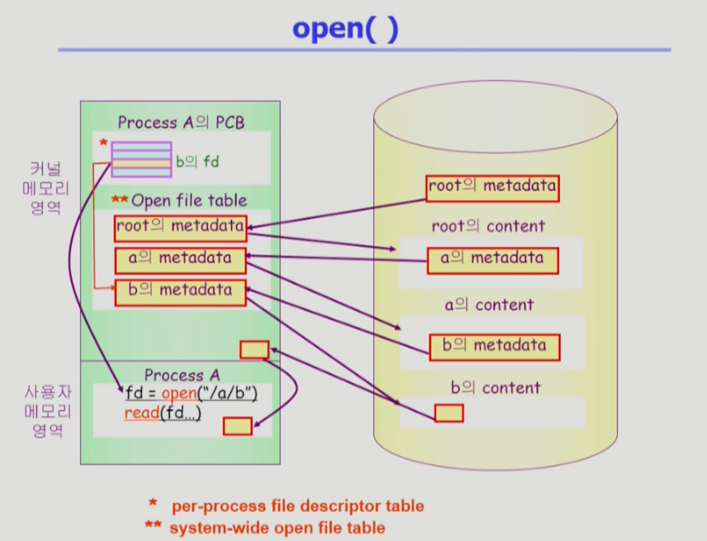
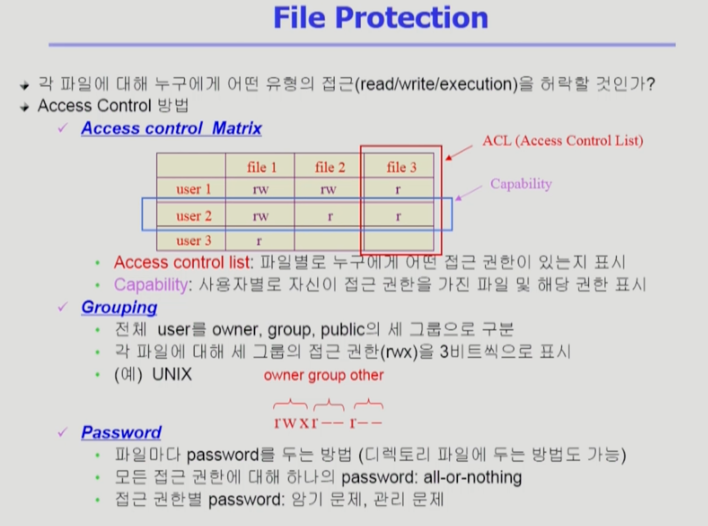
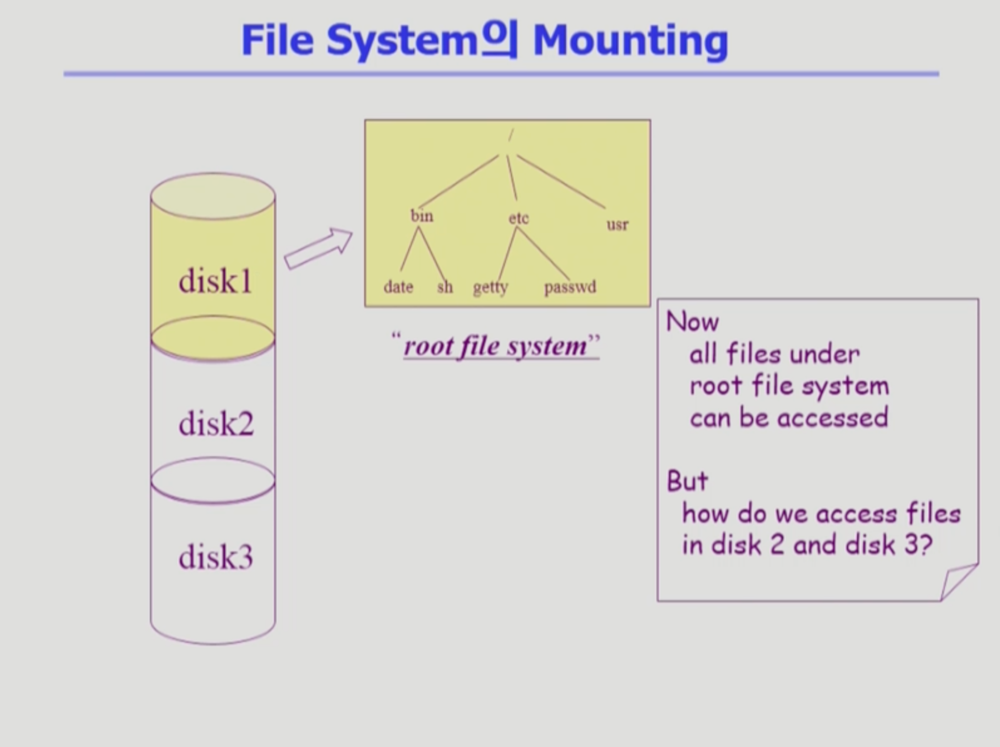
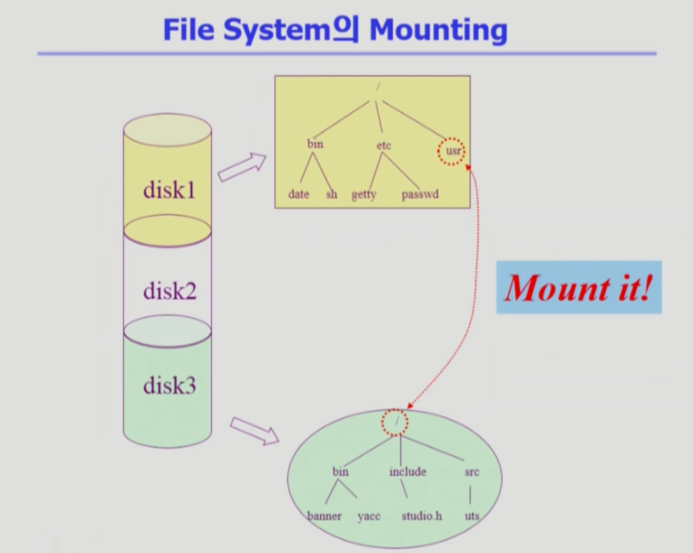

File System
===
이화여자대학교 반효경 교수님의 운영체제 강의를 요약한 내용입니다. 틀린 부분이 있다면 지적해주시면 감사하겠습니다. [강의 링크](http://www.kocw.net/home/cview.do?cid=4b9cd4c7178db077)

# 1. File and File System
## 1.1. 설명
### File
- A named collection of related information. 이름을 통해서 접근하는 단위.
- 일반적으로 비휘발성의 보조기억장치에 저장
- 운영체제는 다양한 저장장치를 file이라는 동일한 논리적 단위로 볼 수 있게 해줌
- Operation
    - create, read ,write, reposition(lseek), delete, open, close 등
        - repoisition : 파일을 읽고 나면 위치를 나타내는 포인터가 그 다음부분을 가르키게 됨. 다른 부분부터 읽고 싶거나.. 파일의 현재 접근하고 있는 위치를 수정해주는 연산
        - open, close : 인터페이스상 read나 write를 하려면 먼저 open을 해야하고, 더 할일이 없으면 close해라. 
            - open : 파일의 메타데이터를 메모리로 올려놓는 작업
### File attribute (혹은 metadata)
- 파일 자체의 내용이 아니라 파일을 관리하기 위한 각종 정보들
    - 파일 이름, 유형, 저장된 위치, 파일 사이즈
    - 접근 권한 (읽기/쓰기/실행), 시간 (생성/변경/사용), 소유자 등
### File system
- 운영체제에서 파일을 관리하는 (소프트웨어) 부분
- 파일 및 파일의 메타데이터, 디렉토리 정보 등을 관리
    - 파일 시스템 저장 시, 일차원적으로 저장하기보다 디렉토리를 둬서 루트 디렉토리부터 계층적으로 저장
- 파일의 저장 방법 결정
- 파일 보호 등

## 1.2. Directory and Logical Disk
### Directory
- 파일의 메타데이터 중 일부를 보관하고 있는 일종의 특별한 파일
- 그 디렉토리에 속한 파일 이름 및 파일 attribute들
- 일부 메타데이터는 디렉토리에 직접 저장하고, 일부는 다른 곳에 저장하기도 한다.
- operation
    - search for a file, create a file, delete a file
    - list a directory, rename a file, traverse the file system(파일 시스템 전체 탐색)
### Partition (=Logical Disk)
- 하나의 (물리적) 디스크 안에 여러 파티션을 두는게 일반적
- 여러 개의 물리적인 디스크를 하나의 파티션으로 구성하기도 함
- (물리적) 디스크를 파티션으로 구성한 뒤 각각의 파티션에 file system을 깔거나 swapping(swap area) 등 다른 용도로 사용할 수 있음

### open()
- a/b/c 루트 디렉토리부터 찾아서 c 찾음.

- 사용자 프로그램의 시스템 콜 fd = open("/a/b")
- 운영체제가 미리 알려진 루트 디렉토리의 메타데이터를 메모리에 올린다.
- 메타데이터에는 파일의 위치정보가 있고, 실제 content를 찾을 수 있다.
- 거기서 a의 metadata를 찾아서 메모리에 올리고, a의 위치를 찾는다.
- a의 내용 중 b의 metadata를 찾아 메모리에 올린다. -> open() 끝
- 프로세스의 정보가 있는 곳에서 오픈한 파일들에 대한 메타데이터 포인터같은 것을 가진 일종의 배열이 존재. b를 카르키는 포인트가 배열 어딘가에 만들어지고, 인덱스가 b의 파일 디스크립터(fd)가 되어 그 값을 사용자 프로세스에게 리턴. fd만 가지고 b에 read/write가 가능해짐
- read(fd..) -> 
- 운영체제가 버퍼캐시 가짐. 읽어온 것을 복사해서 메모리에 가지고 있다가 사용자 프로그램에 전달.
- 이미 운영체제 메모리에 있는것을 똑같이 요청하면, 우선 시스템콜로 운영체제에게 cpu 제어권이 넘어가고, 이미 버퍼캐시에 내용을 가지고 있는지 직접 판단한다.
    - 결국 요청 시 운영체제에게 무조건 넘어가는 구조이므로, 모든 정보를 운영체제가 다 알고 있기 때문에, LRU, LFU 사용 가능
  
+ 일단 메모리에 파일의 메타데이터가 올라온다면, 운영체제는 메타데이터 뿐 아니라 이 프로세스가 메타데이터의 어느 위치를 접근하고 있는지에 대한 offset을 같이 가진다.
+ b에 대한 접근을 여러 프로세스에서 한다면, b의 메타데이터는 한 카피만 올라갈 것이다. 즉, 시스템 와이드하게 존재하지만 접근하는 프로세스마다 offset은 다르다.
+ open file table은 메타데이터와 별도로 가지는 오프셋을 따로 관리하는 테이블을 두는 게 일반적
- ~25:00

# 2. File Protection
- 메모리에 대한 프로텍션은 권한이 있는가 정도만 : 프로세스마다 별도로 있어서 혼자 씀
- 파일에 대한 protection은 여러 사용자와 프로그램이 같이 사용할 수 있기 때문에, 접근 권한이 누구한테 있는지, 어떤 연산이 가능한지 두 가지가 있어야 한다.
## 2.1. Access Control 방법

### Access control Matrix
- 엄청 많은 파일, 특정 사용자가 본인만 사용하려고 한 파일도 행렬에 다 만들려고하면 양이 엄청 많다.
- Access control list : (파일을 추제로 접근권한이 있는 사용자 Linkedlist에 묶기)파일별로 누구에게 어떤 접근 권한이 있는지 표시
- Capability : (사용자 주체로)사용자별로자신이 접근 권한을 가진 파일 및 해당 권한 표시
### Grouping
- Acess control Matrix는 부가적인 오버헤드가 크다. 일반적인 운영체제에서는 그룹핑 사용
- 사용자 그룹을 owner, group, public 세 그룹을 구분
    - owner : 소유주에 대해 접근 권한rwx
    - group : 동일 그룹 속한 사용자들에 대해
    - pulblic : 나머지 전체에 외부 사용자들에 대해 rwx 권한
- 각 파일에 대해 세 그룹의 접근 권한(rwx)을 3비트씩으로 표시
    - 총 9개의 비트만 있으면 됨
### Password
- 파일마다 password를 두는 방법 (디렉토리 파일에 두는 방법도 가능)
- 모든 접근 권한에 대해 하나의 password: all-or-nothing
- 접근 권한 별 password : 암기문제, 관리문제

## 2.2. Mounting

- 물리적 디스크에 파일시스템 설치해서 사용  

만약 다른 파티션에 설치된 파일시스템을 사용하려면?

- 루트 파일 시스템의 특정 디렉토리 이름에 또 다른 파티션에 있는 파일 시스템을 mount해주면, 그 마운트 된 디렉토리를 접근하면, 해당하는 또 다른 파일 시스템의 루트 디렉토리에 접근하게 되는 꼴이다.

# 3. Access Methods
### 순차 접근 (sequential access)
- 카세트 테이프를 사용하는 방식처럼 접근
- 읽거나 쓰면 offset은 자동적으로 증가
### 직접 접근 (direct access, random access)
- Lp 레코드 판과 같이 접근하도록 함
- 파일을 구성하는 레코드를 임의의 순서로 접근할 수 있음
