File Systems Implementation 1
===
이화여자대학교 반효경 교수님의 운영체제 강의를 요약한 내용입니다. 틀린 부분이 있다면 지적해주시면 감사하겠습니다. [강의 링크](http://www.kocw.net/home/cview.do?cid=4b9cd4c7178db077)

# 1. Allocation of File Data in Disk
## 1.1. Contiguous Allocation
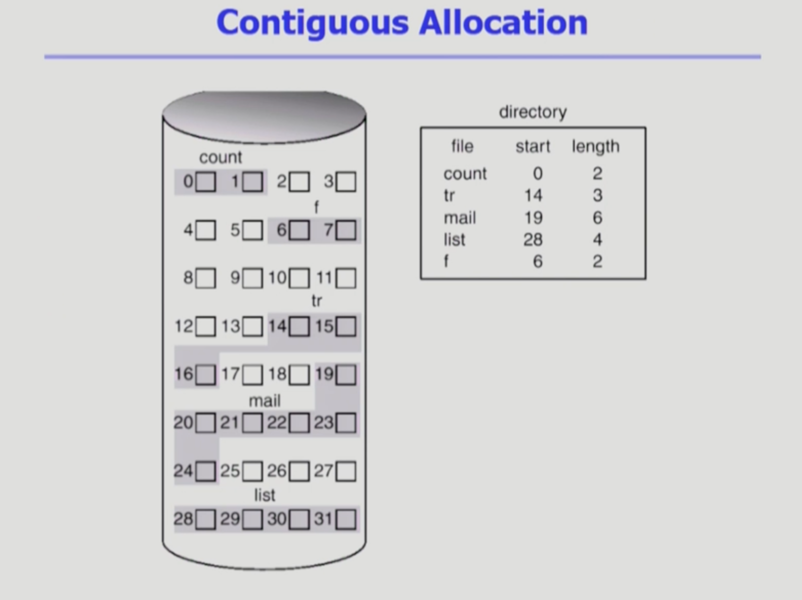
- 디스크 상에 연속해서 저장되는 방법
### 1.1.1. 단점
- 크기가 균일하지 않은 빈 블럭들이 생긴다. 만약 새로운 파일이 3개의 블럭이라면, 17,18에는 들어갈 수 없다. -> 비어있음에도 활용 불가. **외부 조각**
- 14~16을 6개 크기로 키우려면? -> 뒤에 공간이 부족 - > **file grow에 제약**이 있다. -> 미리 빈 공간을 확보해 놓는 방법 -> 얼마나 큰 hole을 배당할 것인가?
- 문제는 커질 것을 **대비해 할당하면, 내부 조각이 발생**하며(공간 낭비), 대비해서 할당해도 **그 이상으로 grow 불가능**하다.

### 1.1.2. 장점
- Fast I/O
    - 한번의 seek/rotation 으로 많은 바이트 transfer
    - 하드디스크 같은 매체는 대부분의 접근 시간이 디스크 헤드가 이동하는 시간이다. 시간에 있어서 읽거나 쓰는 크기는 크게 상관 없다. 많은 양의 데이터를 한번의 이동으로 받아올 수 있기때문에 빠르다.
    - Realtime file 용으로 사용
    - 이미 run 중이던 process의 swapping용
        - swap area의 정보는 프로세스가 끝나면 의미가 없는 정보가 된다. 공간효율성보단 속도효율성이 중요한 경우이다.
    - Direct accesss(=random access) 가능
        - mail의 길이가 6인데, 앞에서 5번째 블럭을 보고 싶다면, 앞에 4개를 순차접근해야하는 것이 아니며, 19 + 5를 하면 바로 접근 가능하다.
## 1.2. Linked Allocation
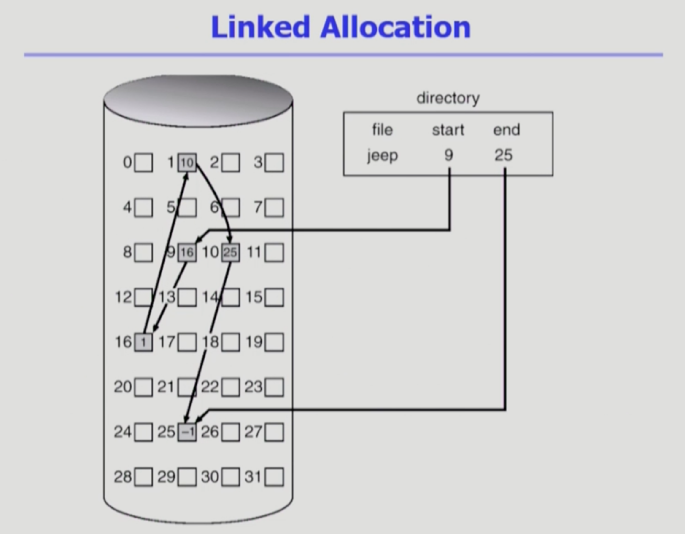
- 연속적인 배치가 아닌, 빈 위치면 아무데나 들어갈 수 있다.
- 파일의 시작위치만 디렉토리가 가지고 있다. 해당 블럭을 찾아가서 파일의 내용이 더 있다면, 다음 블럭의 정보를 찾아간다.
### 1.2.1. 장점
- 외부조각이 발생하지 않는다.
### 1.2.2. 단점
- 직접 접근 불가. 중간 위치를 보려면 앞에 내용을 모두 탐색해야 한다.
- 각각 디스크 이동이 일어나서 시간이 많이 든다.
- **Reliability** 문제 : 간혹 베드섹터가 일어남. 중간에 하나의 섹터가 문제가 생겨 pointer가 유실되면 많은 부분(뒷부분) 유실
- Pointer를 위한 공간이 block의 일부가 되어 **공간 효율성**을 떨어뜨림
    - 보통 512 bytes/sector, 4byte/pointer 단위인데, 포인터 저장때문에 두 섹터에 저장되는 경우
### 1.2.3. 변형
- File-allocation table (FAT) 파일 시스템
    - 포인터를 별도의 위치에 보관하여 reliability와 공간 효율성 문제 해결

## 1.3. Indexed Allocation
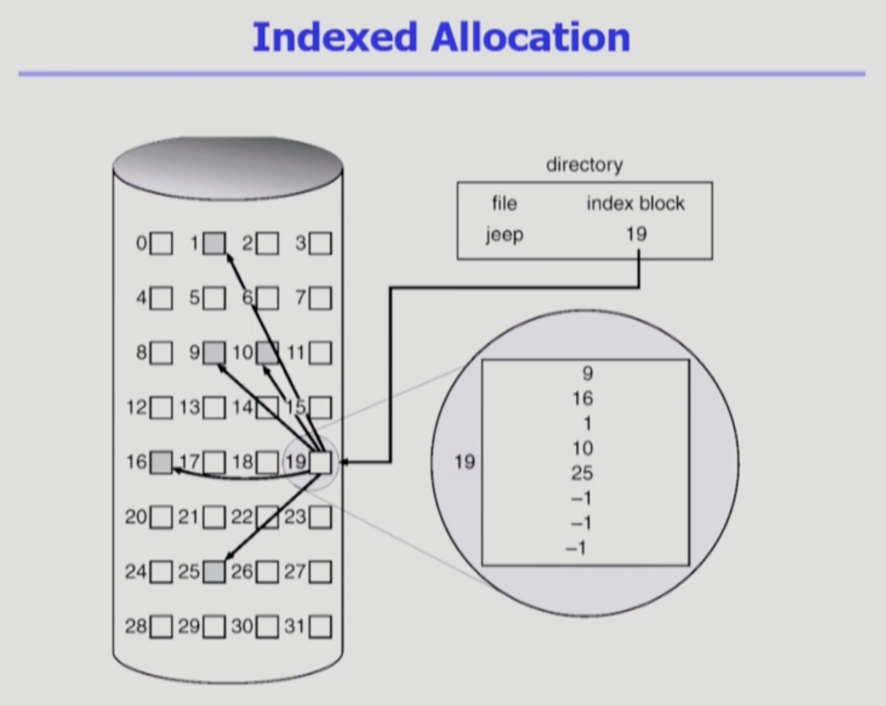
 - 직접 접근을 하기 위해, 디렉토리가 인덱스 블록을 가리키도록 한다. 인덱스 블록은 파일이 저장된 위치들이 나열되어있다.
 - 예시에서 5번째 블록이 25번이다. 라고 알려주는 셈
### 1.3.1. 장점
- External fragmentation 발생 안함
- Direct Access 가능
### 1.3.2. 단점
- 작은 파일의 경우 공간 낭비(실제로 많은 파일들이 작다.)
    - 아무리 작은 파일이어도 인덱스를 위한 블럭이 하나, 저장을 위한 블럭이 하나 총 두개가 필요하다. 
- 굉장히 큰 파일의 경우 하나의 인덱스 블록으로 모든 위치를 나타낼 수 없다.
    - linked scheme : 마지막 위치의 인덱스는 또 다른 인덱스로 규정
    - multi-level index : 하나의 인덱스 블럭이 또 다른 인덱스를 가르킨다.(ex. 마치 2단계 테이블처럼 두 번 거치기)

# 2. 주요 파일시스템들
## 2.1. UNIX 파일시스템의 구조
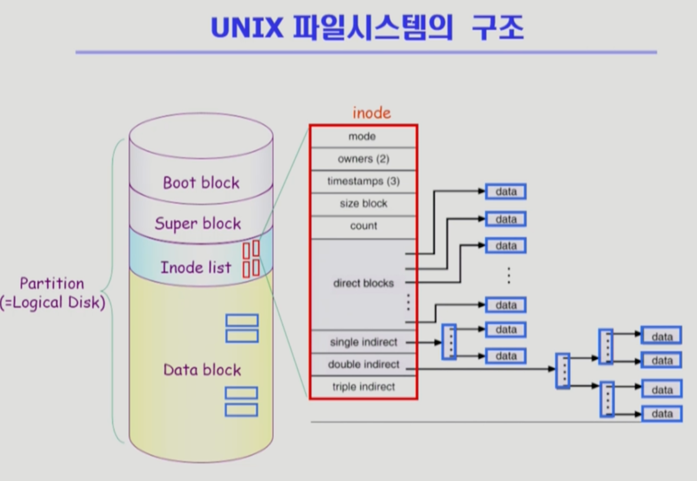
- 가장 기본적인 파일시스템 구조 - fast file system, est2, est3, est4.. 여기서 시작
- 기본구조를 어떻게 더 효율적으로 잘 저장할까? 어떻게 더 효율적으로 시간을 줄여서 저장할지?
+ 파티션에 파일시스템을 설치한 상황
+ Boot block
    + 부팅에 필요한 정보(bootstrap loader)
    + 어떤 파일시스템이든 제일 앞에 boot block. 0번 블럭 메모리에 올리면 boot block
+ Superblock
    + 파일 시스템에 관한 총제적인 정보
    + 어디가 빈 블럭이고, 어디가 사용중인지?, 어디까지가 Inode list가 어디까지고 Data block이 어디부터이고..
+ Inode list(Index node 말하는 것)
    + 실제 파일시스템의 구현에서 디렉토리가 모든 메타데이터를 가지고 있지는 않다. 특히 UNIX의 경우 디렉토리는 일부만 가지고 있고, 별도의 위치(Inode list)에 빼서 가지고 있다.
    + 파일 하나당 Inode가 하나씩 할당 (빨간 작은 네모)
    + UNIX 파일시스템에서 딱 한 가지 파일의 이름은 디렉토리가 가지고 있다. -> 디렉토리에 파일 이름과 Inode 번호를 가지고 있다.
    + Inode의 크기는 고정되어 있다. -> 위치정보를 나타내는 포인터 개수도 유한하다. -> 굉장히 큰 파일을 어떻게 표현? -> direct blocks ~ triple indirect 이용 : 작은 파일은 direct blocks만으로 표현 가능, 큰 파일은 indirect 사용. indirect를 따라가면 인덱스가 있다. double indirect이면 두 번 따라가야 실제 파일 위치가 있다.

## 2.2. FAT 파일시스템
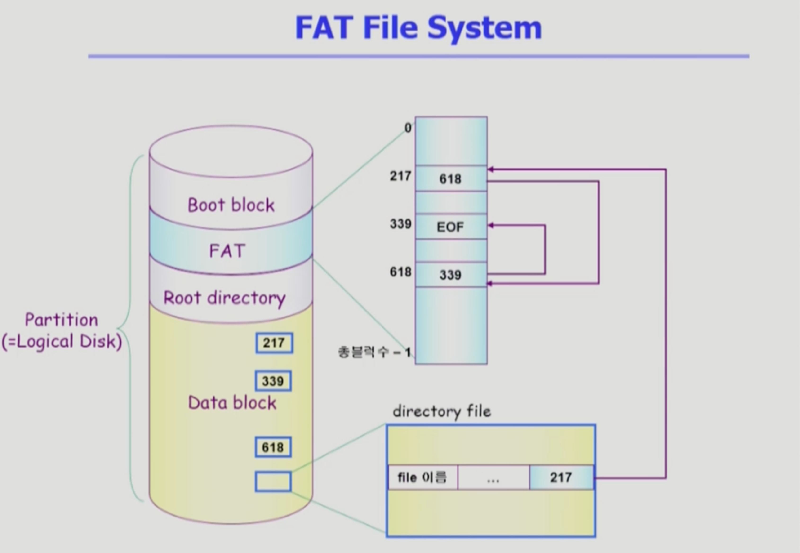
- 마이크로소프트사가 msdos를 만들었을때 처음 만든 시스템
- 최근에도 윈도우 계열, 모바일기기에도 사용한 경우 있음
- Boot block
    - 모든 파일시스템 공통적인 부분. 부팅 정보
- FAT
    - FAT은 파일의 메타데이터의 일부만 보관한다. 사실상 보관하는 정보는 지극히 일부로 위치정보만 보관한다.
    - Linked Allocation의 문제 두 가지(Reliability , 공간 비효율)를 해결한다. 다음 블럭의 위치를 디렉토리와 데이터 블록이 아닌, FAT이라는 별도의 테이블(배열)에 담고 있다.
    - FAT이라는 테이블의 배열의 크기는 해당 디스크가 관리하는 data block의 개수만큼이다.
        - 해당 블럭의 다음 블럭의 위치를 FAT에서 가지고 있다.
        - ex. 보기의 해당 파일의 첫 블럭은 217번에 있다. 217번에 가면 해당 내용이 있다. -> 두번째 블럭을 찾으려면 FAT을 찾아봐야 한다. FAT의 217번 엔트리로 가야한다. -> 해당 엔트리에 618이 있으며, 그 다음 블럭을 찾으려면 FAT의 618번째 엔트리에 가야한다. -> 339를 또 찾아가면 끝났다는 약속된 의미가 적혀있다.
    - FAT은 이미 메모리에 올려져있다. 따라서 곧바로 위치 파악이 가능하며, 직접 접근이 가능하다. 217부터 몇번째인지 찾아가면 된다.
    - 문제 해결 : 
        - Reliability 문제 개선 : 배드섹터 발생해도 FAT에 내용이 있다. data block과는 별도로 존재하며, FAT은 중요한 정보이기 때문에 보통 두 카피 이상 저장
        - 공간 효율성 : 512bytes 충분히 활용 가능

# 3. Free-Space Management
- 중간에 비어있는 블록의 관리

## 3.1. Bit map or bit vector
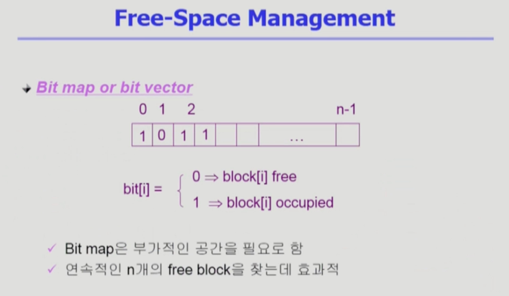
- UNIX의 경우 각각의 블록별 번호들이 있고, Super block부분에 사용중인지 여부를 비트로 나타냄.(0 or 1)
- 비트맵의 경우는 블럭의 개수만큼 -> 부가적인 공간 필요
- 0 : 비어있는 블록, 1: 파일이 할당된 블록
- 연속적인 빈 블록을 찾는데 효과적
## 3.2. Linked list
- 모든 free block들을 링크로 연결 (free list)
- 연속적인 가용공간을 찾는 것은 쉽지 않다.
- 비어있는 블록의 첫번째 위치만 포인터로 가지고 있고, 실제 빈 블럭에 가면 다음번 빈 블럭의 위치를 포인팅하고 있다.
- bit map에 비해 추가적인 공간 낭비가 없다.
- 연속적인 가용공간을 찾는 것은 쉽지 않다. -> 찾고자 한다면 실제로 사용은 쉽지 않다.
## 3.3. Grouping
- linked list 방법의 변형
- 빈 블록에 빈 블록들의 위치가 저장되어 있다.
- linked list보다는 빈 블록을 한꺼번에 찾기에 효율적이다.
- 첫번째 free block이 n개의 pointer를 가짐
    - n-1개의 pointer는 free data block을 가리킴
    - 마지막 pointer가 가리키는 block은 또 다시 n pointer
## 3.4. Counting
- 빈 블록의 위치, 해당 위치부터 몇 개가 빈 블록인가? -> (first free block, # of contiguous free blocks)을 유지
- 프로그램들이 종종 여러 개의 연속적인 block을 할당하고 반납한다는 성질에 착안

# 4. Directory Implementation
## 4.1. 내용을 저장하는 방법
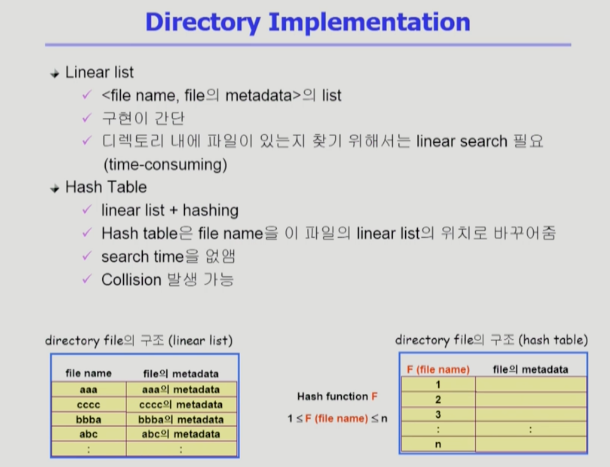
### 4.1.1. Linear list
- \[파일이름, 나머지 메타데이터] 의 list
- 메타데이터의 크기는 고정해서 관리
- linear search 필요 (시간 소요 큼)
### 4.1.2. Hash Table
- linear list + hashing
- hash table은 file name을 이 파일의 linear list의 위치로 바꾸어줌
- 해시함수 적용 시 어떤 인풋값이 주어지더라도, 결과값이 특정 범위안에 숫자로 한정된다.
- 해시함수의 결과값에 대한 엔트리에다가 해당 파일의 메타데이터를 저장
    - 순차적이 아닌, 적용된 해시함수의 결과값인 엔트리만 찾아보면 된다.
    - search time 줄어듦
- Collision 발생 가능
    - 서로 다른 파일 이름에 대해 결과값이 같은 엔트리에 매핑되는 경우

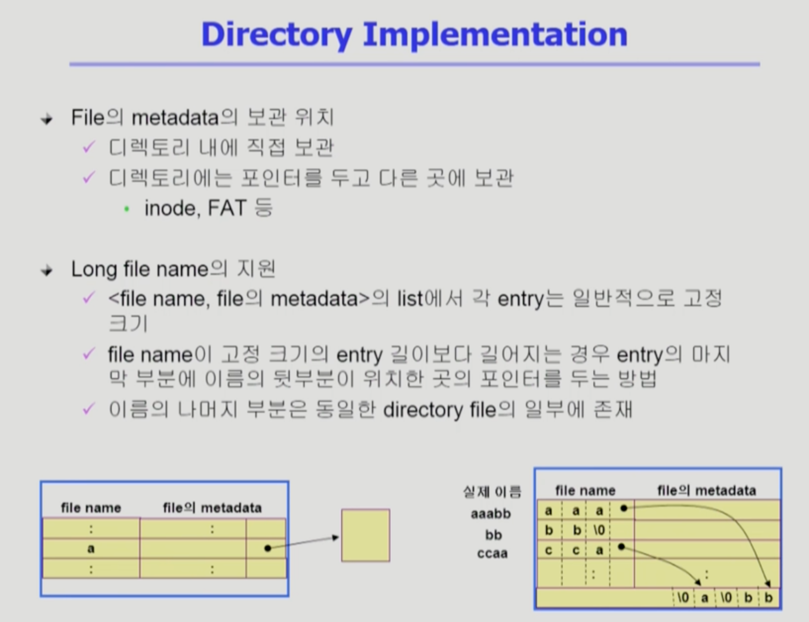
## 4.2. metadata의 보관 위치
- 디렉토리 내에 직접 보관
- 디렉토리내에는 포인터를 두고 다른 곳에 보관
    - inode, FAT 등

## 4.3. Long file name의 지원
- 이미지 참고

# 5. VFS and NFS
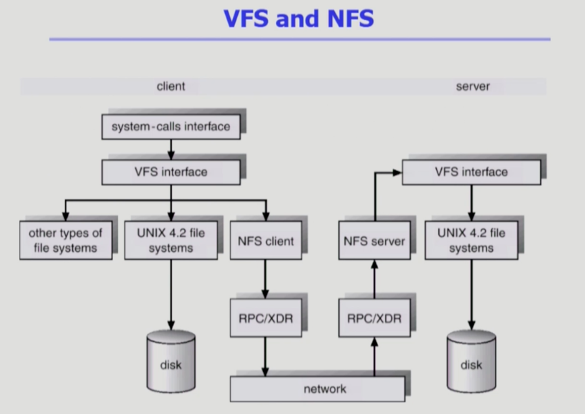
## 5.1. Virtual File System(VFS)
- 여러 종류의 파일 시스템 존재. 접근 시 시스템콜을 하는데, 시스템 종류별로 다른 시스템콜 인터페이스를 사용한다면 혼란스러울 것이다. -> 보통은 어떤 파일시스템이 사용되든지 상관없이 윗 계층에 VFS라는 인터페이스를 둔다.
- 서로 다양한 file system에 대해 동일한 시스템콜 인터페이스를 통해 접근할 수 있게 해주는 OS의 layer 
## 5.2. Network File System(NFS)
- 분산 시스템에서는 네트워크를 통해 파일이 공유, NFS는 분산 환경에서의 대표적인 파일 공유 방법
- 자신의 로컬컴퓨터가 아닌 원격의 다른컴퓨터에 접근 시 지원
- NFS client, NFS server 모두 필요

# 6. Page Cache and Buffer Cache
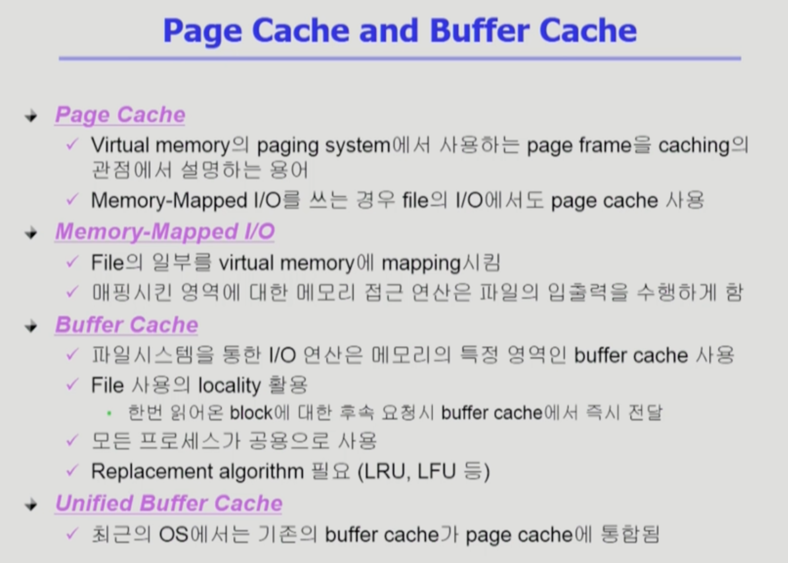
## 6.1. Page Cache
- Virtual memory 의 관점
- 반쪽짜리 정보
## 6.2. Memory-Mapped I/O
- 원래는 파일 접근 시 open후 read/write 등 사용
- 메모리에 매핑하고 read/write등 시스템콜 대신, 메모리에 읽고 쓴다. 실제로는 파일에 데이터를 읽고쓰는 효과가 나도록
## 6.3. Buffer Cache
- 파일 시스템 관점
- LRU, LFU등 사용 가능
## 6.4. Unified Buffer Cache
- 합쳐서 관리하는 운영체제들 있음.
- 버퍼 캐시도 페이지단위로 관리한다. 운영체제에서 물리적인 메모리를 관리하는 루틴에 페이지 캐시와 버퍼 캐시를 같이 관리한다.

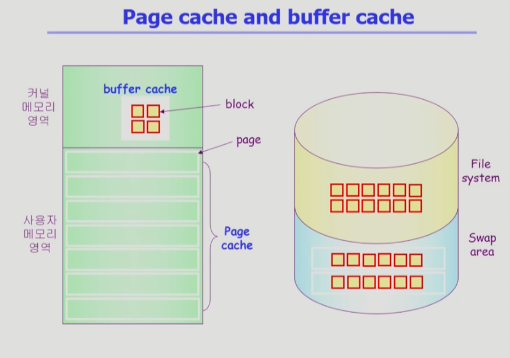
- 페이지 보통 4kb, 블록 512b -> 최근에는 두개가 합쳐지면서 버퍼캐시에도 페이지크기(4kb)로 블록들을 관리
- swap area의 블록들은 빠르게 데이터를 내리고 올려야한다. -> 여러 개의 블록을 모아서 4kb단위로 올리거나 내리는게 기본. 더 크게 여러개의 페이지를 올리고 내리기도 한다.

