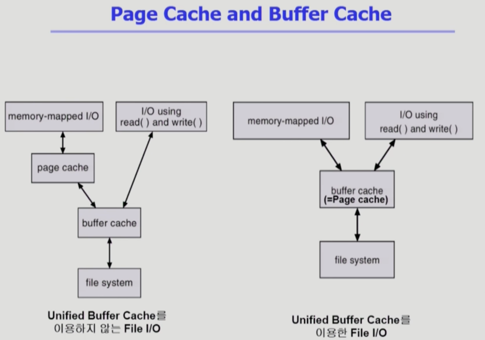

File Systems Implementation 2
===
이화여자대학교 반효경 교수님의 운영체제 강의를 요약한 내용입니다. 틀린 부분이 있다면 지적해주시면 감사하겠습니다. [강의 링크](http://www.kocw.net/home/cview.do?cid=4b9cd4c7178db077)

# 1. 복습
## Page cache and buffer cache
- 페이지 프레임들. 당장 필요한 내용메모리에 올리고, 필요 없으면 쫓아냄
## Buffer Cache
- 프로그램이 그냥 실행되기도 하지만, 파일 입출력하는 경우. 운영체제가 디스크에서 내용을 읽어서 자신의 메모리 영역에 카피해놓고, 사용자 프로그램에게 전달
## Unified Cache
- 최근에는 위 두개가 통합(Linux의 경우). 버퍼 캐시의 단위도 페이지(4kb)단위로 사용
- 공간 구분 없이 페이지단위로 파일입출력 공간(버퍼캐시) 혹은 프로세스의 주소 공간으로 할당해서 사용한다.
## Memory-Mapped I/O
- 파일 이야기로 한정 지을때, Memory-Mapped File
- File의 일부를 virtual memory에 매핑. 프로세스의 주소 공간 중 일부를 파일에 매핑
- 매핑 후에는 메모리 접근 연산으로 파일 입출력 가능

# 2. Page Cache and Buffer Cache

## 2.1. 파일 입출력 방법 2가지
1. 버퍼캐시 : open() -> read/write 시스템콜 -> 운영체제가 버퍼캐시 확인 있으면 전달, 없으면 파일 시스템에서 읽어서 전달 
2. memory-mapped I/O : 처음에 시스템콜(memory mapped하겠다고 알림) -> 주소 공간 중 일부를 파일로 매핑 -> 디스크의 파일을 읽어오고 버퍼캐시 사용하는것까지도 똑같다. -> 읽어온 내용을 페이지 캐시에 카피 -> 다음부터는 운영체제 관여 없이 내 메모리 영역에 데이터를 읽고 씀 (메모리 접근을 통해 파일 입출력 사용)
- 맵만 해놓고 파일 내용을 디스크로 안읽어왔다면, 해당 맵된 메모리를 접근할 때 page fault발생

+ 버퍼캐시는 둘 중 무엇을 쓰던 통과해야한다. 왼쪽그림을 보면 양쪽 모두 버퍼캐시에 내용을 복제하는 오버헤드가 있다.

### Unified Buffer Cache
- 따로 버퍼캐시를 두지 않고, 필요에 따라 paged cache 사용

## 2.2. 프로그램의 실행
+ 가상메모리에서 code 부분은 물리적 메모리에 올린 다음, 제거할때 디스크에 이미 내용이 있어서 swap area에 내릴 필요가 없다.
+ 실행파일을 실행시킬때, 로더라는 소프트웨어가 메모리 mapped 파일을 쓰는 대표적인 방법이 code 부분이다. code는 파일 시스템에 파일 형태로 존재하는데 주소 영역에 매핑시켜논거다. 필요하면 디스크의 실행파일에서 올려야한다.
### Memory-Mapped I/O의 장점
- 일단 올라간 파일의 내용을 직접 접근할 수 있어 더 빠르다. 
- 캐시에 올라온 내용을 자신의 주소공간에 카피하는 오버헤드가 없이 바로 전달된다.
### 단점
- 물리적 메모리의 내용을 share에서 사용할때 일괄성 문제에 주의해야 한다.
- read/write의 경우 카피하기때문에 일괄성 문제가 없다.

**해당 문서는 정리가 필히 다시 필요함.**