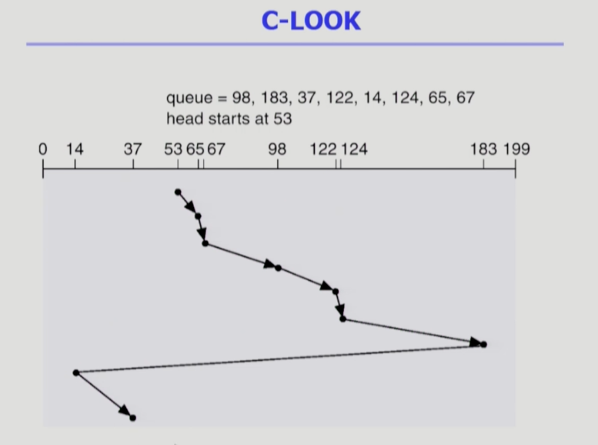

Disk Management & Scheduling 1, 2
===
이화여자대학교 반효경 교수님의 운영체제 강의를 요약한 내용입니다. 틀린 부분이 있다면 지적해주시면 감사하겠습니다. [강의 링크](http://www.kocw.net/home/cview.do?cid=4b9cd4c7178db077)

# 1. Disk Structure
## 1.1. logical block
- 저장은 섹터로 되어있지만, 외부에서는 논리적인 블록단위로 디스크를 바라본다.
    - ex. 배열의 몇번째 원소를 달라 라는 식으로 요청
- 디스크의 외부에서 보는 디스크의 단위 정보 저장 공간들
- 주소를 가진 1차원 배열처럼 취급
- 정보를 전송하는 최소 단위
## 1.2. Sector
- 디스크 관리의 최소 단위
- Logical block이 물리적인 디스크에 매핑된 위치
- Sector 0은 최외곽 실린더의 첫 트랙에 있는 첫 번째 섹터이다.
    - 공통적으로 0에는 부팅 관련 정보 
## 1.3. physical formatting (Low_level formatting)
- 디스크를 처음 만들때 섹터단위로 나눈다. 디스크를 컨트롤러가 읽고 쓸 수 있도록 섹터들로 나누는 과정이다.
- 각 섹터는 **header + 실제 data(보통 512 bytes) + trailer**로 구성
- header와 trailer는 sector number, ECC(Error-Correcting Code) 등의 정보가 저장되며 controller가 직접 접근 및 운영
    - ECC는 본 데이터를 요약한 코드같은 것이다. 해쉬함수를 생각하면 된다. 예시로 나중에 데이터를 꺼내갈때, header와 trailer를 같이 읽는데, 거기에 header나 trailer에 저장되있던 ECC와 ECC를 만든값을 비교해서 같으면 베드섹터안나고 잘 저장되어있구나 확인하는 것. 좋은 해시함수 같은 것을 사용하면 상당부분 에러를 검출 가능하다. ECC의 규모에따라 에러의 검출뿐 아니라 수정까지 가능한 경우도 있다.

# 2. 디스크 실행까지
## 2.1. Partitioning
- physical formating 후에 섹터 영역들을 묶는 것. ex) 하드디스크 하나를 사서 c드라이브, d드라이브로 파티셔닝하면 서로 다른 논리적 디스크가 된다.
- 디스크를 하나 이상의 실린더 그룹으로 나누는 과정
- OS는 이것을 **독립적 disk**로 취급(logical disk)
## 2.2. Logical formatting
- 파티션에 파일 시스템을 설치(만드는)하는 것
- FAT, inode, free space 등의 구조 포함
## 2.3. Booting
1. 처음 부팅시 메모리는 비어있다. cpu는 메모리만 접근가능, 하드디스크는 직접 접근을 못한다. 그렇다면 어떻게?..
2. 전원이 나가더라도 내용이 유지되는 소량의 메모리인 ROM -> 전원을 키면 cpu제어권이 ROM으로 간다. -> ROM에 있는 "small bootstrap loader"의 실행된다.
3. "small bootstrap loader"가 sector 0 (boot block)을 load하여 실행하도록 지시 
4. sector 0은 "full Bootstrap loader program" 실행.
5. full Bootstrap loader program은 파일시스템에서 운영체제 커널의 위치를 찾아 실행하라고 명령한다. OS를 디스크에서 load하여 실행한다.

# 3. 디스크 접근 시간
## 3.1. Access time의 구성
### 3.1.1. Seek time
- 헤드를 해당 실린더로 움직이는데 걸리는 시간
    - 안쪽 -> 바깥쪽 , 바깥쪽 -> 안쪽
    - 같은 트랙에 위치한 곳들을 모은 것을 실린더라고 부름. 트랙이란 말과 비슷하게 사용됨.
    - **가장 큰** 시간구성요소. 기계장치가 이동하기 때문에 반도체 등에 비해 매우 느리다.
        - 한번의 seek로 많은 양을 처리하면 유리한 이유.
### 3.1.2. Rotational latency
- 헤드가 원하는 섹터에 도달하기까지 걸리는 회전지연시간
    - seek time의 1/10 정도로 적은 시간 규모 차지
### 3.1.3. Transfer time
- 실제 데이터의 전송 시간
    - 굉장히 작은 시간 차지
## 3.2. Disk bandwidth
- 단위 시간 당 전송된 바이트의 수
## 3.3. Disk Scheduling
- seek time을 최소화하는 것이 목표
- Seek time ~ seek distance

 

# 4. Disk Scheduling Algorithm
- 사실은 스케줄링 알고리즘이 구현되는 곳이 대부분 디스크 내부가 아니기때문에, (보통 운영체제쪽) 정확한 실린더 위치를 모를 수 있다. 스케줄러는 논리블럭 번호를 보고 스케줄을 하고, 대부분 맞아떨어진다. 내부에서 sector단위를 이용하는 것도 가능은 하다.

## 4.1. FCFS (First Come First Service)
 
- 그냥 들어온 순서대로 처리
- 안쪽과 바깥쪽이 번갈아 요청이 들어오는 경우 seek time이 늘어나 비효율적여진다.

## 4.2. SSTF (Shortest Seek Time First)
 
- 제일 가까운 요청 먼저 처리
- starvation 문제. 한쪽에만 머물 가능성이 있다.

## 4.3. SCAN
 
- 엘레베이터 스케줄링이라고도 한다. 기본적으로 디스크 스케줄링은 SCAN에 기반해서 사용한다.
- disk arm이 디스크의 한쪽 끝에서 다른쪽 끝으로 이동하며 가는 길목에 있는 모든 요청을 처리한다.
- 다른 한쪽 끝에 도달하면 역방향으로 이동하며 오는 길목에 있는 모든 요청을 처리하며 다시 반대쪽 끝으로 이동한다.
- 문제점 : 실린더 위치에 따라 대기시간이 다르다. 최악의 경우 왕복 전체를 기다려야한다. (가장자리의 요청인데, 헤드가 막 떠난 경우)
## 4.4. C-SCAN
 
- Circular SCAN
- 헤드가 한쪽 끝에서 다른쪽 끝으로 이동하며 가는 길목에 있는 모든 요청을 처리
- 다른쪽 끝에 도달했으면 요청을 처리하지 않고 곧바로 출발점으로 다시 이동
- 이동 거리는 길어질 수 있으나, SCAN보다 균일한 대기 시간을 제공한다. 
## 4.5. N-SCAN
- SCAN의 변형
- 일단 arm이 한 방향으로 움직이기 시작하며 그 시점 이후에 도착한 job은 되돌아올 때 service
- 더 균일한 대기시간 분포
## 4.6. LOOK and C-LOOK
 
- SCAN과 C-SCAN의 비효율 개선; 해당 방향에 요청이 없어도 끝까지 이동하는 단점
- 해당 방향에 더 이상 요청이 없으면 끝까지 이동하지 않고 방향을 바꾼다.
- 위 그림을 보면 맨 끝까지 이동하지않고, 14, 183에서 방향을 전환한 것을 확인할 수 있다.

# 5. Disk-Scheduling Algorithm의 결정
 
- SCAN에 기반한 알고리즘들 주로 사용
- 파일 할당 방법도 디스크 스케줄링의 성능에 영향을 미친다. ex)연속할당을 하면 헤드의 이동이 줄어들고, 산발적 할당을 하면 반대이다.
- 현대 컴퓨터에서 디스크 스케줄링을 할 때 중요한 특징은 merge해서 한꺼번에 처리를 하는 것이다. 그때그때 처리하기보다 한꺼번에 묶어서 처리해서 디스크 I/O의 효율성을 높인다.

# 6. Swap-Space Management
 

## 6.1. Disk를 사용하는 두 가지 이유
- memory의 volatile한 특성 -> file system
    - 전원이 나가면 DRAM 메모리는 휘발 -> 파일시스템은 휘발하면 안됨
- 프로그램 실행을 위한 memory 공간 부족 -> swap space(area)
    - 더군다나 멀티프로그래밍 degree도 증가하는 추세

## 6.2. Swap-space
- 하드디스크에서는 어떻게 swap-space를 관리?
- 물리적 디스크를 파티셔닝해서 Logical disk를 만들 수 있다. 이것들은 운영체제가 독립적 디스크로 간주한다. 이것을 파일 시스템을 설치해서 사용할 수 있고, swap area로 사용도 가능하다.
    - 파일시스템은 기본적으로 512byte sector단위로 데이터를 저장. 연속할당, linked allocation, indexed allocation ...
    - 유닉스나 FAT 파일시스템에서는 그런것들을 효율적으로 활용. 공간효율성 높임
    - swap area는 프로그램이 실행되는 동안 머무르던 프로세스의 주소공간들이 프로그램 끝나면 어짜피 사라진다. 물리적메모리의 연장공간으로 사용하는 개념이라 쫓겨날떄도 빠르게 디스크에 쓰고, 다시 올릴때도 빠르게 올려야한다. **속도 효율성을 우선**으로 한다. seek time을 줄이기 위한 목적으로 **큰 단위로 데이터를 올리고 내린다.** **보통 512kb**로 섹터의 1000배이다. **경우에 따라 16k~512k**이기도 하다.

# 7. RAID
## 7.1. RAID?
- Redundant Array of Independent Disks (복수 배열 독립 디스크)
    - (특히 저렴한 디스크) 여러 개의 디스크를 묶어서 사용
- 여러 개 디스크를 어느 정도 중복저장할 것인가?
## 7.2. 사용 목적
### 7.2.1. 디스크 처리 속도 향상
- 여러 디스크에 block의 내용을 **분산 저장**
- 병렬적으로 읽어 옴(interleaving, striping)
### 7.2.2. 신뢰성(reliability) 향상
- 동일 정보를 여러 디스크에 중복 저장
    - 하나의 디스크가 고장(failure)시 다른 디스크에서 읽어옴(Mirroring, shadowing)
- 단순히 통째로 디스크를 중복 저장하는 경우도 있다.
- 단순한 중복 저장이 아니라 일부 디스크에 parity를 저장하여 공간의 효율성을 높일 수 있다. -> parity : 통째로 저장한 게 아닌 중복 저장의 정도를 대단히 낮게 하여 오류가 생겼는지 알아내고 복구할 수 있을 정도만의 중복저장을 하는 기법.
- ex 4개 중 3개의 데이터에 대해 해시함수를 저장한 Parity를 나머지 디스크에 저장해서 깨지면 확인