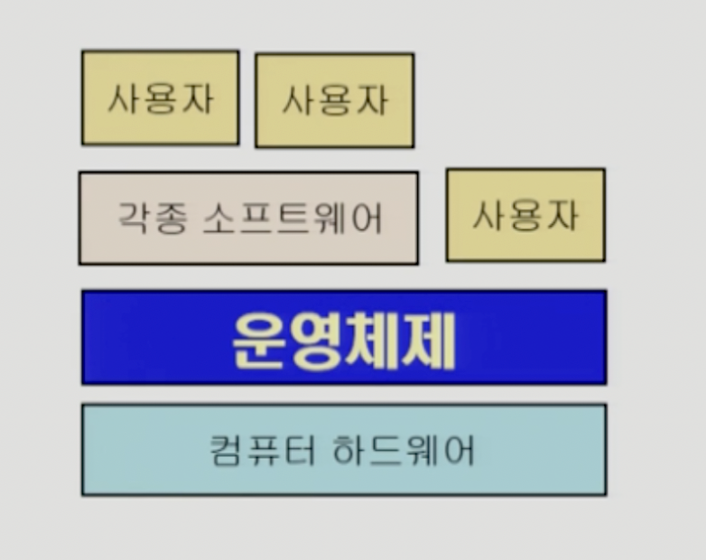

Introduction to Operation System
====
[강의 링크](http://www.kocw.net/home/cview.do?cid=4b9cd4c7178db077)
# 1. 운영체제란?
</img>
- 계층의 위치를 잘 보자
- 각종 소프트웨어를 편하게 사용하도록 하면서, 복잡한 하드웨어를 관리한다.

# 2. 운영 체제의 목적

## 1.1. 컴퓨터 시스템을 편리하게 사용할 수 있는 환경을 제공
- 운영체제는 동시애 독자적으로 컴퓨터가 수행하는 것처럼 보이게 한다.
- 하드웨어를 직접 다루는 복잡한 부분을 대행한다.
  
❗️CPU의 연산 속도가 너무 빠르기떄문에, 마치 여러 프로그램을 동시에 실행하거나 독자적으로 실행하는 것처럼 보일 뿐이다.
## 1.2. 자원을 **효율적으로 관리**
- CPU, 메모리, I/O 장치 등의 효율적 관리
    - 주어진 자원으로 최대한 성능 : 효율성
    - 특정한 곳에 지나친 불이익 발생하지 않도록 : 형평성
- 사용자 및 운영체제 자신을 보호한다.
- 프로세스, 파일, 메시지 등 관리
- 메모리의 분배  

❗️어떤 프로그램에 메모리를 얼마나 올려야 하는가? 

