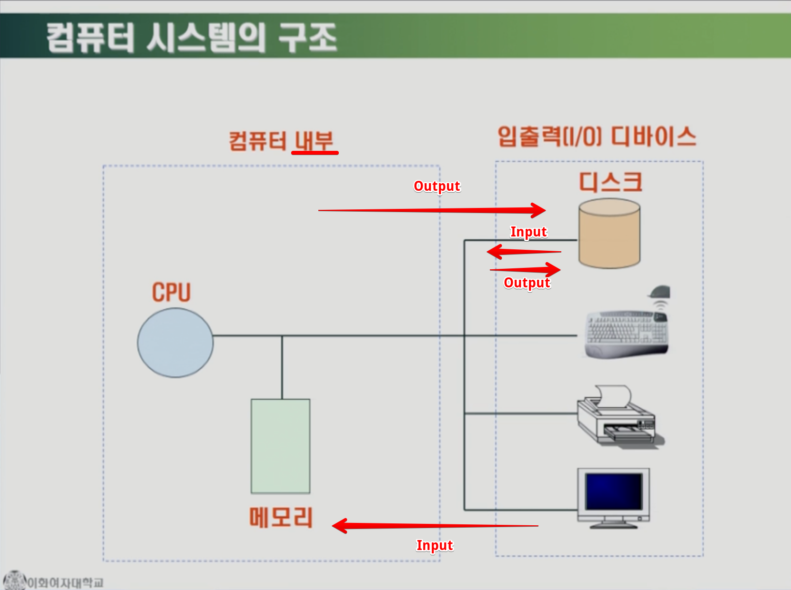
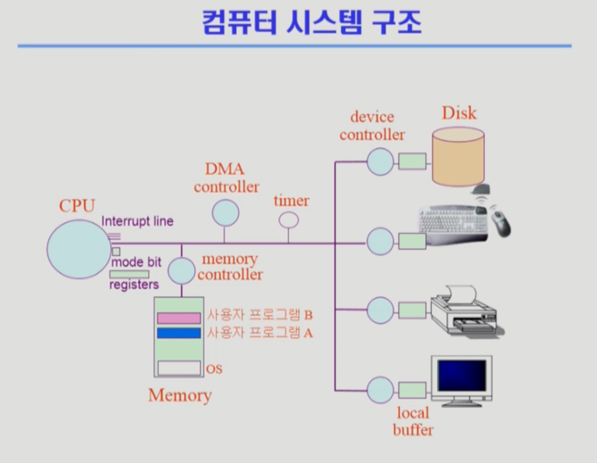

SystemStructure & Program Execution 1
===
이화여자대학교 반효경 교수님의 운영체제 강의를 요약한 내용입니다. 틀린 부분이 있다면 지적해주시면 감사하겠습니다.  [강의 링크](http://www.kocw.net/home/cview.do?cid=4b9cd4c7178db077)

# 목표
운영체제를 설명하기 앞서서 알아본다.
- 컴퓨터 시스템에서 하드웨어가 어떻게 동작하는지?
- 프로그램들이 하드웨어 위에서 어떻게 동작하는지?  

# 1. 컴퓨터 시스템의 구조

- 컴퓨터 내부를 기준으로 인풋과 아웃풋이 구분된다.
- CPU 쪽으로 데이터가 들어오는 것이 input, 반대가 output이다.
- 디스크 입장에서 데이터가 나가는 것이라도, input이다.  

동작의 흐름과 그림에 있는 요소들에 대해 하나씩 알아보자. 이 그림을 계속 기억하는 것이 좋을 것 같다.

## 1.1 CPU
CPU는 연산속도가 가장 빠르며, 매 클럭마다 메모리에서 무언가를 읽는다. registers중에 프로그램 카운터(pc)가 다음번에 실행할 주소를 가지고 있고, cpu는 그것을 기준으로 매번 실행하는 것이다  하지만 CPU는 하드웨어라 생각을 못한다.  즉, 메모리에서 명령(Instruction)을 읽고, 실행하고, 읽고, 실행하고를 반복한다. 그저 읽고 실행만 하기 때문에 운영체제의 기계어로 인한 관리가 개입된다. 
### 1.1.2. cpu의 통제
그렇기 때문에 사실상 CPU를 메모리에 있는 특정 프로그램에 넘겨주고 나면, 운영체제가 CPU를 통제할 방법이 없다. CPU는 그저 실행될 뿐이기 때문이다. cpu의 통제를 위해 운영체제는 하드웨어 장치와 협조하고, **인터럽트**를 사용한다. 인터럽트를 확인하기 위해, CPU는 매 명령어마다 **interrupt line**을 체크한다.

### 1.1.3. 구성
registers, mode bit, interrupt line
### register
- cpu안에 메모리보다 더 빠르면서 정보를 저장할 수 있는 작은 공간들

## 1.2. 인터럽트
- 넓은 의미
    - Interrupt(하드웨어 인터럽트)
    - Trap(소프트웨어 인터럽트)
- 일반적 의미
    - 하드웨어 인터럽트를 말한다. 보통 소프트웨어 인터럽트의 경우 Trap이라고 따로 지칭한다.  
  
### 1.2.2. 설명
CPU가 메모리에서 읽던 명령어에서 I/O 장치를 호출하는 내용이 있었고, I/O 디바이스 컨트롤러에 일을 시켰다. 해당 명령어는 I/O 작업이 끝나서 받아온 값을 사용해야 수행할 수 있다고 가정해보자.

위에서 설명했듯이, CPU의 연산은 다른 장치들보다 훨씬 빠르기 때문에 I/O장치가 일을 하는 것을 기다리는 동안 다른 일을 할 시간이 남는다. cpu가 상대적으로 빠른 만큼, 만약 I/O 장치가 일을 하는 것을 기다리면서 아무것도 하지 않으면 엄청난 낭비인 것이다. 그래서 I/O 작업을 필요로 하는 해당 명령의 실행을 보류하고, cpu는 I/O장치를 안쓰는 다른 프로그램으로 넘어가서 일을 한다.

문제는 CPU는 스스로 움직이지 못한다. 메모리에 명령어를 순차적으로 읽을 뿐이다. 또한 cpu는 I/O장치가 일을 끝냈다는 것을 알 방법이 없다. 그런 cpu에게 I/O장치에 맡긴 일을 완료했다는 말해주는 것이 인터럽트이다. 그런데 cpu는 명령어를 읽기만 하는데 인터럽트가 들어온 것을 어떻게 알 수 있을까?

인터럽트를 확인하기 위해 CPU는 매 명령어를 수행할 때마다 interrupt line을 체크한다. I/O장치를 호출했던(I/O 장치가 필요한) 명령을 실행할 준비가 된 것을 알 수 있게 되는 것이다.
### 1.2.3. Interrupt line
중간에 끼어드는 키보드 등 장치의 인터럽트를 받기 위해 존재한다.

### 1.2.4. 인터럽트 백터
- 해당 인터럽트의 처리 루틴 주소를 가지고 있음
### 1.2.5. 인터럽트 처리 루틴
- interrupt Service Routine, 인터럽트 핸들러
- 해당 인터럽트를 처리하는 커널 함수

### 1.2.6. Mode bit
- 지금 실행되는 것이 운영체제인지, 사용자 프로그램인지 구분해준다.
- 두 가지 모드의 operation 지원
    - 1 사용자 모드 : 사용자 프로그램 수행
    - 0 모니터 모드 : OS 코드 수행  
        - 모니터 모드 = 커널 모드 = 시스템 모드  

보안을 해칠 수 있는 중요한 명령어는 모니터 모드에서만 수행 가능한 '특권명령'으로 규정된다. Interrupt나 Exception 발생 시 하드웨어가 mode bit을 0(모니터 모드)으로 바꾸며, 사용자 프로그램에게 CPU를 넘기기 전에 mode bit을 1(사용자 모드)로 바꾼다.

## 1.3. 입출력의 수행
모든 입출력 명령은 특권 명령이다. 즉, mode bit이 0인 상태여야 한다. I/O장치에 접근하려면 운영체제를 통하도록 막아놓은 것이다. 그렇다면 사용자 프로그램은 어떻게 I/O를 하는 것일까?  

사용자 프로그램은 메모리에서 사용하던 CPU를 운영체제가 있는 주소로 바로 넘길 수 없다. 대신 프로그램이 직접 interrupt line을 건드린다.(인터럽트를 건다.) CPU는 다음 명령어 대신 mode bit을 바꾸면서 운영체제로 넘어간다. 이렇게 사용자 프로그램이 운영체제에게 I/O요청을 하는 것을 **시스템콜(system call)**이라고 한다.

### 1.3.1. 시스템콜(system call)
- trap을 사용해 인터럽트 벡터의 특정 위치로 이동
- 벡터가 가리키는 인터럽트 서비스 루틴으로 이동
- 올바른 I/O 요청인지 확인 후 I/O 수행
- I/O 완료 시 제어권을 시스템콜 다음 명령으로 옮김

## 1.4. Device controller
- I/O device controller
    - 해당 I/O 장치유형을 관리하는 작은 CPU의 일종
    - 제어 정보를 위해 control register, status register를 가짐
    - local buffer 가짐 (일종의 data register)  
device controller는 각각 디바이스를 전담한다. 예시로 디스크 내부를 통제하는 것은 CPU가 아닌 device controller의 몫이다.

### 1.4.1. device controller(장치제어기) vs device driver(장치구동기)
device controller
- 하드웨어
- 각 장치 통제하는 작은 CPU  

device driver 
- 소프트웨어
- OS코드 중 각 장치별 처리 루틴
    - 각 장치에 맞는 인터페이스가 운영체제에 있다. 거기에 접근하게 해준다.
- CPU가 장치를 실행하기 위한 코드를 담고 있다.

### 1.4.2. 제어정보를 위한 레지스터
CPU가 일을 시킬 때 지시하기 위한 것.

### 1.4.3. local buffer
실제 데이터를 저장한다. I/O는 실제 device와 local buffer사이에서 일어난다.

## 1.5. Timer
- 타이머는 시분할(time sharing)을 구현하기 위해 널리 사용
- 특정 프로그램의 cpu 독점을 방지  
- 현재 시간을 계산하기 위해서도 사용  

타이머는 정해진 시간이 지나면, 운영체제에게 제어권이 넘어가도록 인터럽트를 발생시킨다. 매 클럭 틱 마다 1씩 감소하는데, 타이머 값이 0이 되면 인터럽트를 발생시키는 것이다. 특정(ex.무한루프) 프로그램이 CPU를 독점하는 것으로 부터 보호할 수 있다.

## 1.6. DMA(Direct Memory Acess) controller
- 이름 그대로 메모리에 접근 가능하다.
- I/O장치에서 받아올 내용을 메모리에 복사하는 역할을 해준다.  

I/O장치를 이용할때, CPU가 직접 접근하지 않고, device controller를 통해 처리하며, local buffer에 내용을 저장한다. 작업이 완료되면 인터럽트를 발생시키고, 내용을 메모리에 복사해온다.  

그런데 인터럽트는 자주 발생한다. 그때마다 CPU를 활용해 직접 메모리에 내용을 복사하면, 오버헤드가 너무 크다고 한다. CPU뿐만 아니라 DMA는 메모리에 접근할 수 있으며, CPU대신 I/O장치의 내용을 메모리에 복사해준다.  

그리고 동시에 CPU와 DMA가 메모리에 접근하면 문제가 되기 때문에, memory controller가 교통정리를 해준다.

# 2. 총 I/O 과정
1. CPU는 register중에 프로그램 카운터가 다음번에 실행할 주소를 가지고 있고, 매번 읽고 실행하면서 interrupt line을 확인한다.
2. 실행 도중 I/O 장치에 접근하게 되면 device driver를 통해 명령한다. 만약 I/O 장치가 사용자 프로그램에서 호출되었다면, 시스템콜(trap-> 벡터 -> 루틴)을 통해 인터럽트를 발생시키고, 운영체제에 제어권을 넘기면서 mode bit을 0으로 바꾼다. 운영체제는 device driver를 사용한다.
3. 운영체제가 device controller에게 일을 시켜놓고, I/O장치를 기다리는 동안 CPU는 다른 I/O장치가 필요없는 명령들을 실행한다. 사용자 프로그램을 사용할 때는 mode bit을 1로 변경시킨다.
4. device controller는 레지스터들을 활용하여 장치를 사용하고, local bufffer에 내용을 전달한다. 완료 시 인터럽트를 발생시킨다.
5. CPU는 다른일에 사용되다가 인터럽트가 넘어오면 운영체제로 넘어간다. (mode bit 0)
6. DMA는 I/O장치의 내용을 local buffer에서 읽어와 메모리에 복사한다.
7. 보통 timer 시간이 남아있다면 인터럽트 당한 친구한테 CPU를 다시 준다. (mode bit 1)
8. 차례가 돌아오면 I/O값을 사용하려던 명령이 CPU를 얻어 실행된다.
