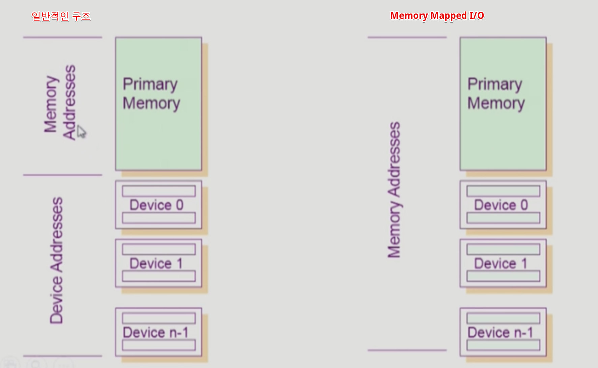
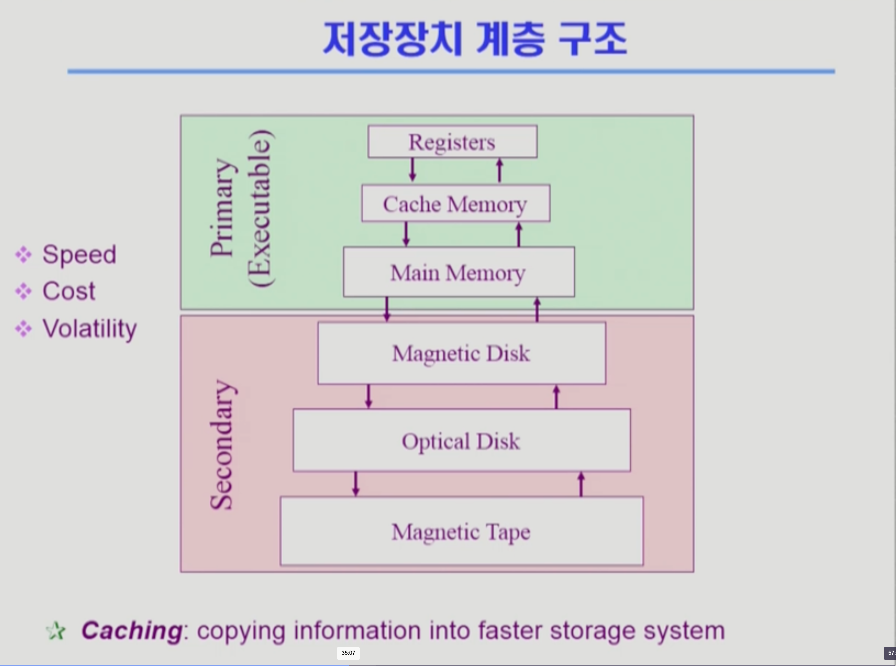
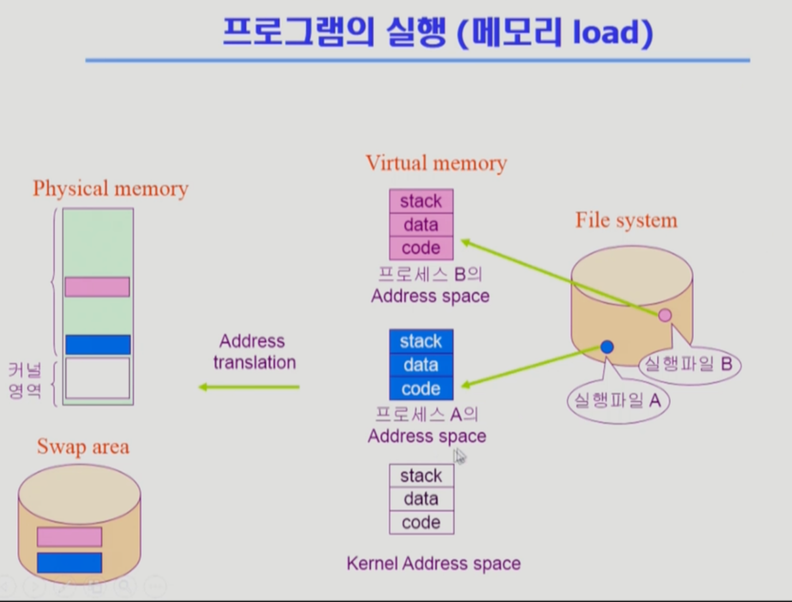
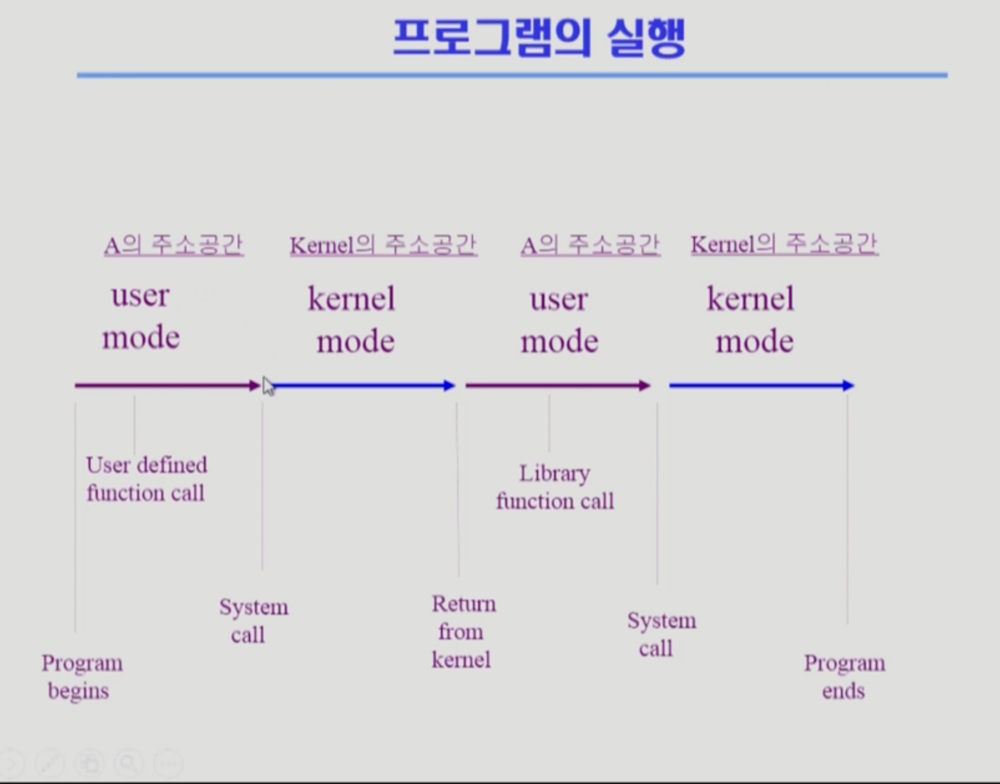

SystemStructure & Program Execution 1
===
이화여자대학교 반효경 교수님의 운영체제 강의를 요약한 내용입니다.  [강의 링크](http://www.kocw.net/home/cview.do?cid=4b9cd4c7178db077)  
# 1. I/O
## 1.1. 동기식 입출력, 비동기식 입출력
동기식 입출력(snychronous I/O), 비동기식 입출력(asynchronius I/O)는 어디에서 언급되는지에 따라 의미가 조금씩 다르다고 한다. 뒤에 배울 프로세스에 나올 synchronus와 지금의 synchronous도 조금 다르다고 하셨다.  
우선 그냥 보통 생각하는 동기식, 비동기식을 생각하면 될 것 같다. 간단히 말해서 동기식은 I/O를 기다리고, 비동기식은 기다리지 않고 작업하는 것이다.

### 동기식(snychronous)
**입출력에서 동기식**은 I/O 요청 후 입출력 작업이 완료된 후에야 사용자 프로그램으로 제어가 넘어가는 것을 말한다.   

구현 방법 1
- I/O 끝날때까지 CPU가 낭비된다.
- 그 뿐만 아니라 매 시점 하나의 I/O만 일어날 수 있다.  

구현 방법 2
- I/O 완료될 때까지 해당 프로그램에게서 CPU를 빼앗고, I/O 처리를 기다리는 줄에 그 프로그램을 줄 세운다.
- 다른 프로그램에게 CPU를 준다.  
### 비동기식(snychronous)
**입출력에서 비동기식**은 반대로 I/O 작업이 끝나면, 사용자 프로그램에 제어가 즉시 넘어간다.
- I/O 장치 여럿이서 동시에 실행될 수 있다. (요청을 던져놓고, 또 다른것 실행하다가 요청을 또 던지고...)  
- I/O 기다리지 않고 다른 작을 하다가 인터럽트로 알려준다.

>보통 write는 비동기식이 자연스러우나, 값을 제대로 확인 하고 싶으면 동기식으로 사용할 수도 있고, 상황에 따라 다르다.

## 1.2. 인터럽트, DMA
### 인터럽트
원래 메모리는 CPU만 접근할 수 있으나, 워낙 I/O 장치도 다양하고 많으며, 작은 일마다 빈번히 인터럽트가 들어오기에 CPU의 효율성이 떨어진다.  
그렇기 때문에 DMA를 사용하며, local buffer에 데이터가 어느정도 쌓이면 전달한다.
### DMA(Direct Memory Access)
빠른 입출력 장치(빈번하게 I/O발생)를 메모리에 가까운 속도로 처리하기 위해 사용한다. CPU의 중재 없이 buffer storage의 내용을 메모리에 block 단위로 직접 전송한다.

## 1.3. 서로 다른 입출력 명령어

  

  

### 일반적인 메모리 구조
- 메모리와 각 장치들의 주소가 별개이다.
    - 로드 스토어와 같은 메모리에 접근하는 instruction
    - 별개의 I/O 장치에 접근하는 special instruction
### 주소 연장?
- I/O장치에 메모리 주소를 매겨서 사용하는 방법
- Memory Mapped I/O에 의해 통제된다.

# 2. 저장장치 계층 구조

  

  

## 2.1. Primary(Executable) vs Secondary
맨위에 사실상 CPU가 있다고 생각하고 그림을 살펴보자.
### Primary(Executable) (연두색)
- 보통 휘발성
- 요즘은 새로운 것들이 생겨나서, 메인 메모리도 비휘발성인 경우들이 있다.(2014년 강의임)
- CPU에 직접 접근(byte 단위 접근 가능해야)이 가능하다(Execuatable 하다). 예시로 dram(메인메모리)은 바이트 단위 접근이 되지만, 하드디스크는 안된다.
### Secondary (분홍색)
- 비휘발성
- CPU에 직접 접근 불가

## 2.2. ❗️캐시메모리
(대략적으로) cpu가 1클락 당 1개의 명령어를 처리한다면, 메모리는 10~100클락의 싸이클을 가진다. 속도차이가 많이난다. 이런 속도 차이를 완충해주는 것이 캐시메모리이다. 메인 메모리보다 용량이 적고 많은 것을 담지는 못하지만, 당장 필요한 것만 올려서 쓴다. 이전 데이터를 담아두었다가 필요할때 빠르게 재사용하는 것이다.  
많은 것을 담지 못하므로, 메모리처럼 꽉 차면 또 무언가를 쫓아내야 한다. 그런 것을 관리하는 것이 caching을 할 때 중요한 사안이라고 한다.  

**캐시메모리 요약**
- 용량이 적지만 빠름
- 이전 데이터를 복사한 임시 저장소, 필요할 때 빠르게 꺼내쓰므로 cpu와 메모리의 속도 차이 완화

# 3. 프로그램의 실행 (메모리 load)

  

  

## 3.1. 가상메모리
실행파일을 실행시키면, 메모리에 올라와서 프로세스가 된다. 그런데 그 전에 중간에 가상메모리를 거쳐서 간다. 가상메모리는 각 프로그램이 가진 독자적인 공간이다. 특정 프로그램을 실행 시, 위 그림처럼 0번 부터 시작하는 독자적인 메모리 주소 공간(address space)을 차지한다.

## 3.2. code, stack, data
**code**는 cpu를 실행할 기계어 코드를 담고 있다.
**data**는 변수나 자료구조 가진다. 
**stack**은 함수 호출 리턴 시 데이터를 쌓는다.

가상 메모리(논리 주소)에서 물리 메모리(물리 주소) 주소가 변환된다. 이떄 주소를 변환해주는 하드웨어 장치(나중에 설명)가 있다.  

### Swap area
- 당장 사용하지 않는 내용 저장
- 메모리의 연장공간
- 휘발성 : 끄면 의미 없는 정보가 되어버림

사실 위에 그림처럼 주소공간이 연속적으로 할당되지 않는다. 쪼개져서 물리적 메모리나 Swap area에 나뉘어진다. 당장 사용하지 않는 것은 디스크의 swap area에 올리고, 당장 사용할 내용만 메모리에 올려서 낭비를 방지한다.  
그림에서 하드디스크가 두 개 나오는데, 오른쪽은 파일시스템 관련 저장을 의미하며, swap area는 메모리의 연장공간으로 휘발성이다. 사실 정보는 남지만, 의미 없는 정보가 되기 때문에 휘발성으로 보았다.

## 3.3. 커널 주소 공간의 내용
### code
- 시스템콜, 인터럽트 처리 코드
- 자원 관리를 위한 코드
- 편리한 서비스 제공을 위한 코드
### data
- 하드웨어를 관리하기 위한 자료구조, 프로세스를 관리하기 위한 자료구조
### stack
-  사용자 프로그램마다 커널 스택을 따로 둔다.
## 함수
### 사용자 정의 함수
- 자신의 프로그램에서 정의한 함수
### 라이브러리 함수
- 자신의 프로그램에서 정의하지 않고 갖다 쓴 함수
- 자신의 프로글매의 실행 파일에 포함되어 있다
### 커널 함수
- 운영체제 프로그램의 함수
- 커널 함수의 호출 = 시스템 콜  

사용자 정의 함수나 라이브러리 함수는 프로그램 안에 들어있지만, 커널 함수는 그렇지 않다. 논리적 메모리 주소에서 사실상 점프를 하는데, 커널은 주소를 바로 점플 불가능해서 시스템콜을 해야 한다.

## 3.4. 프로그램의 실행

  

  

결국에는 유저모드 - 커널모드를 반복하며 실행된다. 중간에 사용자정의 함수, 라이브러리 함수가 호출되면서 시스템콜을 하면 운영체제로 전환된다.