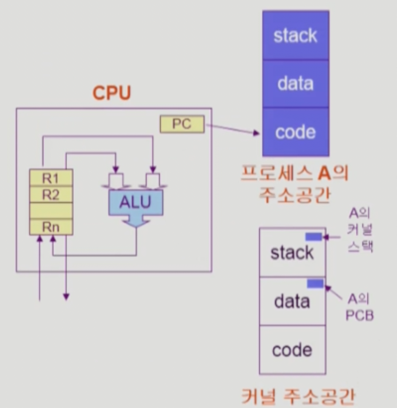
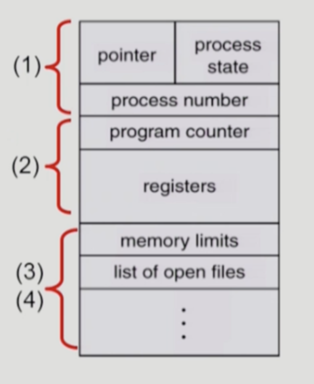
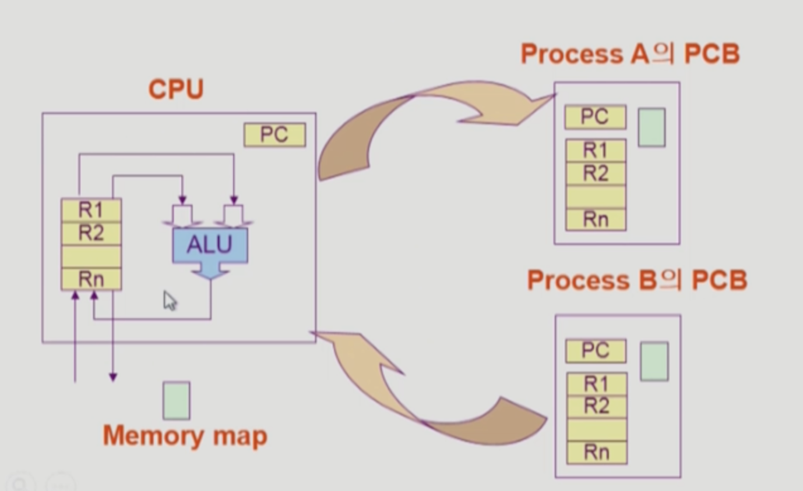

Process 1
===
이화여자대학교 반효경 교수님의 운영체제 강의를 요약한 내용입니다. 틀린 부분이 있다면 지적해주시면 감사하겠습니다.  [강의 링크](http://www.kocw.net/home/cview.do?cid=4b9cd4c7178db077)
# 1. 프로세스의 개념
프로세스는 한 마디로 실행중인 프로그램을 말한다.

## 1.1. 프로세스의 문맥(Context)
  
<!--  -->

프로세스의 문맥은 특정 시점을 놓고 봤을 때, 현재 프로세스의 상태를 나타내는데 필요한 모든 요소들을 말한다.  
PC가 어디를 가르키는지, 프로세스 메모리에 무엇을 담고 있는지(code 실행하다가 stack에 뭐를 얼마나 쌓았나?), data에 실행하면서 바꾸곤 하던 변수값이 지금은 얼마인지, 레지스터에 어떤 값 넣고 어떤 인스트럭션까지 실행 했는지 등 다양한 정보를 저장한다.

**정리하자면,**

- CPU 수행 상태를 나타내는 하드웨어 문맥
	- Program Counter
	- 각종 register  

-> 프로세스는 cpu를 가지고 매 순간 인스트럭션을 실행한다. 이 시점에 어디까지 실행했는가를 알려면, 레지스터에 어떤 값을 넣었고, pc가 어디 가르키는지 알아야 한다.
- 프로세스의 주소 공간
	- code, data, stack에 무슨 내용?
- 프로세스 관련 커널 자료 구조
	- PCB(Process Control Block) : 프로세스 하나 실행될때마다 하나씩 두면서 관리하는 역할. (cpu얼마나 주고 메모리 얼마주지? 나쁜짓 안하나?) -> cpu 상태뿐만아니라 운영체제가 이놈을 어떻게 생각하는지도 알아야한다는 것
	- Kernel stack : 커널은 여러 프로세스가 공유하는 코드이다. 어떤 프로세스든 요청할때 커널의 코드를 실행하고, 어떤 프로세스가 호출하느냐에 따라 스택을 별도로 둔다.

❓context를 왜 기억할까?
- time sharing, multitasking 등 프로세스를 번걸아 수행하는데, 현재 문맥을 백업해놓지 않으면 다음번 cpu를 잡았을때 어느 시점인지 알 수가 없다.

# 2. 프로세스의 상태
## 2.1. 상태
**Running**
- CPU를 잡고 instruction을 수행중인 상태  

**Ready**
- CPU를 기다리는 상태(메모리 등 다른 조건 만족, cpu만 오면 됨) 

**Blocked (wait, sleep)**
- CPU를 주어도 당장 수행 못함
- I/O 등의 event를 (스스로) 기다리는 상태
- process 자신이 요청한 event가 즉시 만족되지 않아 기다리는 상태
	- ex. I/O작업, 디스크에서 파일 읽어오기  

**Suspended (stopped)**
- 외부적인 이유로 프로세스의 수행이 정지된 상태. 중기 스케줄러한테 cpu를 빼앗긴 상태를 표현해준다.
- 프로세스는 통째로 디스크에 swap out 된다.
- 중기한테 뺏긴 경우 말고도, 사용자가 직접 프로그램을 중지시키는 break key의 경우도 있다.

**New**(프로세스 생성 중인 생태), **Terminated**(프로세스 자체는 수행이 끝나고 정리하는 작업 중)  

❗️Blocked는 자신이 요청한 event가 만족되면 Ready가 되지만, Suspended는 외부에서 resume 해줘야 Active가 된다.

## 2.2. PCB(Process Control Block)
  
<!--  -->

### 2.2.1. PCB란?
운영체제가 각 프로세스를 관리하기 위해 **프로세스마다** 유지하는 정보이다. 구조체로 유지하며 여러 구성 요소를 가진다.  

(1) OS가 관리상 사용하는 정보
- 스케줄링 정보, 우선순위  

(2) 문맥을 표시하기 위한 정보들
- PC, registers  

(3) 메모리 관련  
- coda, data, stack의 위치 정보  

(4) 파일 관련  

## 2.2. 문맥 교환(Context Switch)
  
<!--  -->

CPU를 한 프로세스에서 다른 프로세스로 넘겨주는 과정을 말한다. CPU가 다른 프로세스에게 넘어갈 때, CPU를 내어주는 프로세스의 상태를 해당 프로세스의 PCB에 저장한다. 그리고 새롭게 얻는 프로세스의 상태를 대상 프로세스의 PCB에서 읽어온다.
  
결국 각 프로세스가 가진 PCB에 당시 문맥을 저장해놓고, 필요할 때 불러오는 것이다.

❗️문맥교환이 아닌 경우 구분  
시스템콜이나 인터럽트 발생 시 항상 문맥교환이 일어나는 것은 아니다. 두 가지 경우를 비교하자면,
- Timer interrupt처럼 시스템콜에 의해 운영체제가 다른 사용자 시스템한테 cpu를 넘긴다면, 문맥교환이 맞다.
- 발생 이전의 프로세스한테 다시 cpu를 넘기는 것은 문맥교환이 아니다.  

물론 발생 이전의 프로세스에게 다시 넘기는 경우도 context의 일부를 PCB에 저장해야 한다. 하지만 전자에 비해 그 부담이 훨씬 적다.

# 3. 스케줄러
## 3.1. 스케줄링을 위한 큐
프로세스들은 각 큐들을 오가면서 수행된다. 마치 장치마다 queue가 존재하는 듯이 설명했지만, 사실상 커널의 data영역에 자료구조 큐를 만들고 운영하는 것이다. 또 큐에 프로세스가 줄을 선다고 이야기하지만, 사실상 PCB가 pointer를 활용해 줄을 서 있는 것이다.
### 3.1.1. Job queue
- 현재 시스템 내에 있는 모든 프로세스의 집합
- ready queue, device queue가 모두 포함
### 3.1.2. Ready queue
- 현재 메모리 내에 있으면서 CPU를 잡아서 실행되기를 기다리는 프로세스의 집합
### 3.1.3. Device queue
- I/O device의 처리를 기다리는 프로세스의 집합

## 3.2. 스케줄러 종류
### 3.2.1. Long-term scheduler(장기 스케줄러 or job scheduler)
- new 상태에 있는 어떤 프로세스에 메모리를 줄것 인지 결정
- degree of Multiprogramming(메모리에 프로그램이 몇 개 올라갔는가)을 제어
- 시분할에는 보통 장기 스케줄러가 없다. 지금의 시스템은 (무조건 Ready) 시작하면 바로 메모리를 준다. 그렇다면 메모리가 너무 많으면 어떻게 할까? -> 중기 스케줄러
### 3.2.2. Short-term scheduler(단기 스케줄러 or CPU scheduler)
- 어떤 프로세스를 다음번에 running 시킬지 결정
- 프로세스에 CPU를 주는 문제
- 충분히 빨라야 함(millisecond단위)
### 3.2.3. Medium-term scheduler(중기 스케줄러 or Swapper)
- 요즘은 장기 스케줄러를 사용하지 않고, 일단 메모리 올리고 중기 스케줄러를 사용한다.
- 여유 공간 마련을 위해 프로세스를 통째로 메모리에서 디스크로 쫒아냄
- 프로세스에게서 memory를 뺏는 문제
- degree of Multiprogramming 제어

