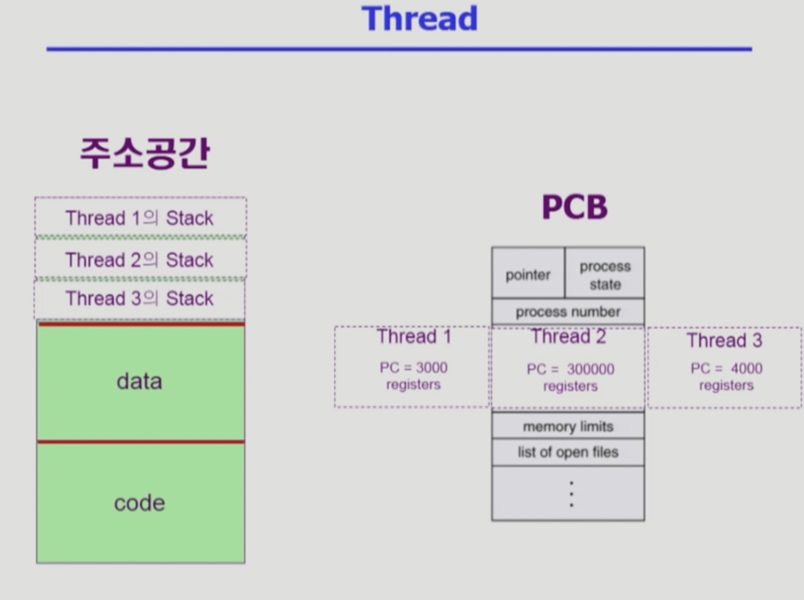
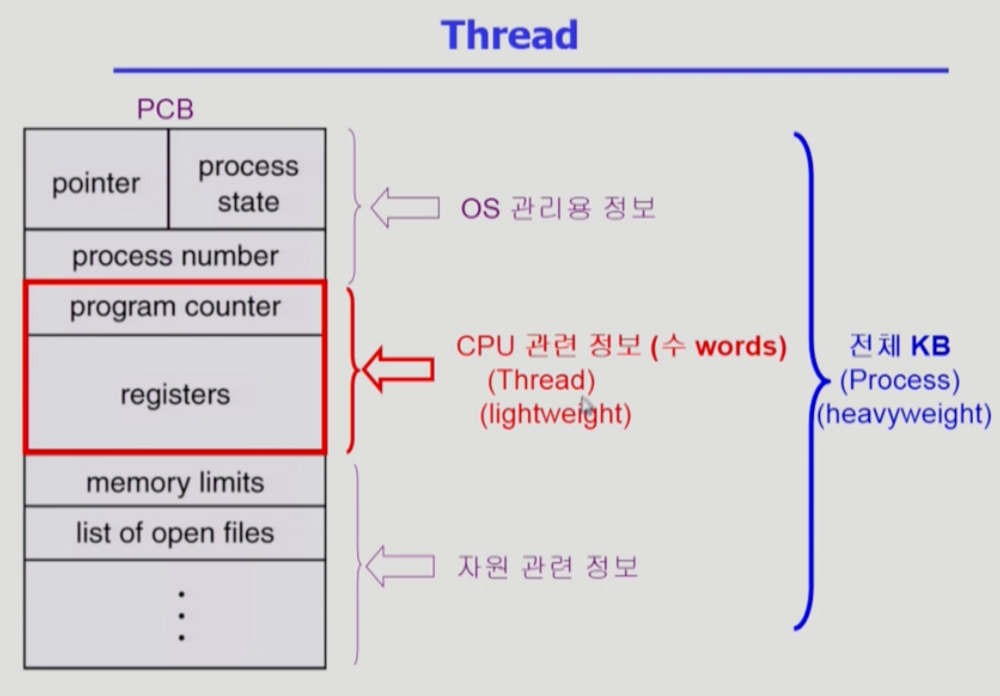

Process 2,3
===
이화여자대학교 반효경 교수님의 운영체제 강의를 요약한 내용입니다. 틀린 부분이 있다면 지적해주시면 감사하겠습니다.  [강의 링크](http://www.kocw.net/home/cview.do?cid=4b9cd4c7178db077)

## 질문
동기식 구현방법 1,2 입출력 비동기식 입출력 다시 정리

# 1. Thread
## 1.1. Thread란?
  

- 경량화된 프로세스(lightweight process)라고도 한다.
- 프로세스 내부에 CPU 실행 단위가 여러 개인 경우
    - 동일한 일을 하는 프로세스를 여러개 만든다면 별도의 프로세스를 만든다면 주소공간이 여러개 만들어지고 낭비가 생긴다. 주소공간을 하나 띄워놓고, 각 다른 코드 부분을 수행하도록 시킬 수 있다.
    - PC 여러 개, 각 실행단위마다 어떤 레지스터, 어떤 코드를 별도로 유지한다. 스택도 별도로 두게 된다. 
- 그림처럼 상태, 각종 자원 등은 공유한다. 공유할 수 있는 것은 최대한 공유한다.

## 1.2. 스레드 구성(별도로 가진 부분 - cpu 수행과 관련된 정보들)
- program counter
- register set
- stack space

## 1.3. 스레드가 동료 쓰레드와 공유하는 부분(= task)
- code section
- data section
- OS resources

  

결국에는 cpu 수행과 관련된 정보만 각 스레드마다 별도로 가지게 된다.

## 1.4. 이점
1. 응답성  

한 스레드가 Blocked(wating) 상태여도, 다른 스레드가 실행(Running)되어 빠른 처리 가능하다.  
웹브라우저를 예시로 들면, 보통 이미지 등의 읽기 요청은 오래걸리며 요청하고 프로세스를 블락시킨다. 그러나 스레드가 여러 개이면, 결과를 보고 실행하는게 아니라 요청한 스레드만 블럭되고, 다른 스레드가 이미 읽은 내용을 디스플레이해주는 방식으로 더 빠른 결과를 낼 수 있다.

2. 자원 공유

같은 일을 하는 프로그램을 하나의 프로세스를 두고 실행단위만 여러개 두면 효율적이다.

3. 경제성

프로세스를 만드는 것이 스레드 만드는 것보다 오버헤드가 크다. 문맥교환은 오버헤드가 큰데, 프로세스 내부에서 스레드끼리 CPU switching하는 것은 간단하다고 한다. 이 경우 대부분의 문맥을 그대로 사용한다. Solaris의 경우 프로세스와 스레드의 오버헤드 차이가 각각 30배(생성), 5배(switching)라고 한다.

4. MP(Multi Processor : cpu 여러개))

각각의 스레드가 서로 다른 cpu를 가지고 병렬적(parallel)처리가 가능하다. 예시로 여러 행을 여러 스레드가 동시에 계산한다면?

## 1.5. 커널스레드 ,유저스레드
### 커널스레드
- 운영체제 커널이 스레드가 여러 개인 걸 알고 관리한다.
### 유저스레드
- 운영체제는 프로세스에 스레드가 여러개인걸 모르고, 유저 프로그램이 라이브러리에서 지원받아서 스스로 관리한다.
- 커널 지원 없이, 어떻게 보면 커널입장에서는 일반적인 프로세스처럼 보인다.
- 프로세스 본인이 내부에서 cpu 수행단위를 나누는 것이기 때문에 구현상의 제약점이 있을 수 있다.
- real-time 스레드도 생성 가능하다.