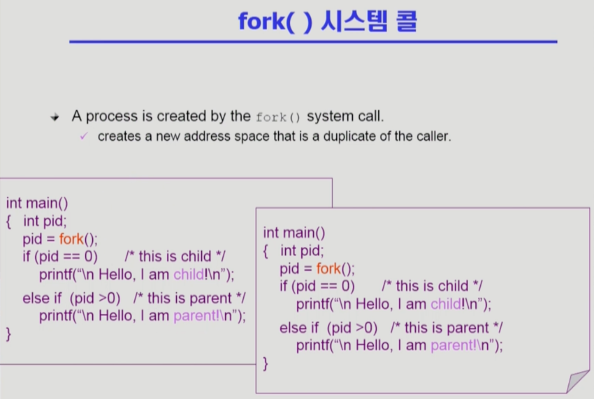
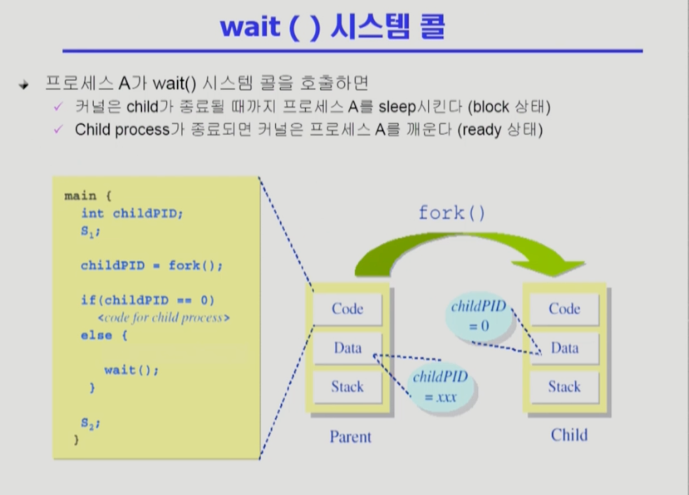
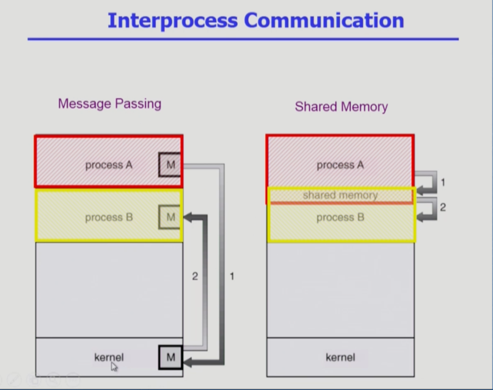

Process Management 2
===
이화여자대학교 반효경 교수님의 운영체제 강의를 요약한 내용입니다. 틀린 부분이 있다면 지적해주시면 감사하겠습니다.  [강의 링크](http://www.kocw.net/home/cview.do?cid=4b9cd4c7178db077)

# 1. 프로세스 관련한 시스템 콜
유닉스의 경우 fork() -> exec() 를 통해 자식 프로세스를 생성한다. 사용자 프로세스가 직접 못하고, 운영체제를 통해서만(시스템콜) 복제할 수 있다.
## 1.1. fork()

- 새거 만듦
- fork()를 하면 해당 코드의 처음부터 실행되는 것이 아닌, **fork()한 바로 다음 시점부터 실행**된다. 부모의 fork 시점의 context를 복제했기 때문이다.
- 복제된 프로세스와 원본을 착각하지 않기 위해 장치가 마련되어 있다.
- fork()함수의 return value로 부모 프로세스와 자식 프로세스를 구분한다.(원본 구분) -> 위 사진에서 부모, 자식 프로세스가 다른 로직을 실행하도록 하는 모습을 볼 수 있다.
## 1.2. exec()
- 새걸로 덮어씌움
- exec()는 어떤 프로그램을 완전히 새로운 프로세스로 태어나게 해준다. exec하면 처음부터 실행되고, 해당 프로그램 끝나면 종료된다. exec()을 호출한 프로그램에서 호출 이후의 코드들은 영원히 호출되지 못한다. exec()하여 완전히 새로운 프로그램이 되기 때문이다.
## 1.3. wait()
<!--    -->

- 자식 종료까지 잠듦
- ex) 리눅스 쉘에서 특정 프로그램을 띄우는 경우 쉘의 자식 프로세스가 띄워지고, 쉘은 wait 상태
### 자발적 종료
- 마지막 statement 수행 후 exit() 시스템 콜을 통해
- main함수 리턴되는 위치에 컴파일러가 자동으로 넣어주는 경우
### 비자발적 종료
- 부모가 자식 프로세스 강제 종료
    - 자식 프로세스가 한계치를 넘어서는 자원 요청
    - 자식에게 할당된 태스크가 더 이상 필요하지 않음
- 키보드로 kill, break 등
- 부모가 종료하는 경우
    - 부모 프로세스 종료 전 자식들이 먼저 종료됨.

## 1.4. exit()
- 프로세스 종료 및 모든 자원 반납하고 부모한테 죽는다고 알림

# 2. 프로세스간 협력
## 2.1. 독립적 프로세스
프로세스는 각자의 주소 공간을 가지며, 원칙적으로 하나의 프로세스는 다른 프로세스의 수행에 영향을 미치지 못한다.

## 2.2. 협력 프로세스
프로세스 협력 메커니즘을 통해 하나의 프로세스가 다른 프로세스의 수행에 영향을 미칠 수 있다.

## 2.3. 프로세스 간 협력 메커니즘(IPC : Interprocess Communication)

### 2.3.1. 메시지를 전달하는 방법
message passing : 커널을 통해 메시지 전달
- Direct Communicatoin
    - 통신하려는 프로세스의 이름을 명시적으로 표시
    - 물론 커널을 통해 넘겨줌
- Indirect Communication
    - mailbox (또는 port)를 통해 메시지를 간접 전달
    - 메일박스에 그냥 집어넣으면 누가 꺼낼지 알 수 없다. 아무나 꺼내가도록 설정도 가능하다. 당연히 커널을 통한다.
### 2.3.2. 주소 공간을 공유하는 방법
<!--    -->

shared memory : 서로 다른 프로세스 간에도 일부 주소 공간을 공유하게 함.
- (겹치는 부분) 일부 주소공간을 공유하도록 매핑해놓는다. 공유된 부분에 A가 어떤 내용을 적으면 B는 자신의 공간에도 포함되어 있기 때문에 바로 전달받아 볼 수 있다.
- 커널한테 시스템콜로 shared 하도록 매핑한 뒤에 가능하다.
- 프로세스끼리 신뢰가 있어야 한다.
