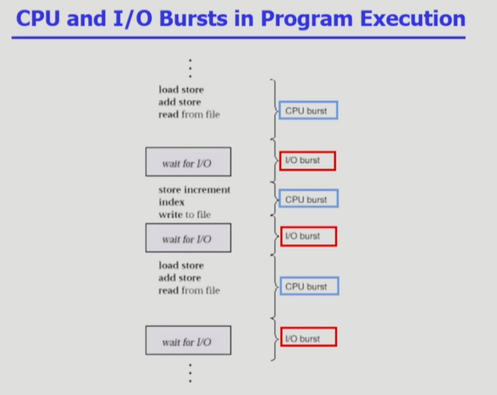
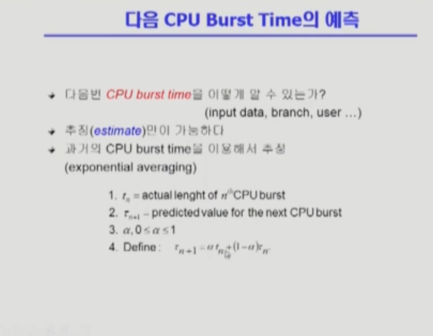

CPU_Scheduling1
===
이화여자대학교 반효경 교수님의 운영체제 강의를 요약한 내용입니다. 틀린 부분이 있다면 지적해주시면 감사하겠습니다.  [강의 링크](http://www.kocw.net/home/cview.do?cid=4b9cd4c7178db077)

# 1. CPU 스케줄링이란?
CPU 스케줄링은 ready queue에 대기하는 프로세스 중 누구에게 CPU를 줄 것인가를 결정하는 작업이라고 한다.   컴퓨터 시스템 안에 있는 job들이 I/O bound job과 CPU bound job이 섞여 있어서 스케줄링이 필요하다.

크게 두 가지 이슈로 보자면, **먼저,** 당장 어떤 프로세스에게 CPU를 줄 것인지를 결정해야 한다. 그리고 **특정 프로그램에 CPU를 준 다음에는** CPU를 특정 시점에 가져갈 것인지, 해당 작업을 끝낼때까지 기다릴 것인지도 결정을 해야한다.

## 1.1. CPU burst, I/O burst
<!--    -->

**CPU burst**는 프로그램을 실행할때, CPU에서 인스트럭션을 실행하는 단계를 말한다. 그에 반해 **I/O burst**는 I/O작업을 하는 단계를 말한다. 모든 프로그램의 실행은 위와 같이 CPU burst와 I/O burst를 번갈아가는 구조이다.

아무래도 **사용자와 상호작용이 자주 있을 경우**, I/O burst가 빈번하게 생길 것이고, 짧은 CPU burst를 가지게 될 것이다. **반대로** 유전자 염시 서열 분석과 같이 **오랜 시간 연산**이 필요한 거대한 작업들은 CPU를 오래 사용한 후, I/O 작업이 가끔씩 있는 구조이므로, CPU burst가 길어질 것이다.

## 1.2. CPU bound job, I/O bound job
이러한 **CPU burst가 짧은 프로그램**을 **I/O bound job**이라고 한다. 반대로 **CPU burst가 긴 경우**는 **CPU bound job**이라고 한다. 결국에는 CPU burst가 긴 경우와 짧은 경우가 섞여있다. 그런 여러 프로그램들을 적절히 스케줄링해주는 것이 CPU scheduling이다. 

예시로 I/O bound job의 경우는 interative한 경향이 있기떄문에, CPU를 늦게 주면 응답시간이 길어질 것이다.(사람이 오래기다린다.) 그런데 CPU bound job에 대책없이 CPU를 주고 작업을 계속하게 한다면, 짧은 CPU burst만 필요한 I/O bound job이 계속해서 대기하게 될 것이다. 적절한 스케줄링이 필요한 것이다.

## 1.3. CPU Scheduler & Dispatcher
CPU Scheduler
- Ready 상태의 프로세스 중에서 이번에 CPU를 줄 프로세스를 고른다.  

Dispatcher
- CPU의 제어권을 CPU scheduler에 의해 선택된 프로세스에게 넘긴다. (문맥 교환)
  
비선점형(nonpreemptive) 일단 CPU 주면 뺏지 않음
선점형(preemptive) CPU 줬다 뺐기 가능

# 2. 스케줄링 성능 척도
## 2.1.  시스템 입장 성능 척도
1. CPU utilization(이용률)
    - 전체 시간 중 CPU가 일한 시간 비율 -> 쉬게 하지 않아야 잘 쓰는 것
2. Throughput(처리량)
    - 주어진 시간동안 몇개의 작업을 완료했는지 -> 주어진 시간동안 많이 처리하면 좋다.

## 2.2. 프로그램(프로세스) 입장 성능척도
빨리 쓰고 I/O 하러 가는 것, 시간이 빨리 처리되어야

3. Turnaround time(소요시간, 반환시간)
    - 프로세스의 시작과 종료 시간이 아니고, CPU를 쓰러 들어와서 CPU를 쓰고 I/O 작업하러 나갈때까지의 시간을 말한다.
    - 프로세스의 도착에서 완료까지의 시간
4. Waiting time(대기 시간)
    - ready queue에서 기다리는 시간만 이야기 할 때
5. Response time(응답 시간)
    - CPU 쓰러 들어와서 처음으로 CPU 얻기까지의 시간
    - 특히 time-sharing 환경에서 처음으로 CPU 얻는 순간이 사용자 응답과 관련해서 중요한 개념이다.
    + 라운드로빈을 생각해보면, 여러번 기다리는 시간을 모두 합친 것이 waiting time, 처음으로 CPU 얻기까지를 response time으로 구분할 수 있다.
    + burst마다로 생각하기

# 3. 대표적인 CPU Scheduling
## 3.1. FCFS(First-Come First-Served)
- 단순하게 먼저온 순서대로 처리
- 비선점형 스케줄링 (먼저온 작업 처리하고 넘어감)
### 특징
- 먼저 온 작업에 따라 기다리는 시간이 차이가 크다.
    - 먼저 온 작업들의 소요시간이 길면 전체 대기시간이 커진다. -> Convoy effect : 긴 프로세스 뒤에 작은프로세스는 무작정 기다려야한다.
    - 먼저 온 작업들의 소요시간이 짧으면 대기 시간이 훨신 짧아진다.

## 3.2. SJF(Shortest)
- 가장 짧은 프로세스를 제일 먼저 스케줄
- 가장 짧은 평균 대기시간 보장 -> Preemptive인 경우
### Nonpreemptive
- 이미 CPU 줬다면, 도중에 더 짧은 작업이와도 CPU 뺏지 않는다.
- 작업이 끝나는 시점마다 스케줄링 일어남
### Preemptive
- 현재 남은 burst time 보다 더 짧은 작업 오면 CPU 뺏김.
- Shortest-Remaining-Time-First(SRTF)라고도 부름
- 언제든지 스케줄링이 일어날 수 있다.
### 문제점
- Starvation(기아 현상) : 짧은 프로세스가 많으면, 긴 프로세스에 도달할 수 없다.
- 실제 사용하기에 문제. CPU사용량을 미리 알 수 없다. CPU를 넘겨받은 시점에 어느 시점에 CPU를 넘겨줄지 모른다. 정확하진 않지만, 과거를 이용해 추정할 수 있다. 그렇다면 과거를 통해 미래를 어떻게 예측할까?

### Exponential Averaging
<!--    -->

- t는 실제 CPU 사용 시간 tau(𝝉)는 예측하는 시간 
- 과거의 t1~tn까지 CPU 사용시간이 주어진 상황에서 taun+1예측
    - 4의 식에서 n에다가 n-1을 대입해서 식을 만든 후, 만들어진 식을 4의 원래 식에다가 taun에 값을 계속 대입하면 tau0만 남게됨
- 최근에 있었던 값이 가중치를 더 가지게 됨(최근값을 더 많이 반영).

## 3.3. Priority Scheduling
- 우선순위가 높은 프로세스에게 CPU 할당
- 정수값으로 우선순위 표현. 보통 작은 숫자가 우선순위가 높다.
- SJF도 priority scheduling의 일종
### 선점형 vs 비선점형
SJF처럼 선점형, 비선점형 모두 있음. 중간에 우선순위가 높은 프로세스가 들어오면 넘겨줄 것인가에 따른 차이
### Starvation 문제
- 보완 : Againg 사용 -> 우선순위가 낮은 프로세스도 오래 기다리면 우선순위를 높여준다.

## 3.4. Round Robin (RR)
- 각 프로세스는 동일한 크기의 할당 시간(time quantum)을 가짐 (일반적으로 10-100 milliseconds)
- 할당 시간이 끝나면 프로세스는 선점당하고 ready queue에 줄을 다시 선다.
- 어떤 프로세스도 (n-1)q time unit이상 기다리지 않는다.
### 특징
-  **빠른 응답 시간**이 **장점**이다. 균등하게 분할하기 떄문에 짧은 프로세스 빨리 끝난다. 
- 대기시간이 자신이 CPU를 사용하는 양에 비례함
### time quantum에 의한 Performance
- q large => FCFS와 동일한 스케줄링이 되버린다.
- q small => 이상적인 RR일지 모르지만, context switch 오버헤드가 커진다.
+ 결국에는 적당한 크기의 time quantum을 지정해야 한다.
### 특이한 예시(안좋은 경우))
- 만약 CPU 사용시간이 모두 동일한 프로세스들만 있다면, 마지막까지 작업이 완료되지 못하다가 마지막에 동시에 작업이 해결된다. 
- 이런 경우에는 오히려 time quantum이 크면 average Turnaround time이 짧아진다.