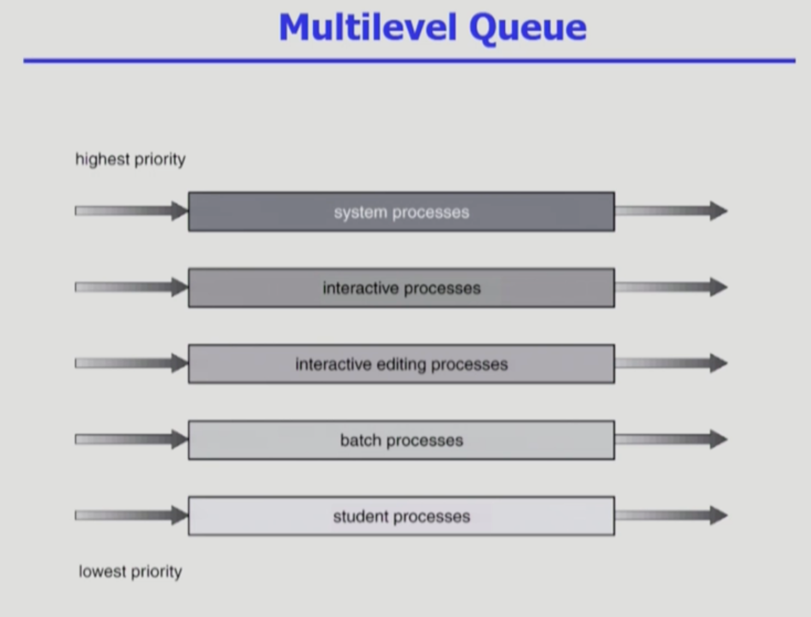
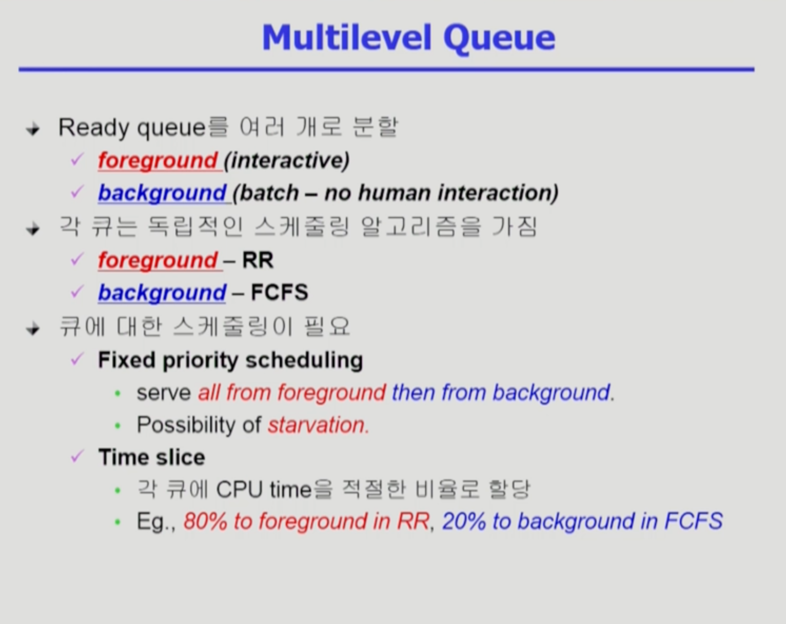
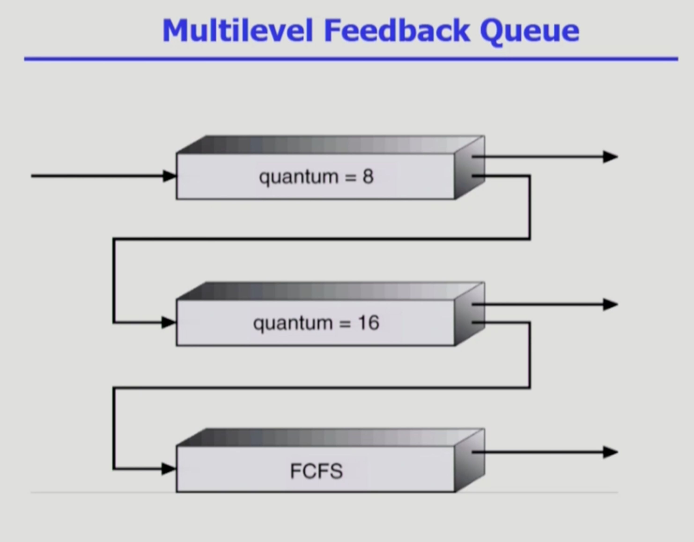
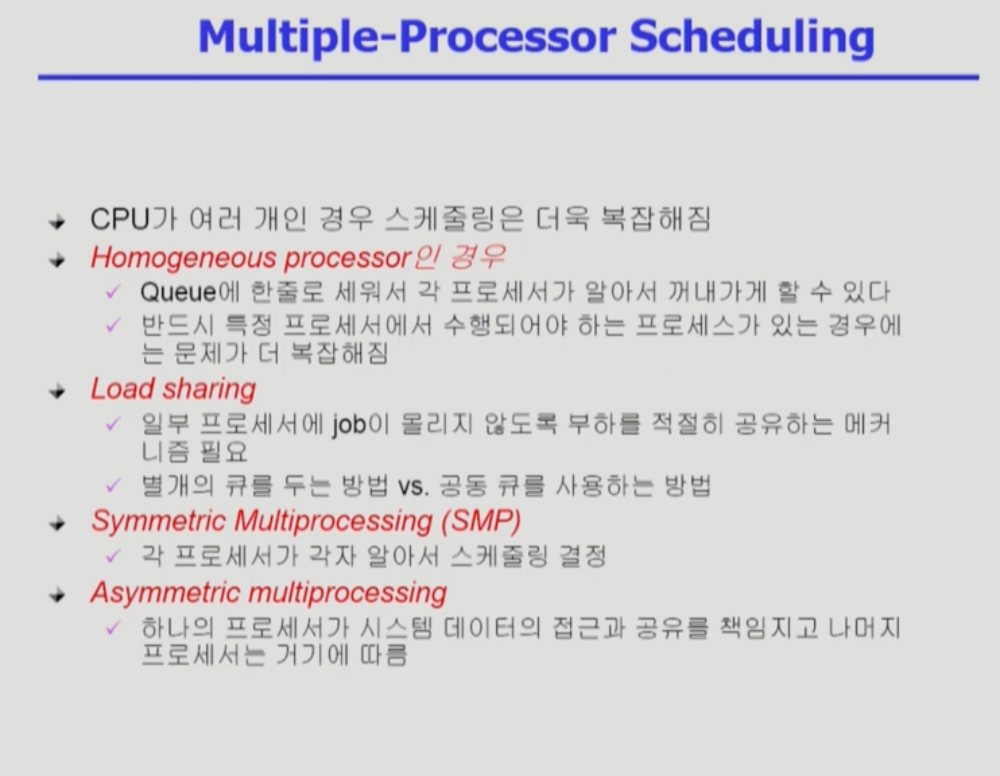
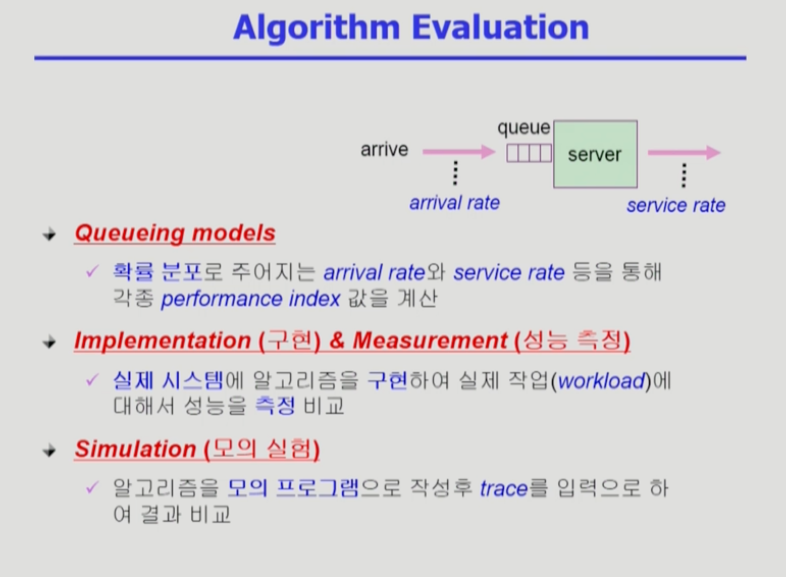

CPU_Scheduling2
===
이화여자대학교 반효경 교수님의 운영체제 강의를 요약한 내용입니다. 틀린 부분이 있다면 지적해주시면 감사하겠습니다.  [강의 링크](http://www.kocw.net/home/cview.do?cid=4b9cd4c7178db077)

# 1. Multilevel Queue

- 여러 줄로 cpu 사용을 기다린다 위로갈수록 우선순위가 높다.
- 우선순위가 높은 프로세스가 기다리고 있으면, 먼저 처리한다.
### 의문
- 프로세스를 어느 줄에 넣을 것인가?
- 무조건 우선순위 높은 프로세스만 우선하는가?

### Multilevel Queue 예시

- 레디큐를 여러개로 분할한다. -> interactive한 foreground와 interactive하지 않은 일괄처리를 하는 background
-  각 특성에 맞게 독립적인 스케줄링 알고리즘을 가지게 한다.
- 먼저 어느 줄에 cpu를 줄지 결정하고, 해당 줄에서 어느 프로세스에 작업을 줄 것인지 결정한다.
+ 큐에 대한 스케줄링
    + 우선순위를 강하게 적용하는 경우, 우선순위 높은 줄이 비어있는 경우에만 낮은 순위를 처리하게 할 수 있다. 하지만 기아현상의 가능성이 있다.
    + Time slice : 각 큐에 CPU time을 적절한 비율로 할당. 예를 들어 높은 큐에 80% 낮은 큐에 20%로 시간할당하기.

# 1.2. Multilevel Feedback Queue

- 우선순위가 변할 수 있는 구조
###
- 보통 RR을 사용하며 처음 들어오는 프로세스 우선순위 가장 높은 큐에 넣고, 내려갈수록 할당 시간을 길게 주고, 제일 아래는 FCFS 사용. 맨 위에 큐 비면 다음 큐 작업 
    - 맨 위에 큐에서 할당시간을 마치고 아래 큐로 강등 또 강등되면 FCFS
    - cpu 사용시간이 짧은 프로세스에게 우선순위를 많이 주는 방식
    - 예측이 필요없음.

# 3.5. Multiple-Processor Scheduling

### Homogeneous processor
- cpu 여러 개여도 Queue에 한줄로 세워서 알아서 꺼내가게 할 수 있다.
- 반드시 특정 프로세서에서 수행되어야 하는 프로세스가 있는 경우 복잡해짐
### Load sharing
- 특정 cpu만 일하면 안된다. 골고루 일시키기 위함. 부하 적절히 공유
- 별개의 큐를 두는 방법 vs 위에서처럼 공동 큐
### Symmetric Multiprocessing(SMP)
- 모든 cpu들이 대등함. 각 cpu가 알아서 스케줄링
### Asymmetric multiprocessing
- 하나의 프로세서가 시스템 데이터의 접근과 고유를 책임지고 나머지 프로세서는 거기에 따름

# 3.6. Real-Time Scheduling
- real-time 실시간 : (데드라인안에 끝내기 보장)
- 보통 미리 스케줄링해서 데드라인 보장
- 주기적으로 활성화해야하는 경우 ex) 10초에 한번씩 잡아서 1초동안은 cpu를 써야한다.
### Hard real-time systems
- 반드시 데드라인 지켜야함
### Soft real-time computing
- 일반 프로세스에 비해 높은 priority를 갖도록 해야함

# 3.7. Thread Scheduling
### Local Scheduling
- 사용자 프로세스가 직접 쓰레드를 관리하고 운영체제는 그 쓰레드 존재를 모름
- 운영체제는 모르기때문에 해당 프로세스에게 cpu를 줄지 말지만 선택
- 어떤 쓰레드를 스케줄할지 사용자 수준의 thread library에 의해 결정
### Global Scheduling
- 운영체제가 쓰레드의 존재를 이미 알고 있음
- 운영체제가 어떤 쓰레드 스케줄 할지 결정

# 4. Algorithm Evaluation(평가)
그림에서 server는 cpu로 생각하면 된다.

### Queueing models
- 최근에는 시스템에서 직접돌리는 방식을 선호하기때문에 사용 빈도가 떨어져가는 듯. 이론적으로 쓰기도
### Implementation(구현) & Measurement
- 실제 시스템에 구현해서 작업을 시켜서 성능 측정. 실측
### Simulation(모의 실험))
- 구현보다 훨씬 간단함
- ex) SJF계산하는 프로그램 작성해서 비교하기
- 실제 프로그램을 통해 추출한 input데이터를 trace라고 한다. 시뮬레이션 프로그램에 input으로 들어가는 데이터. 임의로 만들수도 있고, 실제 프로그램을 돌리면서 뽑아낼 수 있다.