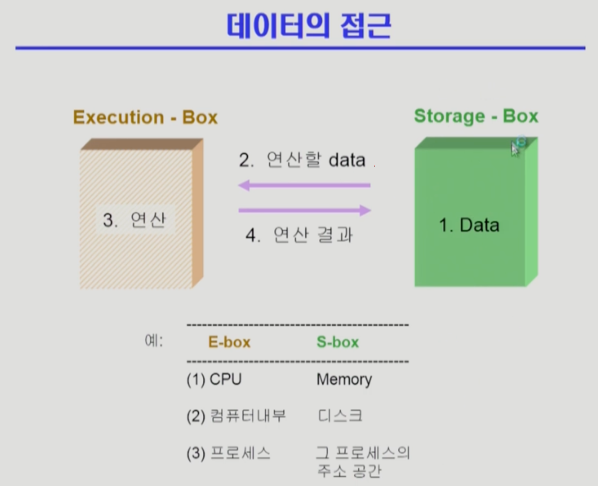

Process_Synchronization1
===
이화여자대학교 반효경 교수님의 운영체제 강의를 요약한 내용입니다. 틀린 부분이 있다면 지적해주시면 감사하겠습니다.  [강의 링크](http://www.kocw.net/home/cview.do?cid=4b9cd4c7178db077)

# 1. Synchronization의 필요
## 1.1. 데이터의 접근
<!--    -->

이해를 돕기 위해 저장소를 Storage, 연산하는 곳을 Execution이라는 이름으로 임의로 지정한 상태이다. 컴퓨터 시스템에는 이런 구조가 자주 있다. 데이터가 저장된 곳에서부터 연산할 데이터를 받아서 연산을 하고, 다시 결과를 전달해주면 그것을 저장하는 것이다. 그림의 예시처럼 Memory, 디스크, 주소 공간 등의 경우이다.

- 여러 Execution박스가 Storage를 공유 시 문제가 생길 수 있다.
    누가 먼저 읽어왔는가에 따라 결과가 달라질 수 있다.
    - process_sychronization이 이슈가 되는 이유
## 1.2. Race_Condition(경쟁 상태)
동시에 접근해서 생기는 문제들
- 여러 프로세스들이 동시에 공유 데이터를 접근하는 상황
- 데이터의 최종 연산 결과가 마지막에 그 데이터를 다룬 프로세스에 따라 달라진다.

<!--    -->

### 1.2.1. 여러 연산 박스가 저장 박스를 공유한다면?

- 왼쪽 박스는 1을 더하는 연산, 오른쪽 박스는 1빼는 연산
- 왼쪽에서 데이터를 읽어가서 하나 증가시키는 동안, 오른쪽에서 데이터를 읽어간다면?
    - 더하기 전의 데이터를 읽어서 빼서 돌려줬기떄문에, 빼기밖에 반영이 안된다.

### 1.2.2. CPU가 여러 개라면? 
**race condition** 발생 가능 경우들
- 공유메모리를 사용하는 프로세스들
- 유저 레벨에서는 별다른 문제가 없더라도, 커널에 있는 데이터가 공유 데이터이기 때문에 문제가 발생할 수 있다.
    - 시스템콜로 커널의 코드가 실행 중(커널의 데이터 접근, 변수 변경)인 상황에서 cpu를 뺏겨서 또 다른 프로세스한테 cpu가 넘어간 상황.   
    만약 여기서 또 시스템콜을 해서 커널의 코드가 중복으로 실행되는 경우 겹친다.
    - 커널의 코드 실행중에 인터럽트가 들어옴. 인터럽트 처리 코드도 커널의 코드이기 때문에 겹친다.

# 2. OS에서의 race condition
## 2.1. 커널 수행 중 인터럽트 발생
<!--  -->

커널 수행 도중 인터럽트 발생 시, 인터럽트 처리 루틴도 커널 코드라서 주소를 공유하면서 문제가 생긴다.  

그림을 보면, 커널이 cpu에서 실행하면서 count의 값을 증가시킨다. 보통 다음과 같이 여러 개의 인스트럭션으로 실행된다. 
- 1 메모리에 변수 값을 cpu의 레지스터로 불러들임
- 2 증가시킴
- 3 다시 메모리에 변수위치에 가져가서 씀

위 과정 중 중간(읽어들인 상태)에 인터럽트가 들어오면 인터럽트 처리 루틴이 수행된다. 만약 1번의 읽는 내용만 실행하고 인터럽트를 받았다고 가정해보자. 인터럽트를 받았기 떄문에, 인터럽트 처리 루틴이 발생해서 count--를 한 후, 다시 문맥교환을 해서 커널을 수행하던 위치로 돌아오게 된다. 처리 루틴에서 count--를 했지만, 하지만 이미 이전에 1을 실행했을때 불러온 count값을 기준으로 값을 증가시키고 메모리에 가져간다. 즉, count--가 반영되지 않는다. 최종 연산 결과만 반영되는 것이다.

- count++ 과정동안 인터럽트를 차단하는 방식으로 해결힌디.

## 2.2. 프로세스가 시스템콜로 커널모드일때, 문맥교환이 일어나는 경우
<!--    -->

user mode - kernel mode 반복해서 수행하는 그림이다. 시스템콜을 해서 kernel mode일때, 값을 변경 중에 본인이 **할당시간이 끝나서** cpu가 B한테 넘어간 경우. B에서 증가시킨 내용이 무시될 수 있다.
### 해결
커널모드일때는 할당시간이 끝나도 cpu를 빼앗지않도록 함. 할당시간이 편차가 생길 수 있다. 하지만 time-sharing은 real-time이 아니다. 시간을 정확히 지켜야하는 경우가 아니므로 큰 문제 없다.

## 2.3. Multiprocessor에서 shared memory 내의 kernel data
<!--   -->

## 2.4. Process Synchronization 문제
- 공유 데이터에 동시 접근은 데이터의 불일치를 발생시킬 수 있다.
- 일관성 유지를 위해 협력 프로세스 간의 실행 순서를 정해주는 메커니즘 필요
- race condition을 막기 위해 concurrent process는 동기화가 잘되어야 함
### 해결
- 커널 전체 락/언락하기 : 한번에 하나의 커널만 들어갈 수 있게 하는 방법
- 해당 데이터 락/언락하기 : 데이터를 가져가기전에 lock을 걸고, 처리 후 unlock

# 3. The Critical_Section Problem (임계구역)
<!--    -->

- n개의 프로세스가 공유 데이터를 동시에 사용하기를 원하는 경우
- 공유 데이터를 접근하는 코드를 **critical section**이라고 한다.

# 4. Critical_Section 해결을 위한 Algorithm (소프트웨어적 해결)
<!--    -->

- 크게 critical section인 코드와 그렇지 않은 코드로 구분 가능하다. (공유 데이터에 접근하거나 그렇지 않거나)
- critical section에 동시에 여러 프로세스가 들어가지 못하게 하기 위해 entry section에서 lock하고, exit section에서 unlock하여 해결 가능.

## 4.1. 해결책의 3가지 필요조건
### 4.1.1. Mutual Exclution(상호 배제)
- 어떤 프로세스가 critical section 부분을 수행 중이면 다른 모든 프로세스들은 각자의 critical section에 들어가면 안 된다.
### 4.1.2. Progress(진행)
- 아무도 critical section에 없으면 critical section에 들어가고자하면 통과시켜줘야한다.
### 4.1.3. Bounded Waiting(유한 대기)
- 다른 프로세스들끼리 독점하여 생기는 Starvation 방지. 프로세스가 critical section에 들어가려는 요청을 한 후 해당 요청이 허용될 때까지 다른 프로세스들이 critical section에 들어가는 횟수에 한계가 있어야한다.
### 가정
- 모든 프로세스의 수행 속도는 0보다 크고, 프로세스들 간의 상대적인 수행속도는 가정하지 않을때.

## 4.1. 알고리즘 1
<!--    -->

- P0은 turn이 0일떄 critical section 들어갈 수 있다는 의미이다.
- while문을 순회하다가, 자신의 turn이 되면 critical section에 들어간다.
- critical section에 들어갔다 **나오면서 다른 프로세스의 turn으로 바꾸어준다.**
+ 문제 : turn을 다른 프로세스가 바꿔주지 않으면 들어갈 수 없다. 극단적인 경우 영원히 들어갈 수 없다.
    + 예시로 만약에 두 개의 프로세스가 있는데, 한 프로세스만 빈번히 critical section에 들어간다면 어떻게 될까? 계속해서 교대를 해주지 않기 때문에 들어갈 수 없는 경우가 생긴다. 최악의 경우 나머지 한 프로세스가 한 번 critical section에 들어가고 다시는 들어가지 않는다면, 영영 들어갈 수 없을 것이다.
+ **Mutual Exclution** 는 만족하지만 **Progress**를 만족 못시킨다. 

## 4.2. 알고리즘 2
<!--   -->

- 프로세스마다 자신의 flag를 가진다. flag는 자신이 critical section에 들어가고자 하는지 표현한다. 처음엔 false이다.
- 들어가고자 할때 flag를 true로 바꾸고, 상대방의 flag를 체크한다. 들어간다고 깃발을 들어표시한다고 상상하자.
+ 문제 : 자신의 깃발을 들은 상태에서 cpu를 빼앗기면, cpu를 가져간 프로세스도 깃발을 들어버린다. 가져간 프로세스는 깃발이 들린것을 보고 critical section에 들어가지 않고 기다린다. 그러다가 cpu가 넘어가고 상대방도 기다린다. 다르게 말해서 그림에서 둘 다 2행까지만 수행 후 끊임없이 양보하는 상황이 발생하는 것이다.
+ **Mutual Exclution** 는 만족하지만 **Progress**를 만족 못시킨다.

## 4.3. 알고리즘 3 (Peterson's Algorithm)
<!--    -->

- turn과 flag 모두 사용
- 들어가고자 할때 깃발을 들고 turn을 상대방에게 준다.
- 상대방이 깃발을 들고 있고, turn도 가지고 있을 경우 기다린다.
- 하나라도 아니면 critical section에 들어간다.
+ **Mutual Excultion** , **Progress**, **Bounded Waiting** 모두 만족
+ 문제 : Busy Waiting(=spin lock)!
    + 쓸데없이 while문을 계속 돌면서 본인의 cpu 할당시간을 낭비한다. critical section이 비워지려면 멀었는데 기다리느라 낭비하는 경우.

# 5. Synchronization Hardware (하드웨어적 해결))
<!--    -->

인스트럭션 실행 도중에 cpu가 뺏기진 않기 때문에, 인스트럭션 하나로 데이터를 읽고 쓰는 작업을 동시에 실행할 수 있다면, lock 문제를 간단하게 해결할 수 있다.  
위의 예시 Test_and_set(a) : 두 가지 작업(1,2)을 atomic하게 수행한다. 코드부분을 보면 while(Test_and_Set(lock)); 와 같이 갼댠하게 해결한다.
