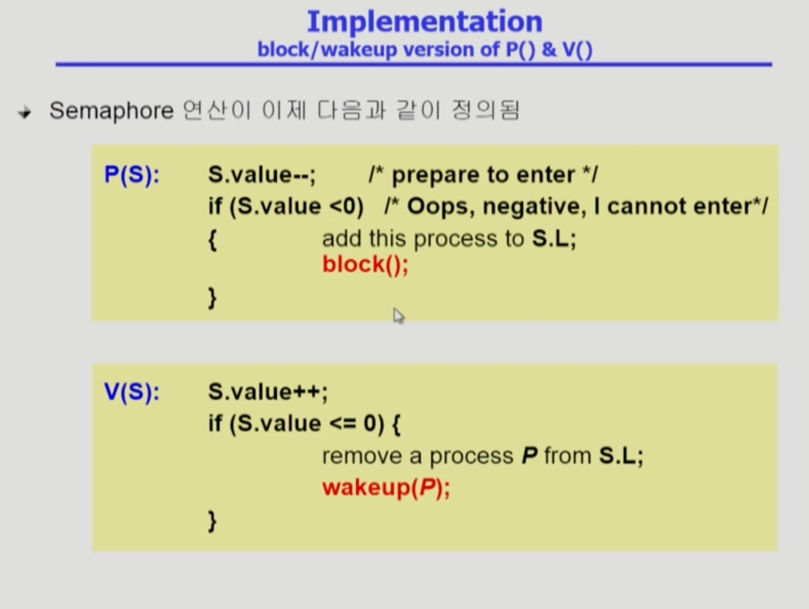

Process_Synchronization2
===
이화여자대학교 반효경 교수님의 운영체제 강의를 요약한 내용입니다. 틀린 부분이 있다면 지적해주시면 감사하겠습니다.  [강의 링크](http://www.kocw.net/home/cview.do?cid=4b9cd4c7178db077)

# 1. Semaphores
- [위키피디아 세마포어](https://ko.wikipedia.org/wiki/%EC%84%B8%EB%A7%88%ED%8F%AC%EC%96%B4)
- 두 개의 원자적 함수로 조작되는 정수 변수
- 공유 자원에 대한 접근을 제한하는 방법으로 사용
- 모든 교착을 해결하진 않음.
- 추상 자료형의 일종. 프로그래머가 편리해짐.
## 1.1. busy waiting 이용한 구현 방식

  
<!--  -->

- lock/unlock 을 semaphore을 통해 가능
- 공유자원을 획득하고 반납하는 것을 처리해줌
- 아래 두 가지 연산은 atomic해야함.

- P 연산
    - S 1감소
    - 공유데이터를 획득하는 과정
    - S값이 0이하면 while문을 돌다가 자원 생기면 가져감
    - 마찬가지로 busy waiting 생김
- V 연산
    - S 1증가
    - 다 사용하고 반납하는 과정

- Semaphore S 
    - S는 정수 값을 가질 수 있는데 S가 5이면 자원이 5개라는 뜻이며, P연산을 하면 자원을 하나 가져가서 4개가 되는 것. 
    - V 연산은 다 사용하고 내어놓는것. 자원이 4개인데 V 연산 시 5개가 됨.
- lock/unlock -> Semaphore 1 일때를 생각 -> P하면 lock, V하면 unlock

### 구현
  
<!--  -->

- mutex(mutual exclution)변수를 1로 두고, critical section 들어갈때 P, 나갈 때 V 연산
- Semaphore가 지원되면 P, V연산만 해주면 됨. 어떻게 P, V를 구현할지는 해당 시스템에서 생각하는 것. 추상 자료 형태로 제공되는 것.

- 구현을 busy-wait(=spin lock) 말고 Block & Wakeup(=sleep lock)형태로도 구현 가능 -> ready queue의 block 생각해보기

## 1.2. Block & Wakeup 이용한 구현 방식
 
<!--  -->

### 정의
- value는 semaphore 정수값, L은 잠든 프로세스를 연결하기위한 큐
- Semaphore획득 불가시 해당 프로세스를 block시키고, 누군가 반납하면 block된 프로세스는 wakeup
- 획득을 못한 프로세스들은 PCB를 semaphore 변수 큐에 매달아 놓는다.

### 구현
  
<!--  -->

- 마찬가지로 P는 자원 획득, V는 다 쓰고 반납
- P : 자원 여분 없으면 blocked, 있으면 획득
    - 값(S.value) 감소 시키고, 값이 음수면 S.L와 같이 재운 리스트에 연결
- V : 활용하고 반납. 해당 자원을 기다리는 프로세스 깨우기
    - (S.value <= 0)내가 자원을 내놓았는데도 값이 0 이하 -> P에서 먼저 변수값을 빼놨기 때문에 누군가 기다린다는 의미
    - S.L에서 빼오고 깨움

## 1.3. Busy Waiting vs Block & Wakeup
- 일반적으로 Busy-wait < Block/Wakeup 더 효과적
- Block/Wakeup 오버헤드가 들긴 한다.
    - Critical section의 길이가 긴 경우 Block/Wakeup이 적당하지만, 매우 짧으면 오버헤드가 더 커질수 있기 때문에 busy-wait도 쓸만하다. 

## 1.4. 두 종류 Semaphores
### Counting semaphore
- 도메인이 0 이상인 임의의 정수값 ex) 정수값이 5.. 10.. 이런식
- 자원 개수 여러개, 여분 카운팅하는 용도

### Binary semaphore(=mutex)
- 자원의 개수가 한 개인 경우. 0 또는 1만 가짐
- 주로 mutual exclusion

## 1.5. Deadlock and Starvation
  
<!--  -->

### deadlock
- 작업을 위해 두 가지 자원 S와Q를 모두 얻어야 한다고 가정해보자. P0가 cpu를 먼저 얻어서 S를 얻은 다음에 cpu를 빼앗겨서 P1이 Q를 획득한 경우 P0이 S를 가지고 있기때문에 영원히 조건을 충족 못하여 얻지 못한다. -> 데드락
- 해결 : Q를 획득하려면 S를 먼저 얻도록 설정하면 해결할 수 있다. P0이 S를 먼저 가져가도, P1은 Q를 먼저 얻지 않고 S를 기다리는 것이다.

### Starvation
- indefinite blocking. 특정한 프로세스가 자원을 얻지 못하고 영원히 기다림. 특정 프로세스들만 자원을 공유하면서 다른 프로세스들은 영원히 자기 차례가 오지 않음

### 식사하는 철학자
  
<!--  -->

- 젓가락이 인원 당 한 개씩만 놓여있다. 식사하려면 양쪽에 젓가락을 모두 사용해야 한다. 여러 사람이 같은 젓가락을 동시에 사용할 수 없다.
- 양 옆에서 계속 먹으면 한 명을 굶길 수 있음 -> Starvation
- 모두 동시에 왼손에 젓가락을 들고 오른손에 젓가락을 쥐려할때 -> Deadlock
- [위키피디아 철학자의 만찬](https://ko.wikipedia.org/wiki/%EC%8B%9D%EC%82%AC%ED%95%98%EB%8A%94_%EC%B2%A0%ED%95%99%EC%9E%90%EB%93%A4_%EB%AC%B8%EC%A0%9C)
