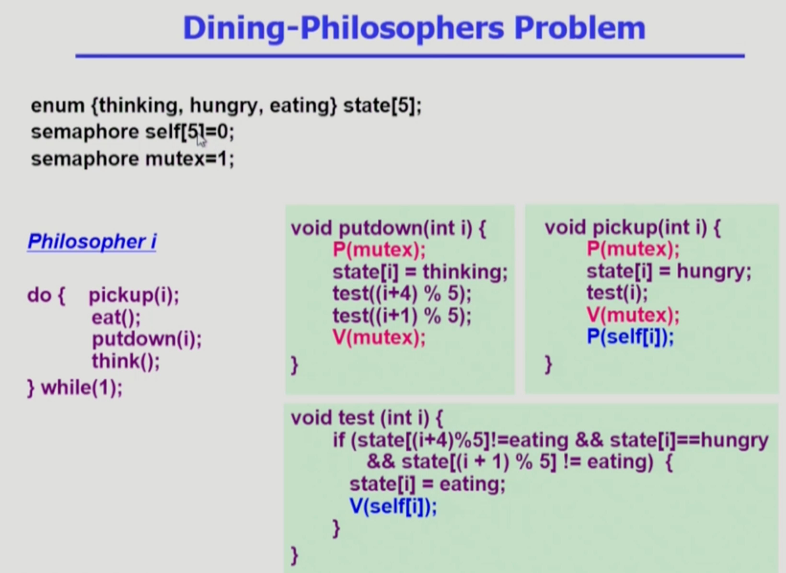

Process_Synchronization3
===
이화여자대학교 반효경 교수님의 운영체제 강의를 요약한 내용입니다. 틀린 부분이 있다면 지적해주시면 감사하겠습니다.  [강의 링크](http://www.kocw.net/home/cview.do?cid=4b9cd4c7178db077)

# 1. 동기화의 고전적인 문제들
## 1.1. Bounded-Buffer Problem (Producer-Consumer Problem)
  
<!--    -->

- 버퍼의 크기가 유한하다.
- 공유 데이터
    - buffer 자체 및 buffer 조작 변수(시작 위치를 뜻함)
- 두 개의 프로세스 종류 : Producer, Consumer 각각 여러 개
    - Producer : 공유 버퍼에 데이터를 만들어서 집어넣는 역할
    - Consumer : 공유 버퍼에 데이터를 꺼내감 
- 문제1 mutual exclusion -> bianry semaphore
    -  같은 empty buffer에 Producer 둘이서 동시에 데이터 집어넣으면 문제가 생기기 때문에 lock을 먼저 건다. 마찬가지로 동시에 꺼내가지 못하게 lock을 걸고 푼다.
    - 데이터를 집어넣거나 뺄때 빈 위치나 full 위치도 조정해줘야한다.
- 문제2 resource count -> integer semaphore
    - 버퍼가 가득차있는데 생산자가 또 들어옴. 생산자 입장에서는 비어있는 버퍼의 개수가 카운팅해야할 자원이다. 즉, 사용할 수 있는 자원이 없는 상태 -> 소비자가 내용을 꺼내가야만 빈 버퍼가 생기고 다시 넣을 수 있다.
    - 반대로 소비자가 다 꺼내갔는데, 소비자가 또 온 경우. full 버퍼가 소비자에겐 자원이고, 생산자를 기다려야한다.  

  

### Producer
- x에 item 공유 버퍼에 넣기
- P(empty) : 빈 버퍼가 있다면 하나 획득
- P(mutex) : lock, V(mutex) : unlock
- V(full) : full 버퍼 개수 증가
- 처음에 빈 버퍼가 없다면 소비자를 기다려야 한다.
### Consumer
- 위와 반대. full 버퍼가 있다면 획득하고 내려감. lock ->  공유버퍼에서 꺼내감 -> unlock
- 만약 처음에 full 버퍼가 없다면 생산자가 데이터를 만들어 넣어 증가시킬때까지 기다림

## 1.2. Readers and Writers Problem

  

- 쓰고 있을때는 기다려야하지만, 읽고있을때 누군가 또 읽으려하면 문제가 생기지 않으므로 허용한다.

  

- DB : 공유 데이터
- db : DB에 대한 lock을 관리하는 Semaphore 변수
- readcount도 공유 변수임. 모든 Reader들이 변경 가능
- 읽을때도 lock을 걸지만 읽을때 읽으러 오는 것은 허용해야함
### 1.2.1. Writer
- 쓰기전에 lock, 쓰고나서 unlock
- 문졔 : Reader가 계속 들어오면 Writer에게 Starvation 문제가 생긴다. -> 해결 : 큐에 우선순위를 둬서 Writer가 일정시간 이상 기다리지 않게 하기. 어느정도 Reader가 지나가면 막았다가 Writer차례도 줘야함.
### 1.2.2. Reader 과정
- (readcount == 1)최초로 읽으러 온거면 DB에 락(P(db))을 건다.
- 누군가 이미 읽고 있으면 락을 걸 필요가 없다.
- readcount도 공유되기 때문에, 동기화 문제가 생길 수 있다. 따로 lock/unlock을 해준다.(P(mutex), V(mutex))
- (readcount == 0) 만약 마지막에 빠져나가는 프로세스라면 DB를 언락한다.

## 1.3. Dining-Philosophers Problem
  

- 생각하거나 밥먹거나
- 밥먹으려면 양쪽 젓가락을 잡는 연산
- 5개의 젓가락이 1로 초기화 되어있기 때문에, 동시에 둘이 젓가락을 못잡는다.
- 모두 다 왼쪽 젓가락을 잡은 경우 -> 데드락
### 1.3.1. 데드락의 다양한 해결책
- 4명의 철학자만 동시에 앉을 수 있도록 한다.
- 젓가락을 두 개 모두 집을 수 있을때에만 집을 수 있게 한다.
- 비대칭 : 짝수(홀수)) 철학자는 왼쪽(오른쪽) 젓가락부터 집도록

### 1.3.2. 해결 코드 
  

- 3가지 상태로 철학자의 상태를 나누어놈.
- 각각의 상태변수를 가지지만, 옆에 철학자의 상태를 바꿀수 있기 때문에 state는 공유되며, 동시접근을 막기위해 lock을 위한 mutex 존재
- self[i] -> i번째 철학자가 젓가락 두 개를 다 잡을 수 있는 권한이 있는지, 특이하게 0(권한 없음)에서 시작
    - test의 조건을 만족하지 못하면, 젓가락을 잡을 권한을 얻지 못한다. 그때는 P(self[i]) 연산을 해도 젓가락을 얻지 못한다.
- 먹고 putdown할때 주변 철학자가 먹으려고 기다리고 있는지 test
###
- 모니터와 세마포어는 사실 기계적으로 서로 바꿀수있다?

## 1.4. Monitor

### 1.4.1. Semaphore의 문제점
- 아무리 쉽게 만들어도 코딩하기 힘들다.
- 정확성의 입증이 어렵다.
- 자발적 협력이 필요하다.
- 한번의 실수가 모든 시스템에 치명적 영향, 버그 잡기 힘듬
  

### 1.4.2. monitor 코드 구조
  

- 프로그래밍 언어 차원에서 동기화 문제를 해결.
- 공유 데이터를 내부의 프로시저를 통해서만 접근 가능
- 모니터 내부에 공유 데이터에 대한 선언
### 1.4.3. monitor 코드 구조(그림)

- 밖에서 아무나 공유데이터에 접근 하는게 아니라 내부 프로시저를 통해서만 가능.
- 모니터 내부에서 원천적으로 동시에 프로시저가 여러개 실행이 안되도록 통제 권한 줌 -> 프로그래머가 lock을 걸 필요가 없다.
- 하나의 프로세스만 활성화 되기 때문에 나머지 프로세스는 기다림.(entry queue)
- 공유 자원이 모자라면 그림의 x,y처럼 기다린다.
### 1.4.4. condition variable

- monitor에서는 자원의 개수를 count 하기 위한 **condition variable이** 있다.
- x의 여분이 있으면 바로 접근, 기다려야하면 x.wait()와 같이 기다리도록 한다.
- 접근을 다 하고 빠져나갈때는 signal()로 기다리는 프로세스 있는지 확인

### 1.4.5. Bounded-Buffer Problem 모니터 코드

- 공유 버퍼가 모니터 안에 정의. 내부 코드를 실행해야 생산이나 소비를 할 수 있다. semaphore처럼 lock/unlock가 불필요하다.
- wait(), signal() 을 통해 자원이 없을때 기다리고 작업후에는 서로에게 신호를 줘서 깨워준다.