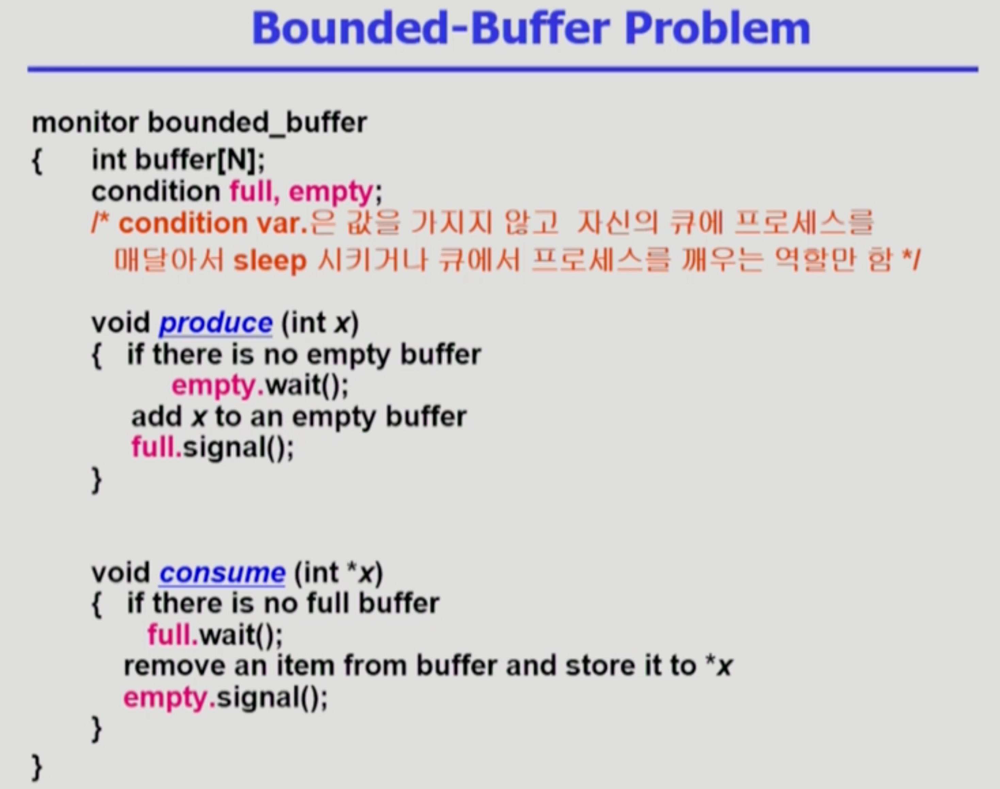
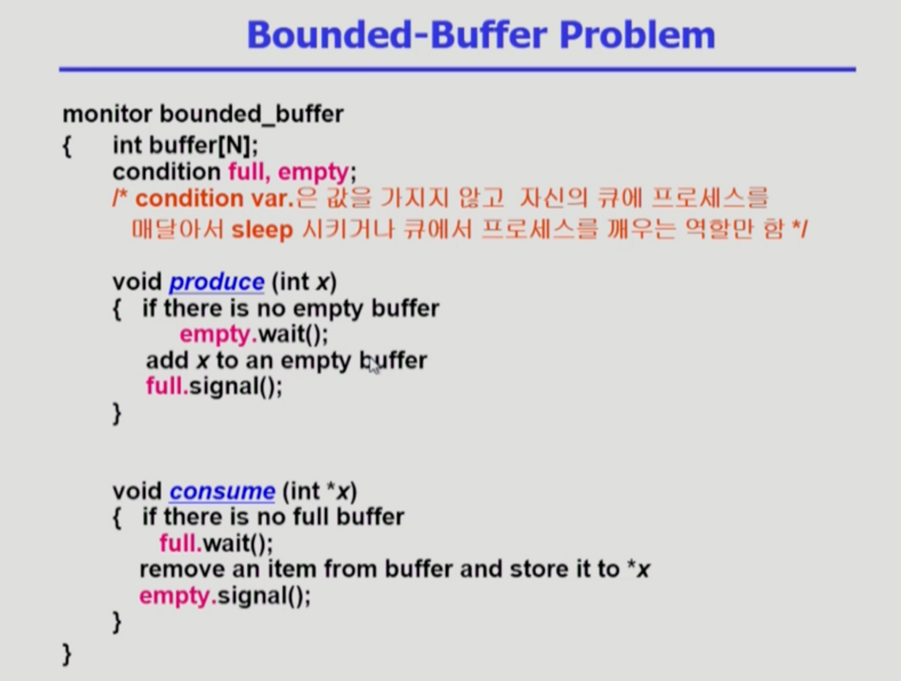
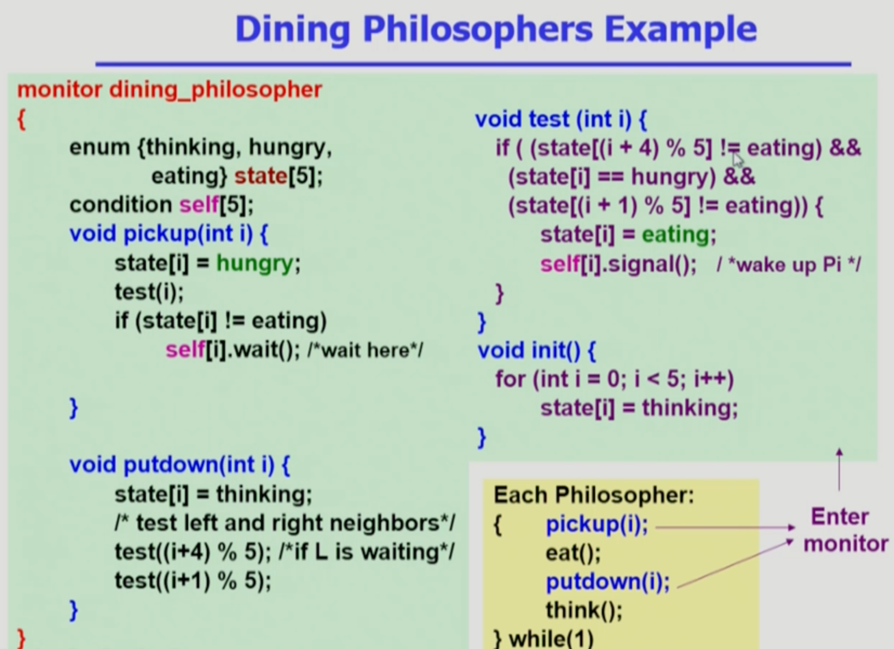

Process_Synchronization4
===
이화여자대학교 반효경 교수님의 운영체제 강의를 요약한 내용입니다. 틀린 부분이 있다면 지적해주시면 감사하겠습니다.  [강의 링크](http://www.kocw.net/home/cview.do?cid=4b9cd4c7178db077)

Process Synchronization (프로세스 동기화)
= Concurrency Control (병행 제어)

# 복습

# 1. Semaphore vs Monitor

- Semaphore -> 프로그래머 관점에서 어떻게 제어할 수 있는가?
- Monitor -> 프로그래밍 언어 차원에서 공유데이터에 동시접근 문제를 자동으로 해결해줌
    - 모니터안에서 프로세스가 사용하던 cpu를 빼앗겨도 실행하던 프로세스는 액티브한 상태로 모니터에 남아있는다. 다른 프로세스가 모니터 안에 코드 실행하지 못하고 모니터 밖에 큐(entry queue)에 줄서서 기다린다.
    - condition variable; condition fuill, empty는 값을 가지지 않고 자신의 큐에 프로세스를 매달아서 재우고 깨우는 역할만 함

### 두 가지 서로 conversion가능, 차이점?

- Semaphore 변수는 값을 가지고 있다. full, empty같은 값으로 자원의 개수를 체크하고, P(empty), V(full)연산을 해준다. 연산마다 값이 변화한다.

- Monitor는 값 없이 조건이 만족되지 않는지 프로그램적으로 체크해주고, wait(), signal()을 사용한다. signal()은 suspend(sleep)되어 있는 프로세스가 없으면 아무일도 일어나지 않는다.

사실은 두 가지의 목적자체가 다르다. **모니터**는 **동시접근을 막는 것**을 모니터차원에서** 지원**, **세마포어**는 **자원을 획득하기 위해 프로그래머가 알아서 P,V 연산**을 해야하는 것.

# 2. 식사하는 철학자 - 모니터

