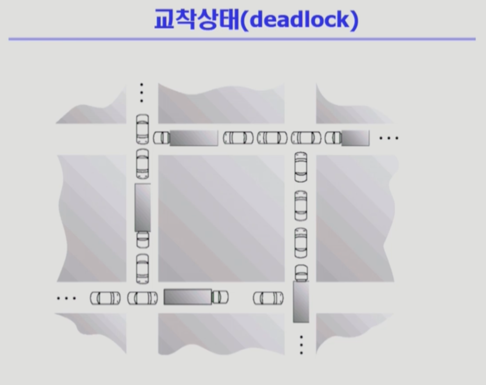
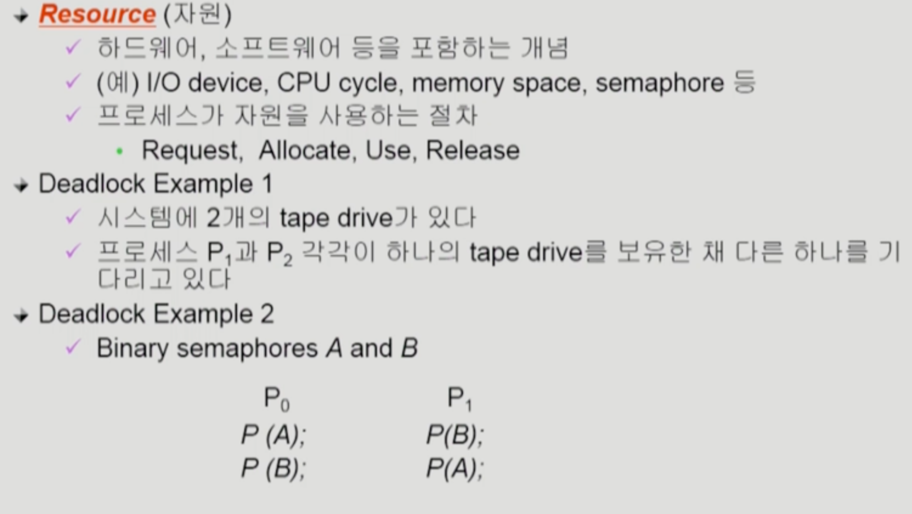
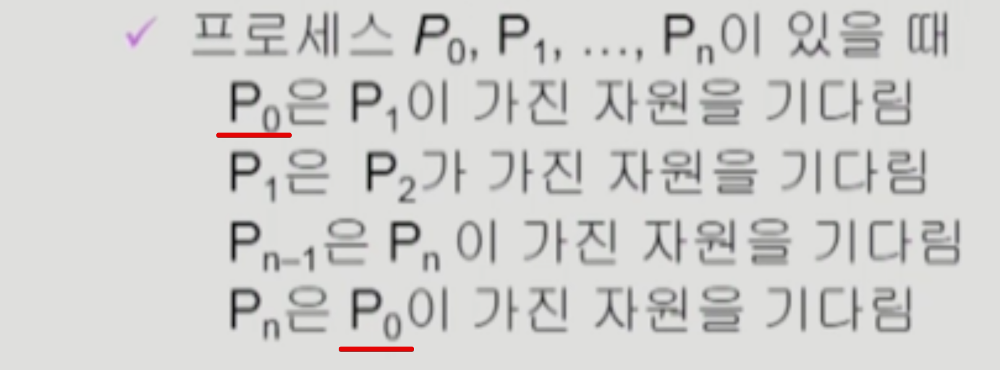
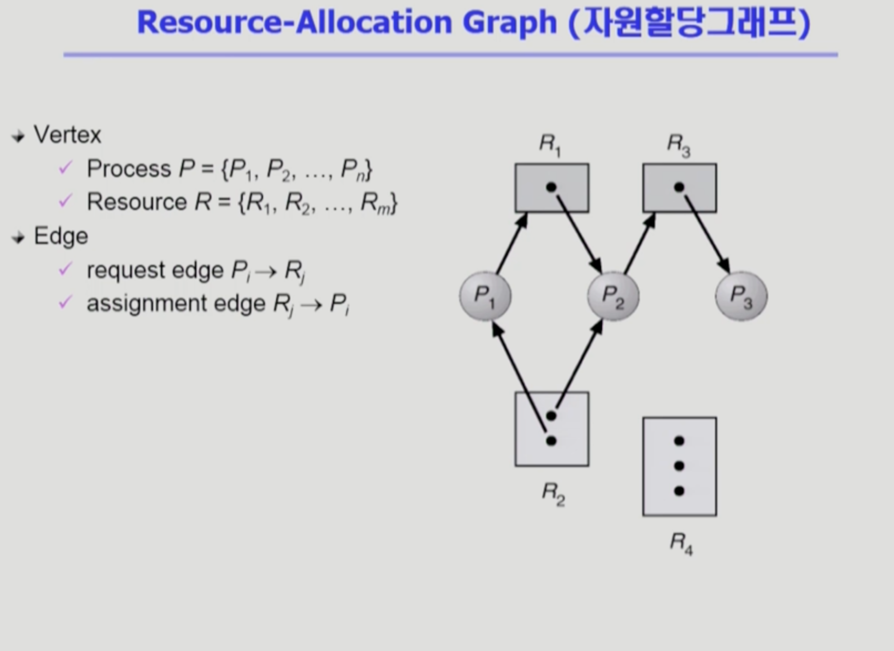
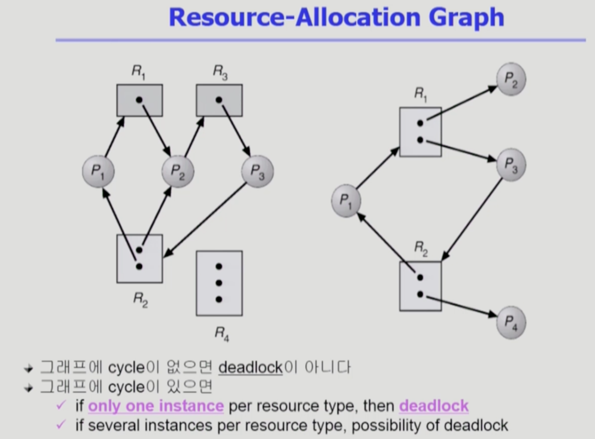
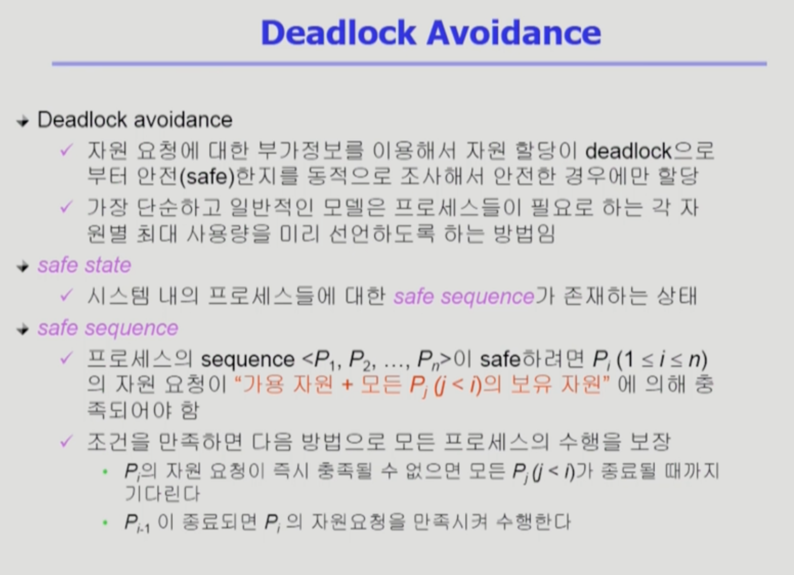
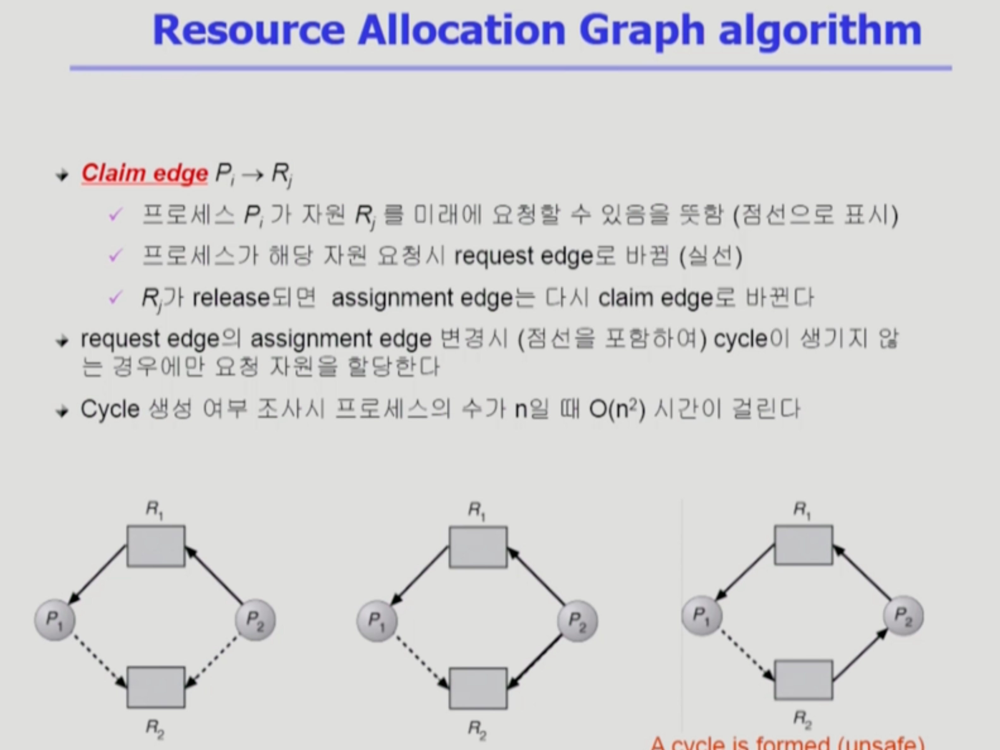
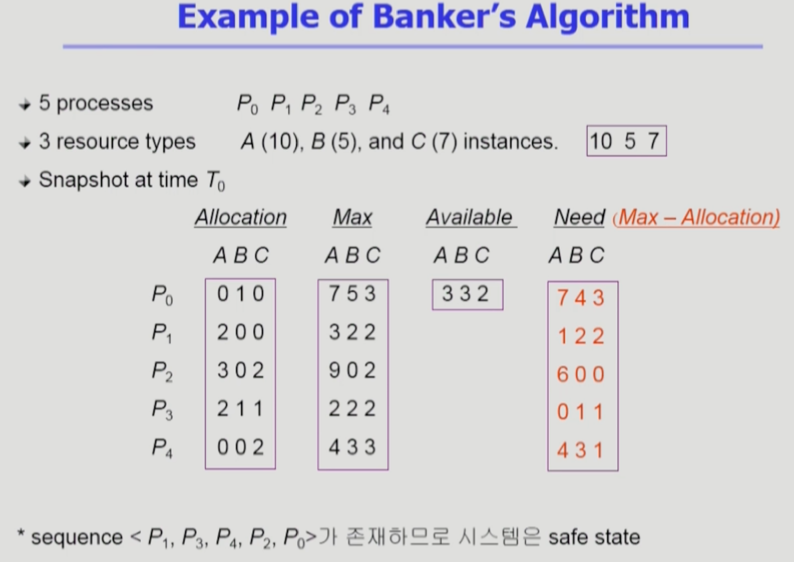

Deadlock1
===
이화여자대학교 반효경 교수님의 운영체제 강의를 요약한 내용입니다. 틀린 부분이 있다면 지적해주시면 감사하겠습니다.  [강의 링크](http://www.kocw.net/home/cview.do?cid=4b9cd4c7178db077)

# 1. Deadlock

데드락이란 일련의 프로세스들이 서로가 가진 자원을 기다리며 block된 상태이다. 앞의 그림을 보면 서로 앞의 차가 빠지길 기다리지만 서로가 서로를 막아 움직일 수 없다. 위와 같은 상태이다.

- 예시 : 
    - 테이프가 서로 한쪽식 가지고 원하는 경우
    - Bianry semaphores 
- 자원 사용 단계 : 요청(Request), 획득(Allocate), 사용(Use), 반납(Release)

## 1.1. Deadlock 발생의 4가지 조건
### Mutual exclusion(상호 배제)
- 매 순간 하나의 프로세스만이 자원을 사용
### No preemption(비선점)
- 프로레스는 자원을 스스로 내어놓을 뿐 강제로 빼앗기지 않음
### Hold and wait(보유대기)
- 자원을 가진 프로세스가 다른 자원을 기다릴 때 보유 자원을 놓지 않고 계속 가지고 있음.
### Circular wait(순환대기)
- 자원을 기다리는 프로세스간에 사이클이 형성되어야 함

## 1.2. 자원 할당 그래프

- 자원(R1~3) -> 프로세스 화살표 : 해당 자원이 해당 프로세스에 속해있다.
- 프로세스(P1~3) -> 자원 화살표 : 해당 프로세스가 해당 자원을 요청했다.(아직 미획득)
- 점 : 자원의 인스턴스 .

- 두 경우 모두 싸이클을 형성하고 있다.
- 인스턴스가 여러개인 경우 데드락일수도 있고 아닐수도 있다.
    - 왼쪽 그림의 경우 한 개도 내어놓지 않기떄문에 데드락이다.
    - 오른쪽의 경우 자원이  P2, P4가 여분의 자원을 반납할 가능성이 있기떄문에 데드락이 아닐 수 있다.

# 2. 데드락의 처리 방법
- Prevention / Avoidance : 미연에 방지.  위로 갈수록 강한 처리방법이다. (Prevention > Advoidance > Detection > Ignorance)
- Detection and recovery / Ignorance :  방치

## 2.1. Deadlock Prevention
- 데드락 4가지 필요 조건 중 하나를 원천적으로 차단하는 방법 (미연에 방지)
### 2.1.1. Mutual Exclusion 
애초에 상호배제가 없으면 데드락을 고민할 이유가 없음. 없앨 수 있는 조건이 아니다.
### 2.1.2. Hold and Wait 
자원을 기다릴때 자원이 없어야 한다. 요청 시 어떤 자원도 없다.
- 방법 1 : 프로세스가 시작될때 평생 필요로 하는 자원을 전부다 할당. 기다릴 일이 없다. 매 시점마다 필요한 자원이 다른데 모두 보유하면 비효율성이 생긴다.
- 방법 2 : 방법 1처럼 모두 보유하지 않고 그때그때 요청, 대신 요청해야할 자원이 생기면 보유 자원을 모두 놓고 다시 요청
### 2.1.3. No Preemption
선점 가능하게 하면 해결
- process가 어떤 자원을 기다려야 하는 경우 이미 보유한 자원이 선점됨. 모든 필요한 자원을 얻을 수 있을 때 그 프로세스는 다시 시작.
- State를 쉽게 save하고 restore할 수 있는 자원에서 주로 사용한다.(cpu, 메모리) 중간에 빼앗으면 하던일에 문제가 생기는 경우는 사용하기 힘듦.
### 2.1.4. Circular Wait
싸이클을 파괴하면 해결
- 모든 자원 유형에 할당 순서를 정하기
- 순서가 3인 자원 Ri를 보유 중인 프로세스가 순서가 1인 자원 Rj을 할당받기 위해서는 우선 Ri를 release
### 2.1.5. 단점
- Utilization 저하, Throughput 감소, Starvation 문제
## 2.2. Deadlock Avoidance 

- 자원의 부가정보를 활용해서 데드락 가능성이 없는 경우에만 할당 (미연에 방지)
- 프로세스 시작 시 해당 프로세스가 평생 쓸 자원을 미리 알고 있다고 가정하고 데드락을 피해가는 방법
- 가용 자원만 가지고 최대 요청을 처리할 수 있는 프로세스에게 투자 -> 최대 요청 만족했으니 언젠가 자원을 반납 -> 프로세스가 가졌던 자원이 가용자원이 됨 -> 가용자원 + 뱉어낸 자원으로 다른 프로세스도 처리
- safe -> 데드락 x / unsafe -> 데드락 가능성
## 2가지 경우의 Avoidance 알고리즘
### 2.2.1. **Resource Allocation Graph algorithm** 사용
Single instance per resource types 일때

- 점선은 현재는 아니지만 미래에 요청할 가능성이 있음을 뜻함. R2에 P1과 P2가 요청하면 점선이 실선으로 바뀜.
- deadlock avoidance는 최악의 가능성을 상정한다. 맨 오른쪽 그림처럼 P2가 R2에 자원을 요청하고 hold하게 되면 싸이클이 만들어지고 데드락의 가능성이 생긴다. -> 데드락의 가능성이 있는 자원 요청을 애초부터 받아들이지 않고 놔둔다. 예시로 P1이 요청하면 주지만(싸이클이 안생기기때문), P2가 자원을 요청했을떄 아무도 가지고 있지 않은 자원이더라도 주지 않는다.
### 2.2.2.  **Banker's Algorithm** 사용 
Multiple instances per resources types 일때
- safe할때만 자원을 할당해준다.

- Allocation : 할당된 자원
- Max : 평생 사용할 최대 자원
- Available : 가용 자원
- Need(Max - Allocation) : 추가로 요청할 수 있는 양
- 마찬가지로 최악을 상정하고, 최대로 요구할 수 있는 자원의 개수를 고려해서 요청을 받아준다.
### 예시 1 : P1 request(1,0,2)
- P1의 Need(1,2,2)를 가용자원(3,3,2)으로 모두 채울 수 있는지 보는 것이다. 충족되기 때문에 요청하면 준다.(데드락에 안전)
### 예시 2 : P0 request(0,2,0)
- 가용자원으로 B 2개를 줄 수 있지만, Need를 모두 줄 수 없다. 이런 경우에는 자원이 있어도 주지 않는다.
- P1가 최대 요청을 해버리면 **가용자원만으로는 처리가 안되기떄문**이다.
### 2.2.3. 단점
안전하게 사용하지만, 자원이 남아돌기떄문에 사실은 비효율적이다.