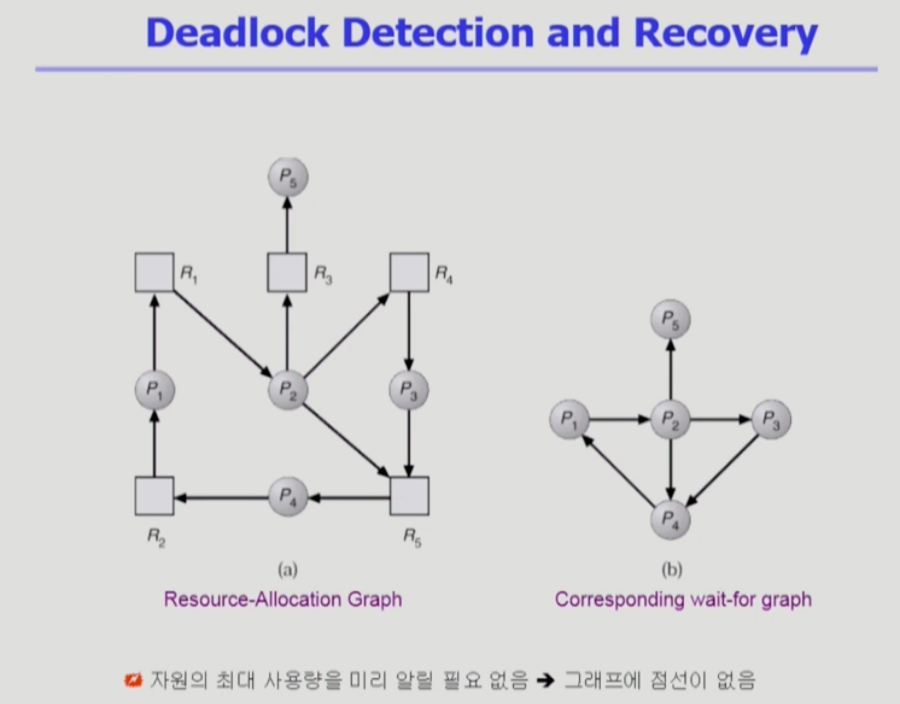
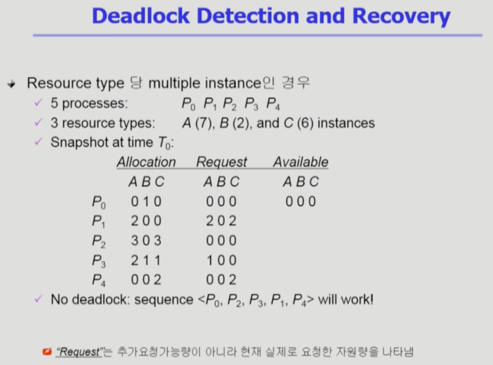
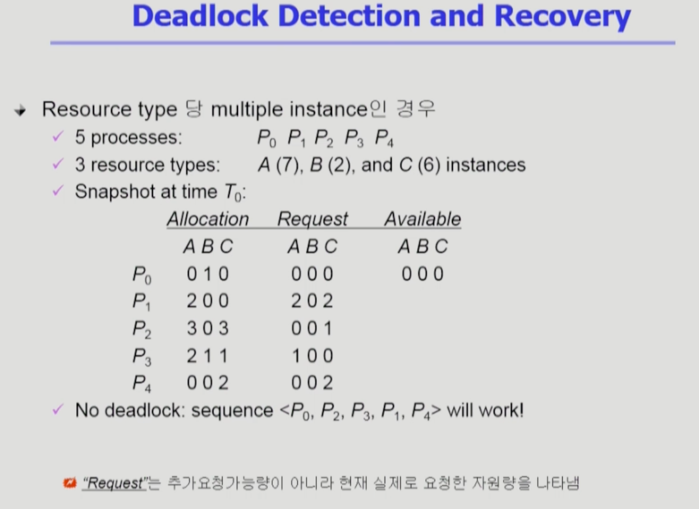
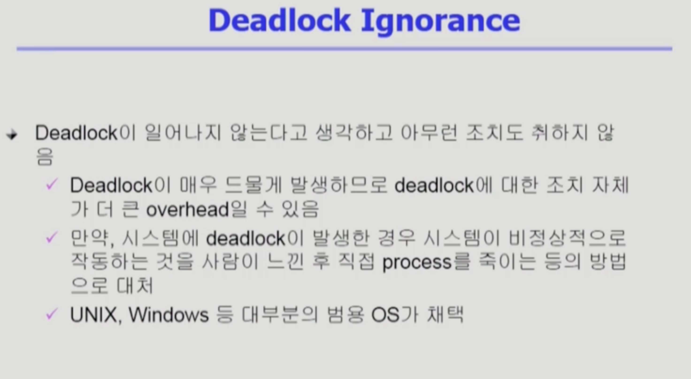

Deadlock2
===
이화여자대학교 반효경 교수님의 운영체제 강의를 요약한 내용입니다. 틀린 부분이 있다면 지적해주시면 감사하겠습니다.  [강의 링크](http://www.kocw.net/home/cview.do?cid=4b9cd4c7178db077)

## 2.3. Deadlock Detection and recovery 
- 방치하되 탐지 루틴을 둔다. 시스템이 느려지거나 하면 데드락을 탐지해서 해결
- 자원당 인스턴스 하나 -> 자원할당그래프
- 자원당 인스턴스 여러개 -> 표
- 사실상 하나일때도 표로하는게 편하다. 자원할당그래프는 표의 서브셋느낌이다. avoidance도 마찬가지.
### Detection

- 자원할당그래프에서 자원을 제거해서 wait-for graph를 그린다.
- 특정 프로세스가 요청한 자원을 어떤 프로세스가 가졌는지 가르키게 됨.

- P1이 (2,0,2)를 요청했지만 가용 자원이 없는 상황
- 낙관적으로 요청을 하지 않은 프로세스들이 자원을 반납할 것으로 예상. 이런식으로 요청을 받아들이는 sequnce가 존재한다고하면 데드락이 없다.

- 자신의 요청이 이뤄지기 전에는 가진 자원을 내놓지 않는다는 가정하
- 요청이 없는 것이 P0뿐이다. B 1개를 가지고 있는데, 반납해도 다른 요청들을 해결할 수 없다. -> 데드락
- 가용자원으로 처리 가능한게 있는지? 요청이 없는 프로세스들 자원 반납한다고 가정, 처리 가능한 것 있는지? 끝까지 못가면 데드락.

### Recovery
- Process termination
    - 데드락에 연류된 모든 프로세스 죽임
    - 연류된 프로세스를 하나씩 죽임. 데드락 없어질때까지 죽인다.
- Resource Preemption
    - 비용을 최소화할 victim 선정
    - safe state로 rollback하려 process를 restart
    - 문제 : 자원을 뺏었는데 뺏긴 프로세스가 다시 요청해서 가져간다? 똑같은 패턴이 계속될 가능성. 자원뺏는 패턴을 조금씩 다르게 하기.
    - Starvation 문제
        - 동일한 프로세스가 계속해서 victim이 되어서 굶는 경우
        - 비용 측면에 rollback 횟수도 같이 고려

## 2.4. Deadlock Ignorance

- 관여 x. 현대적인 운영체제, UNIX를 포함한 대부분의 OS가 채택
- 데드락이 생기지 않게 하는 것 -> 비효율적 자원 운용
- detection -> 조금만 느려졌을때 디텍션 루틴이 발생한다거나 하면서 오버헤드가 많이 발생할 수 있다.
