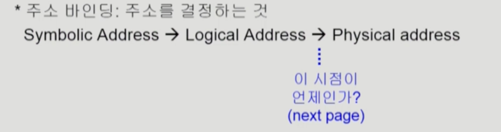

Memory_Management1
===
이화여자대학교 반효경 교수님의 운영체제 강의를 요약한 내용입니다. 틀린 부분이 있다면 지적해주시면 감사하겠습니다. [강의 링크](http://www.kocw.net/home/cview.do?cid=4b9cd4c7178db077)

# 1. Logical address vs. Physical Address
## 1.1. Logical address(=virtual adderess)
- 프로세스마다 독립적으로 가지는 주소 공간
- 각 프로세스마다 0번지부터 시작
- cpu가 보는 주소는 logical address임
- 주소는 바뀌지만 그 안에 코드 상의 주소는 logical address로 남아있다.

## 1.2. Physical address
- 메모리에 실제 올라가는 위치
- 실제로 사용하려면 논리적 주소는 물리적 메모리 어딘가에 올라가야함

- 주소 바인딩 : 주소를 결정하는 것

심볼로된 어드레스 사용 -> 컴파일, 숫자로된 주소 -> 주소변환해서 물리적 메모리로

# 2. 주소 바인딩 (Address Binding)

## 2.1. Compile time binding
- 컴파일할때, 물리적 메모리 주소를 결정한다.
- 시작 위치 변경 시 컴파일을 다시해야 한다.
- 이미 결정된 상태이므로, 물리적 주소로 갈 때 논리적 주소를 그대로 가져다 써야한다.
- 미리 결정되어야 하기 떄문에 비효율적. 이전에 컴퓨터 안에서 하나의 프로그램만 실행되는 환경에서 사용하곤 했다.
- 컴파일러가 만드는 해당 코드를 절대 코드(absolute code)라고 한다.
## 2.2. Load time binding
- 프로그램이 시작되어 메모리에 올라갈때 결정
- 컴파일러가 재배치가능코드(relocatable code)를 만들었을 때. 비어있는 위치는 어디든 갈 수 있는 코드
- ex) 500번대가 비어있는걸 보고, 해당 주소에 올린다.

## 2.3. Execution time binding (=Run time binding)
- 실행 시 주소가 결정되는 것은 load time binding과 같지만 주소가 실행 도중에 바뀔수가 있다.
- 300번째에서 700번째로 이동
- 지금의 컴퓨터 시스템에서 지원
- cpu가 메모리 주소를 요청할 때 마다 바인딩을 체크해야 한다.(address mapping table) ;물리적인 메모리가 어디 올라가 있는지 체크
- 하드웨어적인 지원이 필요

# 3. MMU

- 주소변환을 해주는 하드웨어 장치
- 두 개의 레지스터 이용해서 주소 변환(limit register, relocation register)

- 두 가지 레지스터에 의해 동적 재할당이 이뤄진다. 요청된 프로세스에 대해 relocation register에서 최솟값을 가지고 있다가, 요청한 논리적 주소에 더해서 물리 메모리의 위치를 찾는다.
- limit register가 없으면, 악의적인 프로그램에서 해당 프로세스의 limit을 넘은 부분까지 침범하여 다른 프로세스에 접근할 가능성이 있다.
# 4. 용어들
## 4.1. Dynamic Loading
- 해당 루틴이 불려질 때 메모리에 load
- memory utilization 향상
- 가끔씩 사용되는 양 많은 코드 유용
- 보통 프로그래머가 운영체제 지원없이 구현하는 것을 말하지만, 운영체제가 자체적으로 올리고 쫒는 것을 지칭하기도 한다. (OS는 라이브러리를 통해 지원 가능)
* loading : 메모리로 올리는 것

## 4.2. Overlays
- 메모리에 프로세스의 부분 중 실제 필요한 정보만을 올림 -> 차이가 없음?
- 프로세스의 크기가 메모리보다 큰 경우
- 프로세스를 한 번에 올릴 수 없는 작은 공간의 메모리를 사용하던 초창기 시스템에서 수작업으로 프로그래머가 구현하던 것이 시초이다. 매우 복잡. Manual Overlay

## 4.3 Swapping
- 프로세스를 일시적으로 통째로 메모리에서 backing store로 쫓아내는 것
- swap out : 메모리에서 쫓아냄, swap in : 쫓겨났던게 메모리로 올라옴
### Backing store(=swap area)
- 디스크
    - 많은 사용자의 프로세스 이미지를 담을 만큼 충분히 빠르고 큰 저장 공간
- Swap in/Swap out
    - 일반적으로 중기 스케줄러(swapper라고도 함)에 의해 swap out 시킬 프로세스 선정
    - priority-based CPU scheduling algorithm
        - priority가 낮은 프로세스를 swapped out 시킴
        - 높은 프로세스 메모리에 올려 놓음
    - Compile time 혹은 load time binding에서는 원래 메모리 위치로 swap in 해야 함
    - Execution time binding에서는 추후 빈 메모리 영역 아무곳에나 올릴 수 있음 -> 효율적 swap in을 위해 지원되면 좋음
    - 파일 입출력과 다르게 통째로 옮겨서 양이 많다. swap time은 대부분 transfer time(swap되는 양에 비례하는 시간)임. -> 원래는 하드디스크에서 접근 시간은 seek time이 가장 큰 부분을 차지하고, transfer time은 상대적으로 매우 미미하다. 하지만 양이 방대한 swapping 시스템에서는 양이 워낙 많기때문에 transfer time도 상당부분을 차지한다.
- 원칙적인 swap은 프로그램을 구성하는 주소공간이 통째로 이동하는 것을 말한다. 하지만 최근에는 프로그램의 일부, 예로들면 페이징할때 일부 페이지만 쫓겨나는 것 마저도 이 페이지가 swap out 되었다라고 말하기도 한다. 

## 4.4. Dynamic Linking
- Linking을 실행 시간(execution time)까지 미루는 기법
- Linking : 프로그램 작성 -> 컴파일 -> 링크(여러 군데 존재하는 컴파일된 파일들을 묶어 하나의 실행파일 만드는 것)
### 4.4.1.  Static linking
- 라이브러리가 프로그램의 실행 파일 코드에 포함된
- 실행 파일의 크기가 커짐
- 동일한 라이브러리를 각각의 프로세스가 메모리에 올리므로 메모리 낭비 eg.같은 기능을 하는 printf 함수 100개 코딩하면 100카피가 메모리에 올라감
### 4.4.2. Dynamic Linking
- 라이브러리 실행 시 연결됨
- 라이브러리 호출 부분에 라이브러리 루틴의 위치를 찾기 위한 stub이라는 작은 코드를 둠
- 라이브러리가 이미 메모리에 있으면 그 루틴의 주소로 가고 없으면 디스크에서 읽어옴
- 운영체제의 도움이 필요 
- 이것을 해주는 라이브러리를 shared library, shared object(linux), dnl(windows)

# 5. Allocation of Physical Memory
### 메모리 일반적인 두 영역
- OS 상주 영역 (interrupt vector와 함께 낮은 주소 영역 사용)
- 사용자 프로세스 영역 (높은 주소 영역 사용))

## 5.1. Contiguous allocation (연속할당)
- 각각의 프로세스가 메모리의 연속적인 공간에 적재되도록 함(이전의 예시들)

### 5.1.1. 고정 분할 방식 (Fixed Partition allocation)
- 프로그램이 들어갈 사용자 메모리 영역을 미리 영구적 분할(partition)으로 나누어놈.
- 균일하게, 가변적으로 모두 나눌 수 있음
- 외부조각 : 올리려는 프로그램보다 메모리 조각이 더 작아서 사용이 안된 공간
- 내부조각 : 올리려는 프로그램이 메모리 조각보다 작아서 프로그램이 할당되고 남은 사용안되는 공간

### 5.1.2. 가변 분할 방식 (Variable Partition alloction)

- 들어갈 메모리 영역을 미리 나누어 놓지 않는것.
- 프로그램이 실행될때마다 순서대로 쌓음. 프로그램 B가 끝나면 빈공간, D는 빈공간보다 커서 아래쪽에 들어간다. 빈공간보다 커서 못들어갔으니 외부조각이며, 남은 공간도 외부 조각이 된다.

- 종료가 되면 중간에 hole들이 생긴다.
- hole들 적당한 위치에 프로그램을 넣어야하는데 어디에?

### Dynamic Storage-Allocation Problem
- First-fit
    - 최초발견 hole에 넣기
- Best-fit
    - Size n 이상인 가장 작은 hole 찾아서 할당 
    - Hole들의 리스트가 크기순 정렬되지 않은 경우 모두 탐색해야
    - 많은 수의 아주 작은 hole들이 생성
- Worst-fit
    - 가장 큰 hole에 할당
    - 모든 리스트 탐색해야
    - 상대적으로 아주 큰 hole들이 생성
+ first-fit(오버헤드 적음)과 best-fit(적당한 홀)이 worst-fit보다 속도와 공간 이용률 측면에서 효과적인 것으로 알려짐 (실험적 결과)

### 5.1.3. Compaction
- external fragmentation 문제를 해결하는 한 가지 방법
- 사용 중인 메모리 영역을 한군데로 몰고 hole들을 다른 한 곳으로 몰아 큰 block을 만드는 것
- 매우 비용이 많이 듦
- Compaction은 프로세스의 주소가 실행 시간에 동적으로 재배치 가능한 경우에만 수행될 수 있다. runtime binding이 애초에 지원되어야한다.
- 최소한의 메모리 이동으로 compaction하는 방법(매우 복잡한 문제)

## 5.2. Noncontiguous allocation(불연속할당)
- 하나의 프로세스가 메모리의 여러 영역에 분산되어 올라갈 수 있음

### 5.2.1. Paging

- 하나의 프로그램을 구성하는 주소공간을 같은 크기의 페이지로 자른다. 페이지 단위로 올려놓거나, backing store에 내려놓는다.
- 가상메모리를 자르는 것처럼 물리적 메모리도 페이지 크기로 잘라논다. 그 공간을 페이지 프레임이라고 부른다. 프레임 하나하나에는 페이지가 올라갈 수 있다.
- 주소변환을 페이지별로 해야하기 때문에 address binding이 더 복잡해진다.

- page table은 주소변환 위치 값을 저장하는 일종의 배열
### 5.2.2. Segmentation
- 주소공간을 같은 크기가 아닌 의미있는 단위로 자르는 것.
- 주소공간이 code, data, stack 으로 크게 나뉘는데, 해당 방식과 같이 자름. 더 잘게 자를 수도 있다. 함수단위 등. 대신 세그먼트별로 주소변환해야
### 5.2.3. Paged Segmentation
- 합친 것
