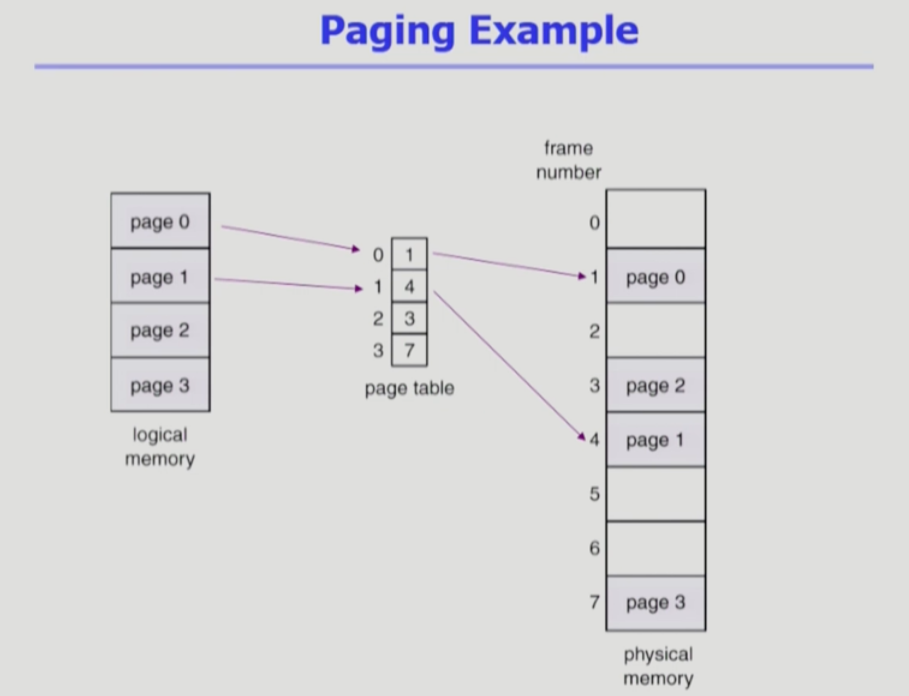
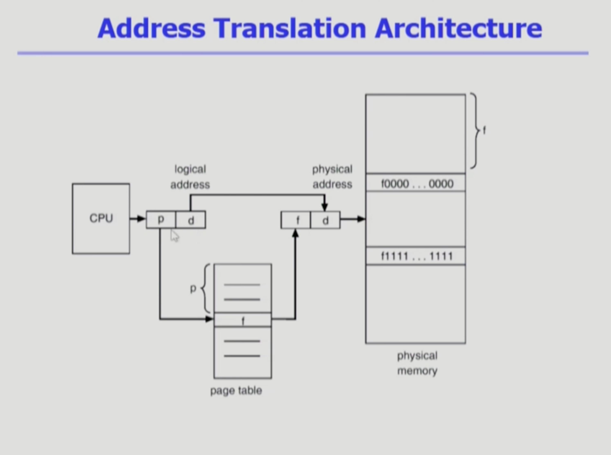
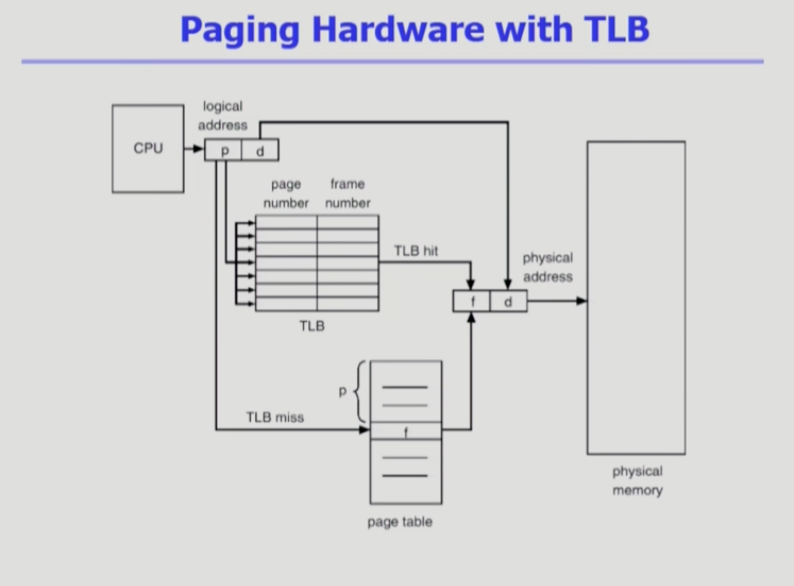
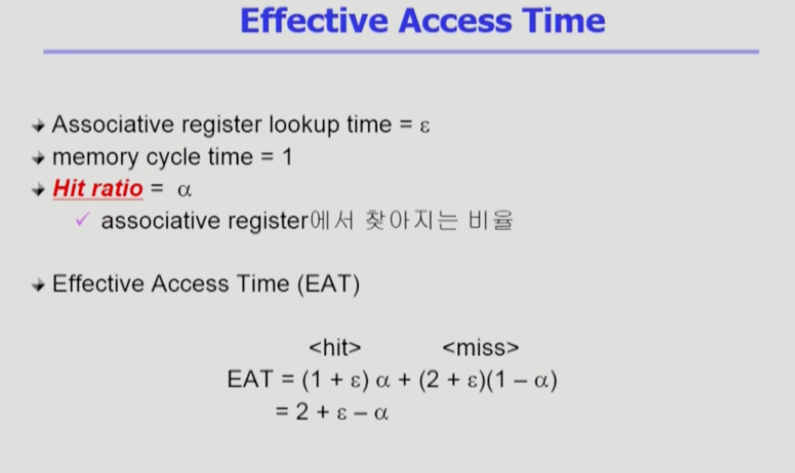
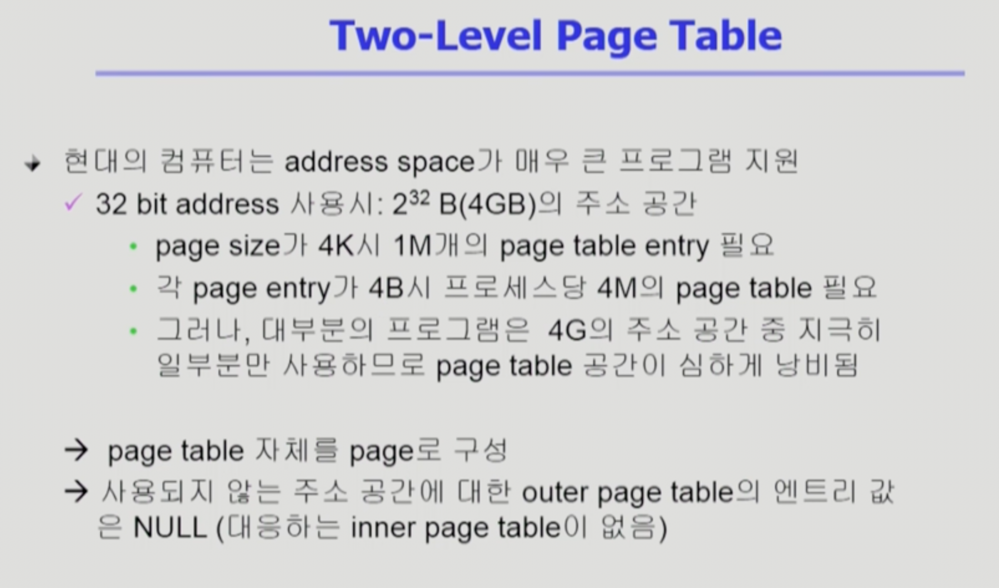
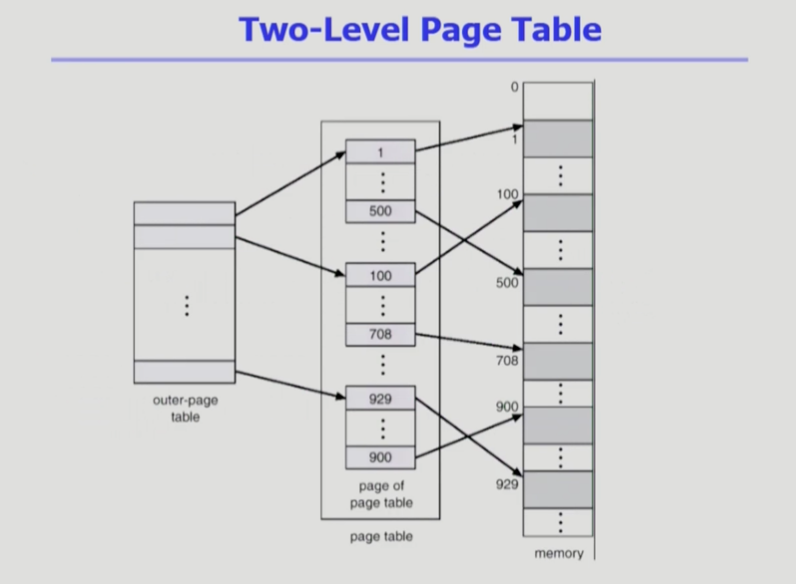
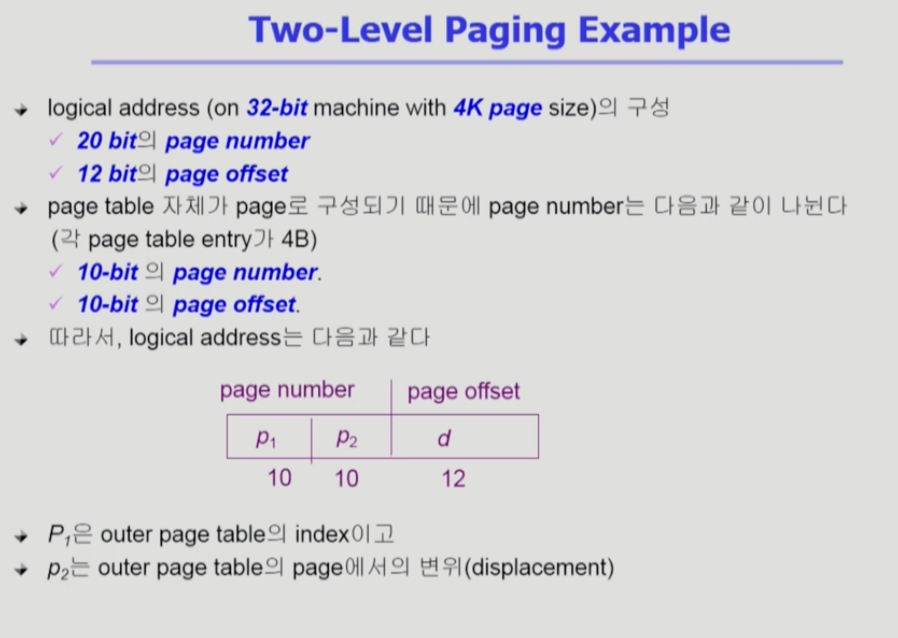

Memory_Management2
===
이화여자대학교 반효경 교수님의 운영체제 강의를 요약한 내용입니다. 틀린 부분이 있다면 지적해주시면 감사하겠습니다.  [강의 링크](http://www.kocw.net/home/cview.do?cid=4b9cd4c7178db077)

# 1. Paging

- 연속할당처럼 레지스터 두 개만으로는 paging을 할 수 없다.
- page table : 논리 메모리의 페이지 개수만큼 엔트리가 존재
- 물리 메모리를 나눈 것은 페이지 프레임이라 한다.
## 1.1. 주소 변환 구조

- 페이지 내에서의 offset부분은 주소 변환에서 영향이 없다. 내부에서의 상대적 위치는 똑같다. 
- 보통 페이지 크기 4kb -> 엔트리가 실제로 100만개 정도.. -> 용량이 크기 때문에 cpu의 레지스터에 못 들어감 -> 심지어 프로그램마다 있다. -> 메모리에 집어넣어 버림
## 1.2. 페이지 테이블의 구현
- 메인 메모리에 상주
- 앞에서 레지스터 두개로 주소 변환하듯이 page table을 찾는다.
    - Page-table base register(PTBR)가 page table(시작위치)을 가리킴
    - Page-table length register(PTLR)가 테이블 크기를 보관
- 메모리에 상주하기 때문에 모든 메모리 접근 연산에는 **2번의 memory access** 필요
        - page table 접근 1번, 실제 data/instruction 접근 1번
- 속도 향상을 위해 associative register 혹은 **translation look-aside buffer(TLB)** 라는 고속의 lookup hardware cache 사용. TLB는 메인메모리와 cpu사이 존재. 주소변환해주는 계층
## 1.3. Translation Look-aside Buffer(TLB)

- 속도를 개선하기 위해 TLB라는 별도의 하드웨어를 둔다.
- 메인 메모리보다 접근 속도가 빠른 하드웨어로 되어 있다.
- 페이지 테이블에서 빈번이 참조되는 일부 엔트리(전체 x)를 캐시를 한다. 접근 전에 TLB를 먼저 검색
- 페이지 일부만 가져온 것이라서 **페이지 번호 p**, **주소변환된 프레임 번호 f** 두 개가 모두 필요햐다.
- TLB 전체에서 페이지 번호를 모두 검색해야한다. 전체 검색이 오래 걸리므로, 보통 parallel search가 가능한 associative registers를 이용해서 구현. TLB miss(찾는 값 없음) -> 페이지테이블 써야함
- TLB는 context switch때 flush 해야 한다. (remove old entries) -> (프로세스마다 주소변환 정보가 다르기때문에, 문맥교환시 비운다.)

- TLB접근 시간을 입실론이라 하면 메인 메모리 접근 시간인 1보다 작다.
- ε = TLB에서 찾는 시간
- ⍺ = TLB에서 찾아지는 비율 -> (1 - ⍺) : 찾지 못한 비율
- \<hit> : 찾아질 경우; ([메모리 접근 시간] + ε) * ⍺
- \<miss> : 못찾을 경우; ([2번의 메모리 접근시간] + ε)(1 - ⍺)
- => 2 + ε - ⍺

## 1.4. Two-Level Page Table

- 페이지 테이블의 용량이 크지만, 대부분의 프로그램은 4G의 주소 공간 중 지극히 일부분만 사용하므로 페이지 테이블 공간이 심하게 낭비된다.
- page table 자체를 page로 구성
- 사용되지 않는 주소 공간에 대한 outer page table의 엔트리 값은 NULL(대응하는 inner page table이 없음)
- 사용하지 않는 공간을 빼고 페이징 테이블(배열)을 만들수는 없다. 인덱스를 통해 접근하기 떄문이다.

- 바깥, 안 테이블이 따로 존재
- 두 번 접근하기때문에 시간이 더 걸림
- 속도는 줄지 않지만 페이지 테이블을 위한 공간이 줄어든다.
- 물리적 메모리보다 가상 메모리가 더 크더라도 실행에 문제는 없다.
- 시간도 공간도 손해인데 2단계 페이지 테이블을 왜 쓸까?
    - 페이지 테이블의 공간을 줄일 수 있다.
    - 상당부분 사용 안되는 부분을 연속적인 구조여서 해소 할 수 없었는데, 2단계 페이지 테이블을 이용한다.
    - 낭비가 워낙 심해서 2단계 테이블이 오히려 이득

-  그렇다면 virtual memory크기가 최대 얼마까지 가능한가? -> 메모리를 표시하는 주소 체계를 몇 비트 주소체계를 사용하냐에 따라 다름 -> 메모리는 byte 단위. 
- 1bit -> 2가지 표현 , 2bit -> 4가지.. 32bit -> 232
- 210 = K, 220 = M, 230 = G
- 안쪽 페이지의 크기는 페이지 크기와 같다(4KB). 테이블 자체가 페이지화 되어서 페이지 어딘가에 들어간다. -> 엔트리 하나는 4B, 엔트리 개수는 1K개
