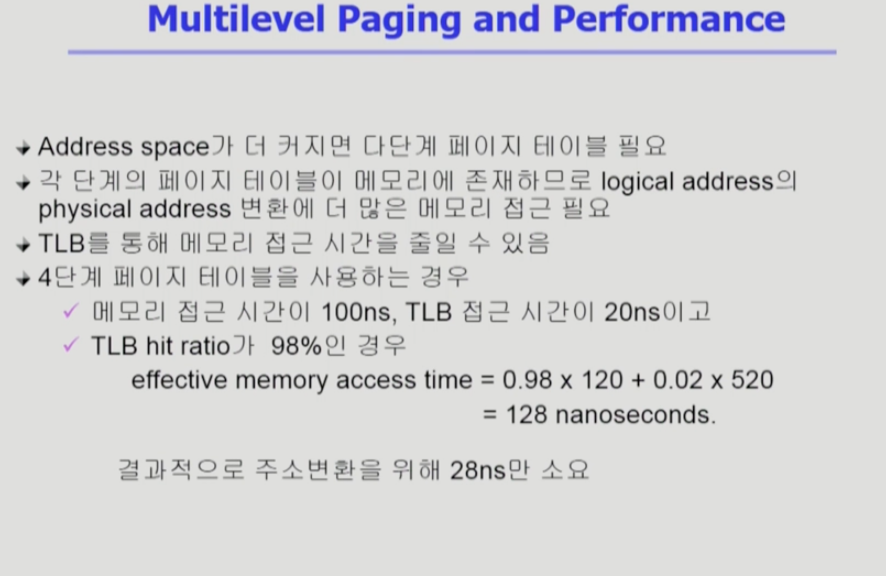
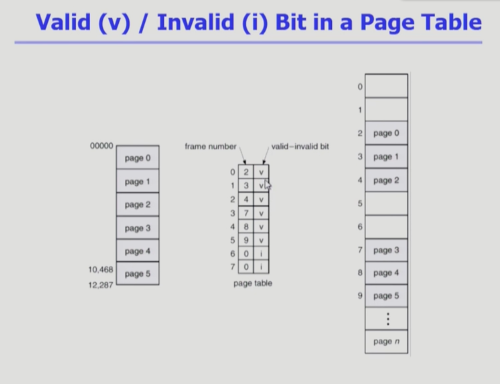
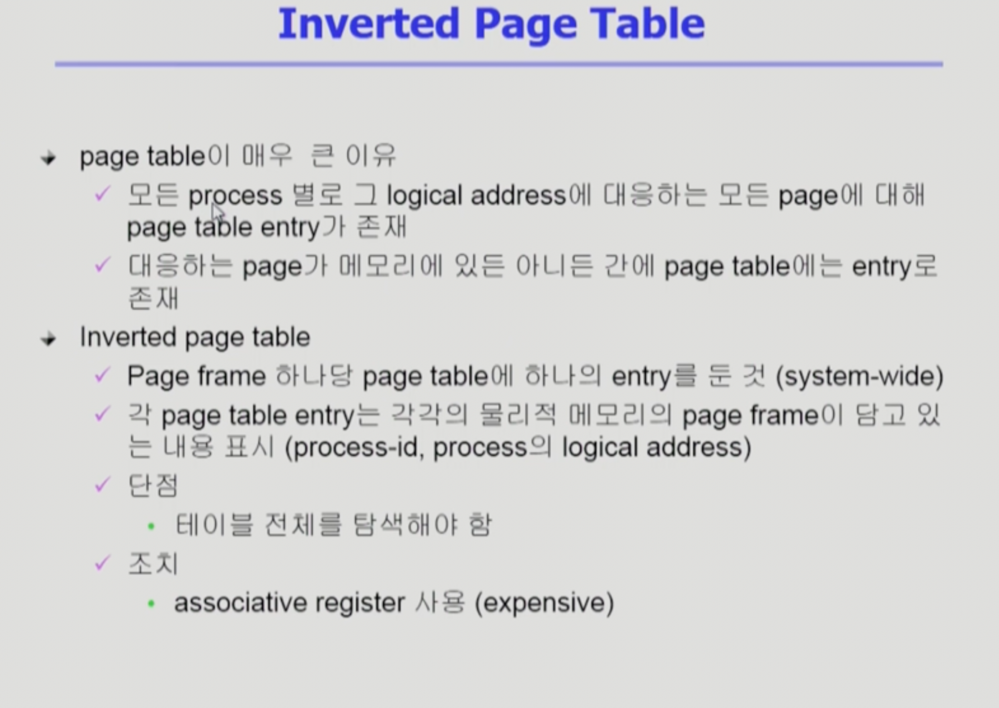
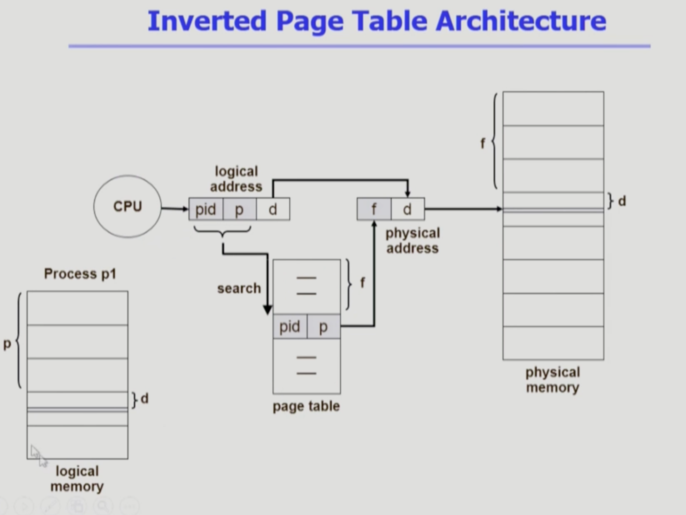
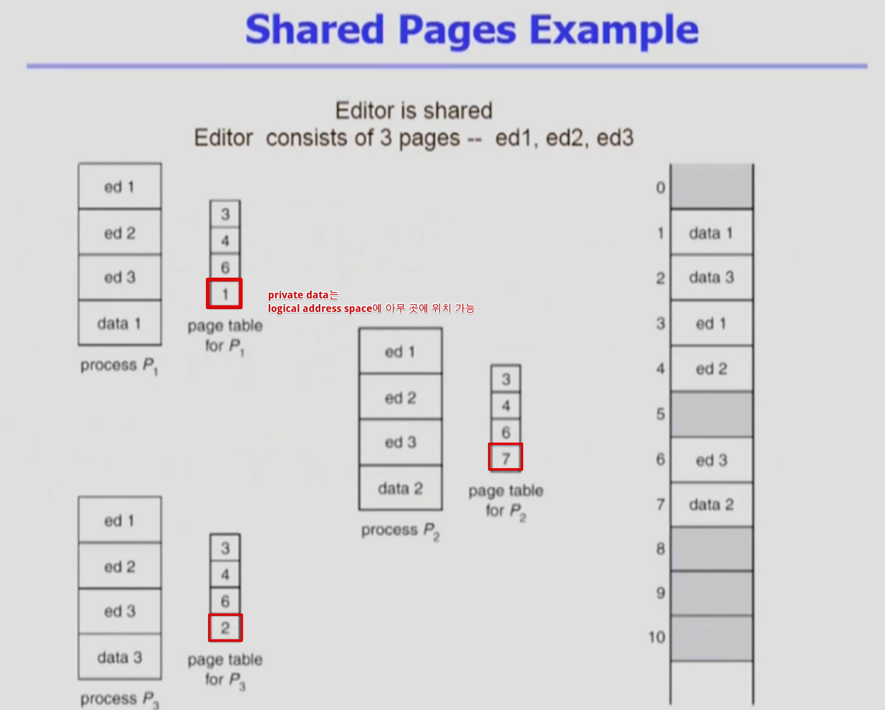
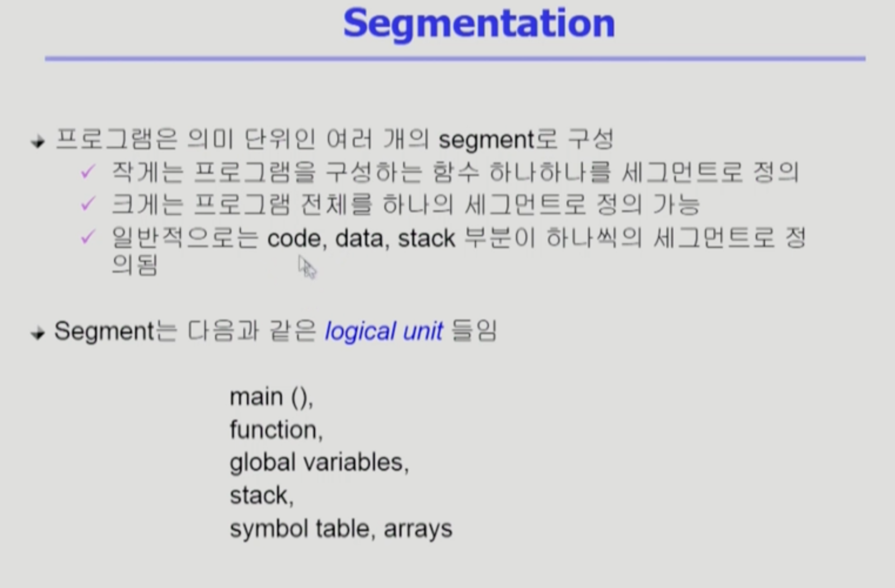
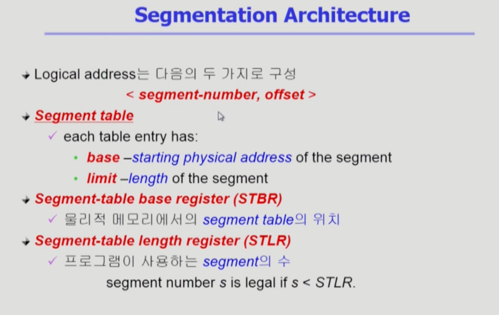
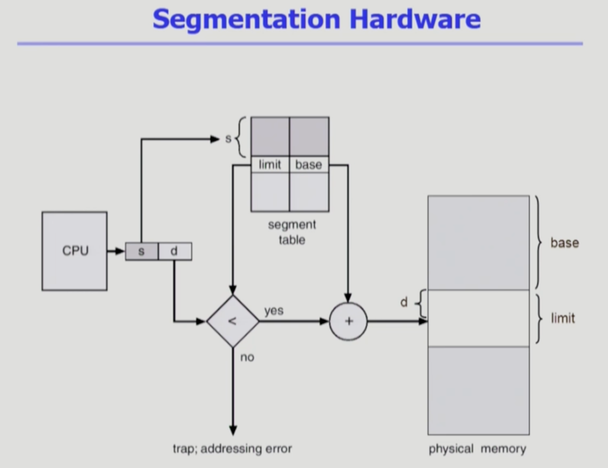
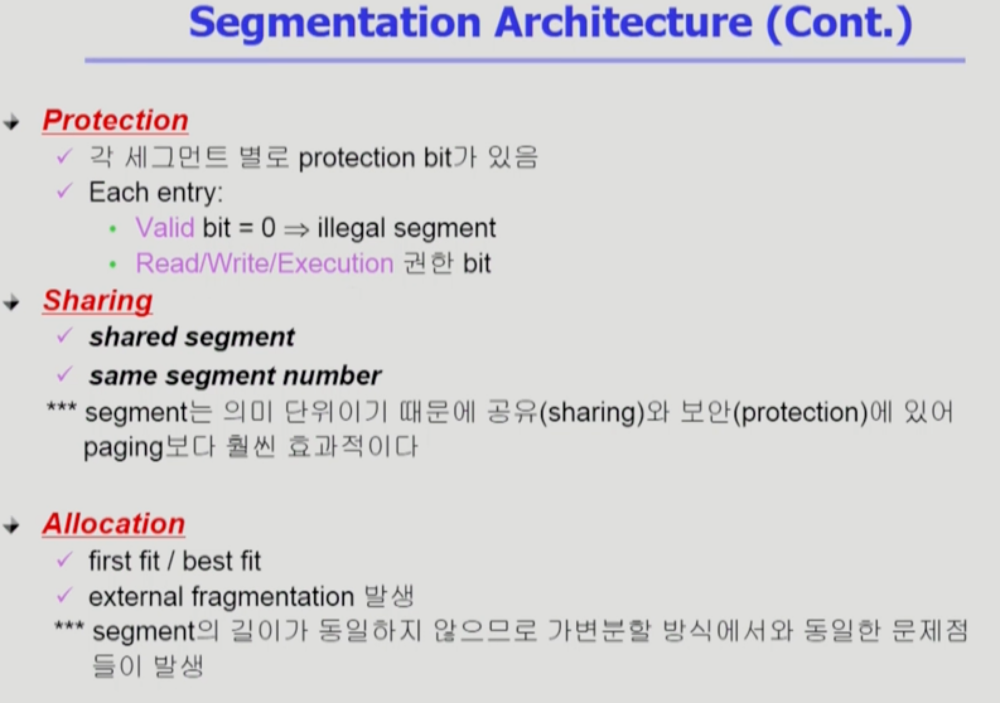

Memory_Management3
===
이화여자대학교 반효경 교수님의 운영체제 강의를 요약한 내용입니다. 틀린 부분이 있다면 지적해주시면 감사하겠습니다.  [강의 링크](http://www.kocw.net/home/cview.do?cid=4b9cd4c7178db077)

## 1.5. Multilevel Paging and Performance

- 4단계 -> 메모리가려면 5번 접근 필요
- 대부부 TLB를 사용해서 4단계여도 속도가 많이 줄어든다.
- 20(TLB) + 100(메모리) / 20(TLB) + 100(메모리) * 5(횟수)로 이해하면 됨.

## 1.6. 부가적인 비트들

### 1.6.1. Valid(v) / Invalid(i)
- 사실 엔트리마다 부가적인 비트가 더 저장되어 있음. 그 중 하나
- valid 표시의 경우 : 해당 주의 frame에 유효한 내용(접근 허용)
- invalid의 경우 : 유효한 내용이 없음
    - 1) 프로세스가 그 주소 부분을 사용하지 않는 경우
    - 2) 해당 페이지가 메모리에 올라와 있지 않고, swap area에 있는 경우 등 없음
### 1.6.2. Memory Protection
- read/write/read-only
- Protection bit : 접근 권한의 제어는 어떤 연산에 대한 접근 권한이 있는가를 말함. 다른 프로세스는 애초에 접근 불가능해서 상관없다. ex) code는 read-only로 data나 stack은 read/write를 다 준다.

## 1.7. Inverted Page Table

- 페이지 프레임 -> 논리적 페이지 번호. 역순으로 주소 변환
- 페이지 프레임 하나당 페이지 테이블에 하나의 엔트리를 둔 것.(system-wide)
- 페이지 번호가 주어지면 엔트리를 전부 검색해야 해당 페이지가 어떤 프레임에 있는지 확인할 수 있다.
- 프레임에 올라간 해당 페이지가 누구의 p번째 페이지인가? -> pid같이 저장해야한다.
- associative register 사용 (비쌈))

## 1.8. Shared Page

- 다른 프로세스들과 공유할 수 있는 페이지
- ex) 한글 파일을 여러개 연다면, code부분은 똑같다 -> shared code -> 한 카피만 메모리에 올림
### 1.8.1. Shared code
- Re-entrant Code (= Pure code)
- read-only로 프로세스 간에 하나의 code만 메모리에 올림
- 모든 프로세스의 logical address space에서 동일한 위치에 있어야 함
### 1.8.2. private code and data
- 각 프로세스들은 독자적으로 메모리에 올림
- Private data는 logical address space의 아무 곳에 와도 무방

# 2. Segmentation
## 2.1. 의미

- 프로세스를 구성하는 주소 공간을 의미단위(ex.code,data,stack)으로 나누는 것
- 보통 code, data, stack 작게 함수단위도 가능
## 2.2. 구성

- 페이징과 유사한 구조
- 세그먼트 번호, offset(논리적 위치)
- 각 세그먼트가 서로 다른 메모리 주소에 올라갈 수 있기떄문에, 세그먼트 별로 주소 -> 테이블 필요.
- base = 세그먼트 테이블 위치, length = 세그먼트의 개수
    

- 페이징과 다르게 세그먼트는 의미단위라 크기가 일정하지 않다. 그래서 limit이라는 길이를 테이블에 가지고 있다.
- 페이징과 다르게 물리적 메모리에 어디에서 시작해야하는지 정확한 byte단위 주소로 알려줘야한다. 
- 세그먼트가 3개인데 세그먼트 번호가 5번이다? -> trap
- 세그먼트의 limit이 d에서 떨어진 offset이 더 크다면? -> trap
- 세그먼트의 길이는 offset(d)으로 표현할 수 있는 비트수 이상으론 안된다.

- 의미 단위로 나누다 보니, 페이징보다 protection 하기 쉽다.
- 의미 단위이기 때문에 공유와 보안에 있어 paging보다 훨씬 효과적이다.
- 크기가 균일하지 않아 가변분할 방식에서와 동일한 문제점들이 발생
