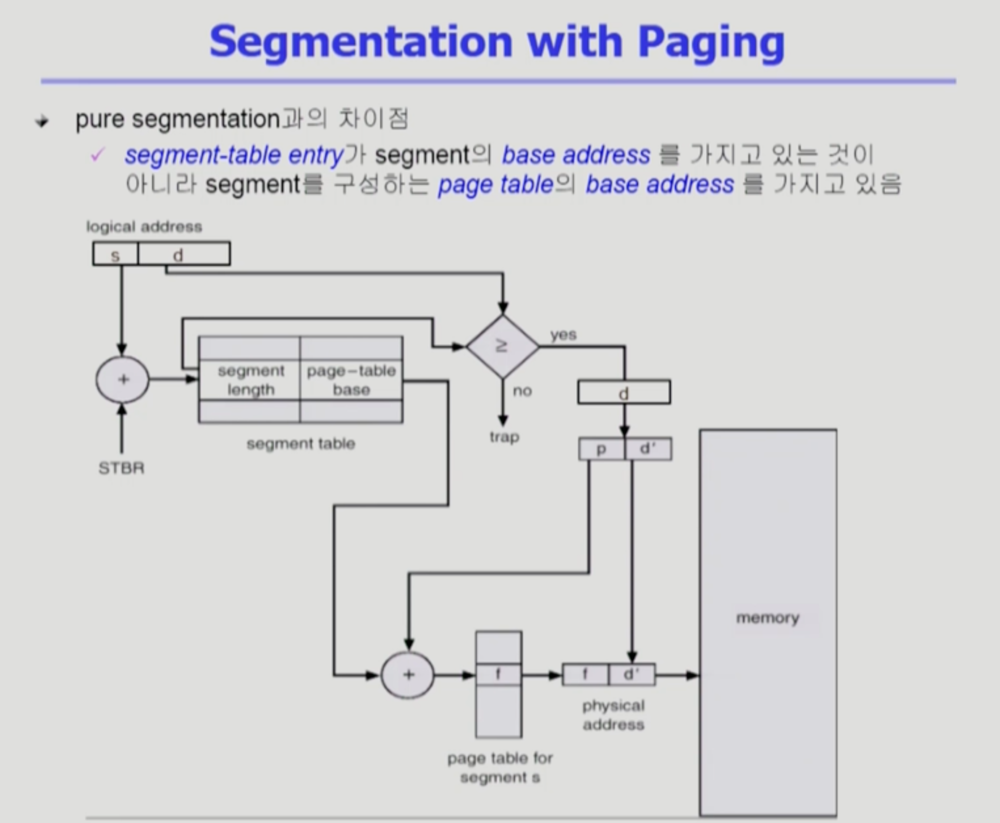

Memory_Management4
===
이화여자대학교 반효경 교수님의 운영체제 강의를 요약한 내용입니다. 틀린 부분이 있다면 지적해주시면 감사하겠습니다.  [강의 링크](http://www.kocw.net/home/cview.do?cid=4b9cd4c7178db077)

# 2. Segmentation
### 복습
- 세그먼트 번호, offset
- base의 주소값으로 가서 (offset)얼만큼 떨어져 있는가를 더해준다.
- 페이징과 다르게 크기가 균일하지 않다. base뿐 아니라 길이(length register)가 얼마인지  엔트리에 같이 담고 있다.
    - 세그먼트 개수보다 세그먼트 번호가 크면 부적절한 참조 -> STLR값과 세그먼트 번호 비교
    - offset이 세그먼트 길이보다 크면 부적절한 메모리 참조
- 공유와 보안에 효과적
- 크키가 다르므로 external fragementation 발생, 가변분할과 같이 동일한 문제점들이 발생
- 일반적으로 테이블에 대한 메모리 낭비가 심한쪽은 페이징임. (4KB) 

# 3. Paged Segmentation

- 세그먼트를 여러 개의 페이지로 구성하는 것
- 세그먼트 하나가 여러 개의 페이지 -> 논리 주소 : 세그먼트 번호, offset
    - offset이 세그먼트 길이이내인 경우에만 주소 변환
    - offset을 다시 잘라서 앞에는 페이지번호, 뒤는 페이지에서 얼마나 떨어져 있는지에 해당하는 page offset으로 사용한다.
- **세그먼트 당 페이지 테이블** 존재
- Allocation 문제가 생기지 않는다.
- 보안이나 공유는 페이지 테이블 레벨에서 해결한다.
    - 현실적으로 오리지날 segmentation사용하지는 않음. 페이지랑 같이.

###
사실 이 챕터에서 운영체제의 역할은 없다. 모두 하드웨어가 해줘야하는 역할이다.  
운영체제는 I/O 접근할때나 끼어든다. 운영체제도 사실상 하나의 프로그램이다. 운영체제도 cpu를 가지고 주소변환해서 일을 해야한다. 어떤 의미에서 다른 프로그램과 크게 다르지 않다.