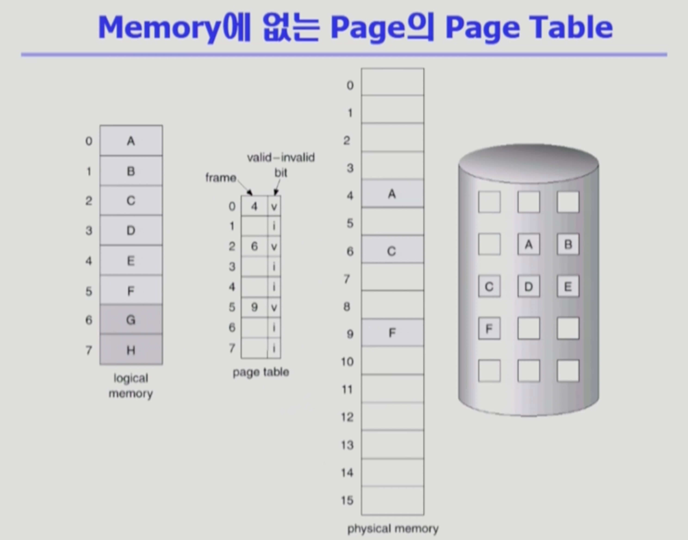
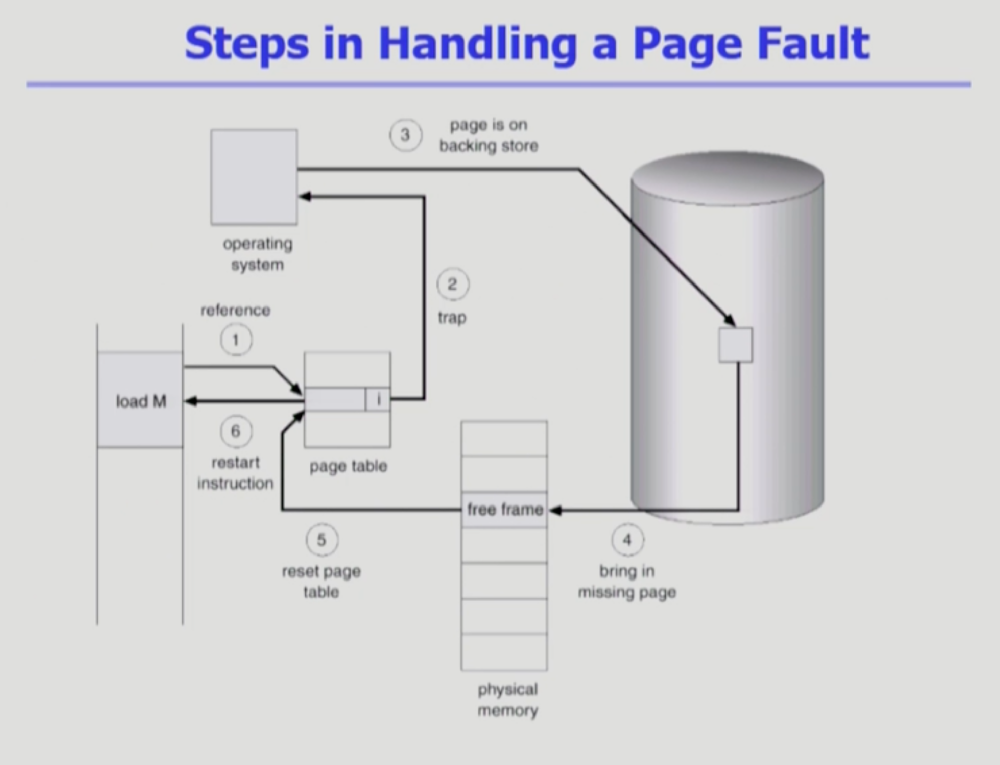
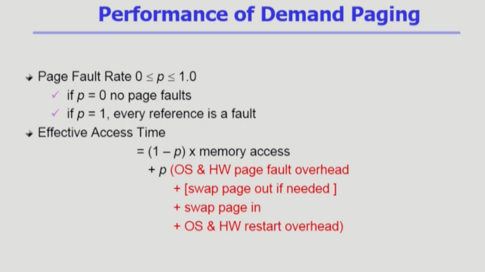
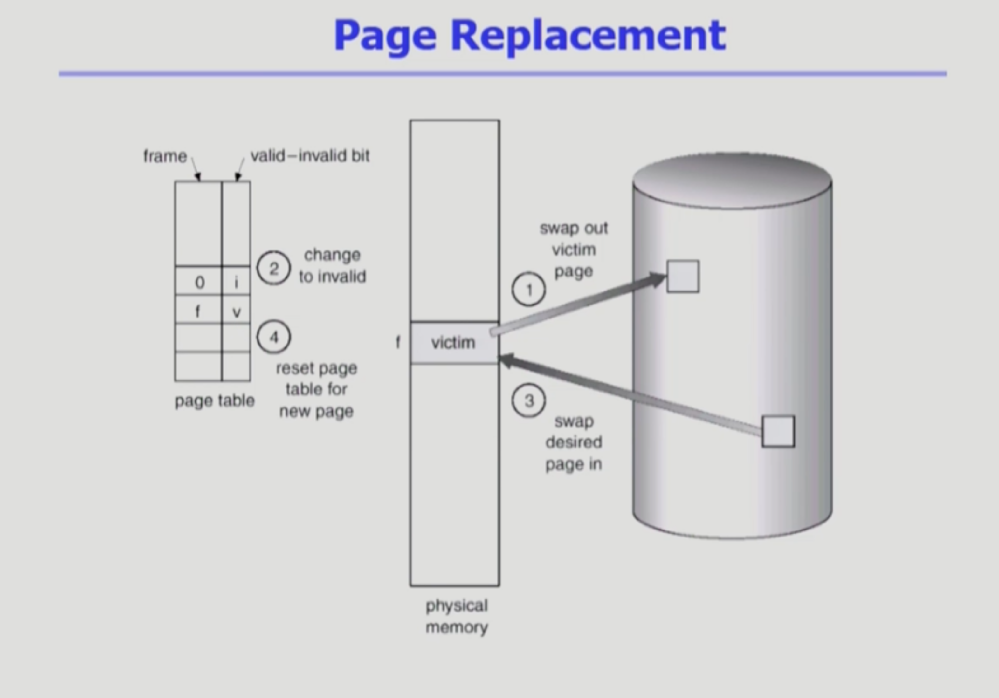
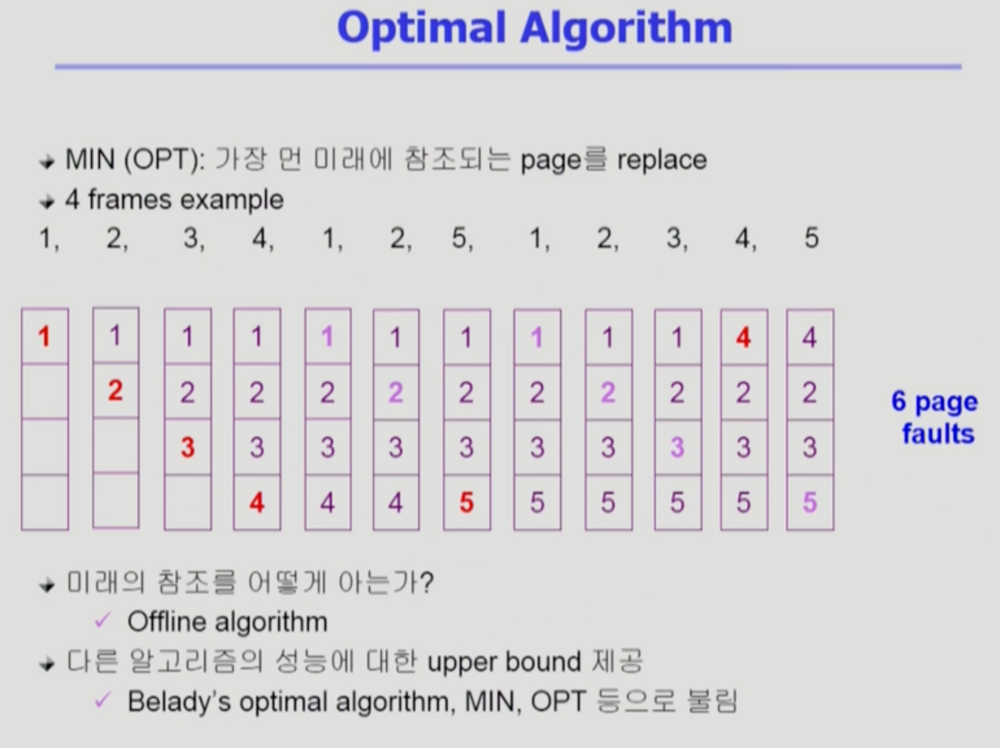
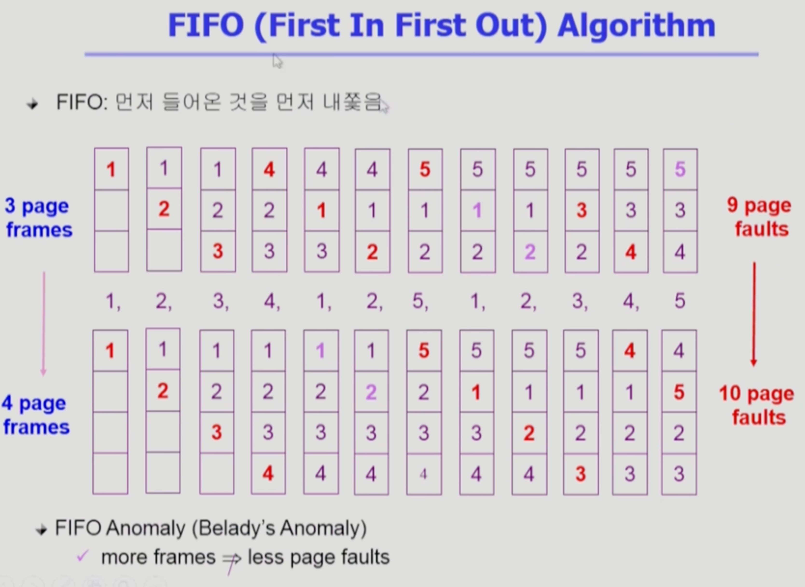
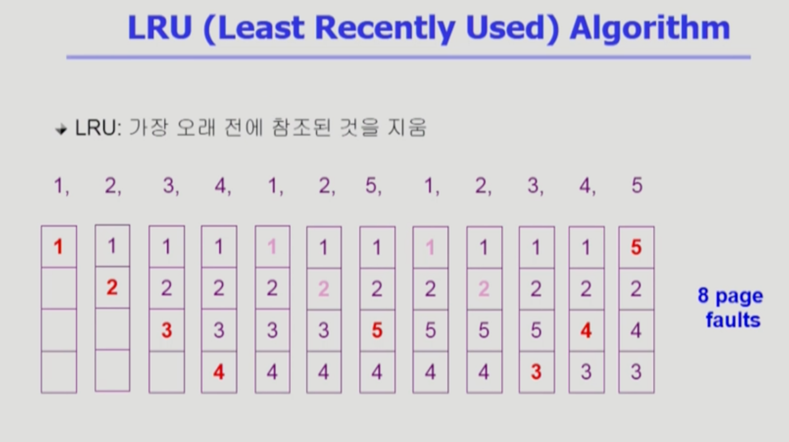
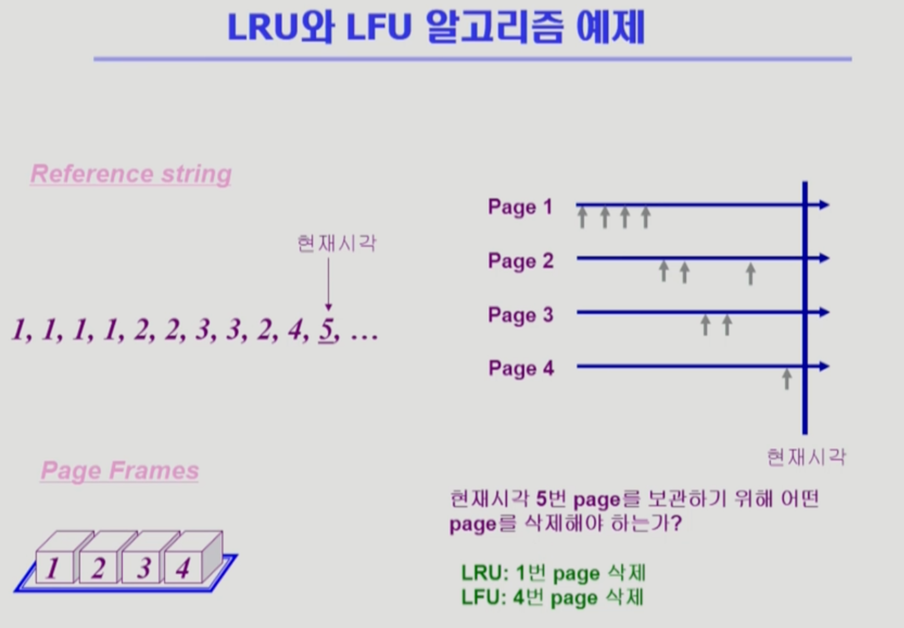
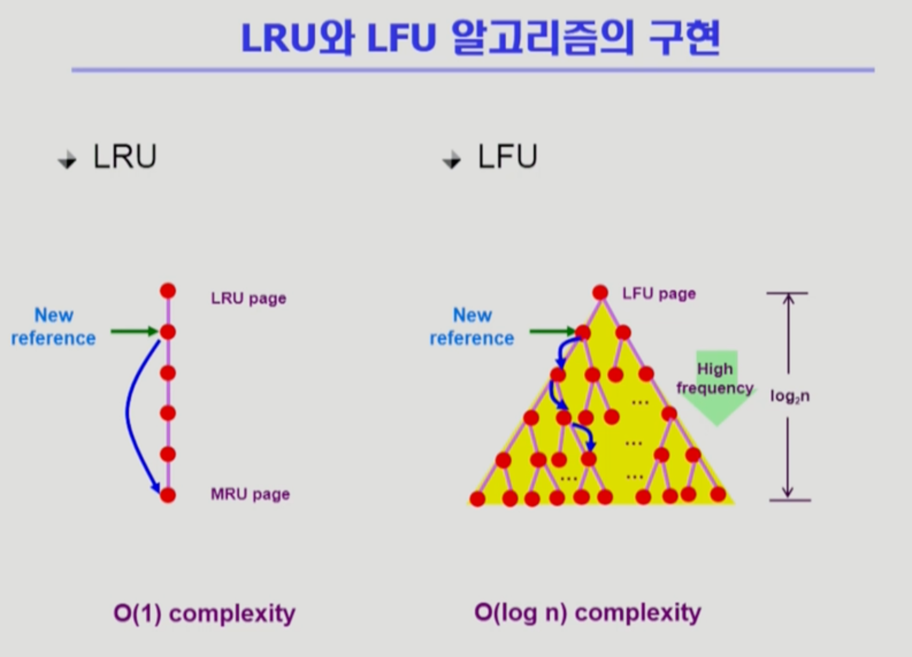

Virtual Memory 1
===
이화여자대학교 반효경 교수님의 운영체제 강의를 요약한 내용입니다. 틀린 부분이 있다면 지적해주시면 감사하겠습니다. [강의 링크](http://www.kocw.net/home/cview.do?cid=4b9cd4c7178db077)

! 운영체제는 물리메모리의 주소변환에 관여하지 않는다 했지만, 가상 메모리는 전적으로 관여한다.  
이 챕터부터는 페이징 기법을 사용하는 것은 전제로 한다. 실제로도 페이징 기법을 많이 사용한다.
# 1. Demand Paging
## 1.1. 필요할때 page를 올린다 
- 요청이 있으면 그 페이지를 메모리에 올리겠다는 의미. 전부 한꺼번에 올리는게 아니고, 필요할때 page를 올린다는 의미이다.
    - I/O 양의 감소
    - (물리적)Memory 사용량 감소
    - 빠른 응답 시간
        - 디스크에 통쨰로 옮기면 응답 시간이 필요한가요? 
            - 관점에 따라 다를 수도 있지만, system wide하게 전체적으로 생각했을 떄 이야기다. 어짜피 메모리는 한정되어 있고, 여러 프로그램을 동시에 사용한다면, demand paging을 사용해 메모리에 더 빈번하게 사용되는(더 의미있는) 정보를 올려놓는 것이다. 
            - 그렇기에 메모리에서 직접 서비스하는 비율이 높아져서 I/O 양이 감소하고, 응답시간이 줄어든다고 볼 수 있다.
    - (멀티 프로그래밍 환경에서)더 많은 사용자 수용. 
## 1.2. Valid/Invalid

### 1.2.1. Invalid
- 페이지가 물리적 메모리에 없는 경우
    - demand paging에 의해 필요하지 않은 페이지들 backing store에 있음. -> Invlalid 표시
- 사용되지 않는 주소 영역인 경우
    - 위 그림에서는 G,H는 사용안되는 공간, 주소 공간에서 영역을 지원하기 떄문에 페이지테이블에는 올라가게 되고, invalid 표시가 된다.
- 처음에는 모든 page entry가 invalid로 초기화
- address translation 시에 invalid bit이 set되어 있으면 "page fault" -> cpu가 자동적으로 운영체제로 넘어간다.(page fault trap)

## 1.3. Page Fault
ex) 1번 페이지 접근하려고 봤더니 invalid이다 -> 해당 페이지를 디스크에서 메모리로 올려야함(I/O 작업), 사용자 프로세스가 직접 못하는 일이다. -> page fault 현상
- invalid page 접근 시 MMU가 trap을 발생시킴(page fault trap)
- Kernel mode로 들어가서 page fault handler가 invoke됨
### 1.3.4. page fault 처리 순서
1. Invalid reference인지? (사용하지 않는 주소, 권한 위반) -> 강제 abort
2. 그렇지 않다면 빈 페이지 프레임을 획득 (빈 페이지 없으면 뺏어온다 : replace)
3. 해당 페이지를 disk에서 memory로 읽어온다. (상대적으로 대단히 느린 작업이다. 메모리보다 디스크가 수십만배~백만배 느림)  
    1. disk I/O 끝나기까지 이 프로세스는 CPU를 선점당함(해당 프로세스 block, 당장 사용할 ready상태의 프로세스에게 cpu넘김. 그 전에 컨트롤러에 디스크 읽으라 부탁)
    2. Disk read가 끝나면(운영체제가 끝난거 확인) page tables entry 기록, valid/invalid bit = "valid"
    3. ready queue에 process를 insert -> dispatch later
4. 이 프로세스가 cpu를 잡고 다시 running
5. 중단 되었던 instrcution 재개

## 1.3.5. Steps in Handling a Page Fault 그림

1. reference -> 주소변환을 봤더니 invalid,
2. trap이 걸려 운영체제에 넘어감  
3. backing store에 있는 페이지
4. 를 물리적 메모리에 올림
5. 해당하는 프레임 번호를 엔트리에 적고 valid로 bit 바꿈

## 1.4. Performance of Demand Paging
- 디스크 작업은 굉장히 오래걸리므로, page fault가 얼마나 발생하느냐에 따라 메모리 접근 시간 차이가 많이 난다.

### 1.4.1. Page Fault Rate 0 <= p <= 1.0
- 0이면 page fault가 없는 경우
- 1이면 참조마다 있는경우
- 보통 0.098~ 정도이다.
- 대부분의 경우 page fault 안나고 메모리로부터 직접 주소변환 가능.
### 1.4.2. 접근 시간
- p : page fault인 경우 -> 운영체제, 하드웨어 페이지 폴트 처리하는 오버헤드 + 빈공간 없으면 쫓아내야함 + 디스크에서 올려놔야함 + valid표시등 작업 과정, 나중에 cpu를 얻으면 다시 시작하는 오버헤드
## 1.5. Free frame(빈 페이지가)이 없는 경우
### 1.5.1. Page replacement(기존 페이지 메모리에서 쫓아냄)
- 어떤 frame을 빼앗아올지 결정
- 곧바로 사용되지 않은 page를 쫓아내는 것이 좋음
- 동일한 페이지가 여러 번 메모리에서 쫓겨났다가 다시 들어올 수 있음
### 1.5.2. Replacement Algorithm
- page-defualt rate를 줄이는게 목적이다. -> 기껏 쫓아냈는데 바로오면 큰 낭비 : page fault rate을 낮춰야함 
- 알고리즘의 평가
    - 주어진 reference string에 대해 page fault를 얼마나 내는지 조사
- reference string의 예
    - 페이지들이 참조된 순서를 나열해놓음
    - 1, 2, 3, 4, 1, 2, 5, 1, 2, 3, 4 ,5
    - 만약 여기서 1번이 한 번 사용된 상태에서 쫓아내면 뒤에서 또 page-default가 발생할 것이다.

### 1.5.3. Page replacement 과정

- 선정된 victim을 쫓아낼때, 만약 write가 발생해서 victim에 변경사항이 있다면, 디스크에 반영해야한다. 변경이 없다면, 그냥 지우면 된다.
- 쫓겨난 페이지는 invalid, 메모리에 올라온 페이지는 프레임 번호를 엔트리에 적고 비트를 valid로 변경. 

# 2. 알고리즘들
## 2.1. Optimal Algorithm

**미래에 참조되는 페이지를 모두 다 안다고 가정**한 알고리즘이다. 실제 시스템에서는 사용 불가하기떄문에 Offline algolithm이라고도 부른다. Belady's optimal algorithm, MIN, OPT 등으로도 불린다.
- MIN (OPT) : 가장 먼 미래에 참조되는 page를 replace
- 그림
    - 빨간색 : page fault
    - 분홍색 : fault없이 메모리 직접 참조
- 처음으로 5번이 들어갈 때, 미래에 4번의 참조가 가장 멀기 떄문에 처음 쫓겨났다. page default 6개가 최소이다.
+ 아무리 좋은 알고리즘 만들어도 Optimal의 성능을 못 넘는다. upper bound로 제공한다.

## 2.2. FIFO(First In First Out) Algorithm

- 먼저 들어온 것을 먼저 내쫓음
- 가장 먼저 들어온 1번을 쫓아내는 것을 볼 수 있다.
- Belady's Anomaly : 메모리를 늘렸더니 성능이 떨어지는 이상한 현상이다. 프레임이 많다고 적은 faluts로 이어지지 않는다. 페이지 프레임을 4개로 늘렸음에도 faluts가 1개 늘어난 것을 확인할 수 있다.

## 2.3. LRU(Least Recently Used) Algorithm

- 가장 오래 전에 참조된 것을 지움.
- 가장 오래전에 사용된 3번을 쫒아내는 것을 볼 수 있다.
- 미래를 모르니 과거에서 찾는다.

## 2.4. LFU(Least Frequently Used) Algorithm
- 참조 횟수(reference count)가 가장 적은 페이지를 지움
    - 최저 참조 횟수인 page가 여럿 있는 경우
        - 기본적으로 여러 page중 임의로 선정
        - 성능 향상을 위해 가장 오래 전에 참조된 page를 지우게 구현할 수도 있다.
    - 장단점
        - LRU 처럼 직전 참조 시점만 보는 것이 아니라 장기적인 시간 규모를 보기 때문에 page의 인기도를 좀 더 정확히 반영
        - 참조 시점의 최근성을 반영하지 못함
        - LRU보다 구현 복잡함
## 2.5. LRU, LFU 예제

- LRU는 과거의 많은 참조를 고려하지 않는다.
- LFU는 참조의 최근성을 반영하지 못한다.

## 2.6. LRU, LFU 구현

### 2.6.1. LRU
- 메모리 안에 페이지들을 시간 순서에 따라 한 줄로 세운다. LinkedList 형태로 관리.
- 새로 메모리에 들어오거나, 다시 참조되면 참조 시점이 최근이 되므로, 제일 아래쪽으로 보낸다.
- replacment시 맨 위에것을 쫓아내면 됨.
- O(1) complexity : 쫓아내기위해 비교가 필요 없다.
### 2.6.2. LFU
- 리스트 형태로 구현하면 언뜻보면 비슷해보이지만, 다르다. 
- 어떤 페이지가 참조가 되었을때, 비교를 해서 어디까지 내려갈지 확인해야한다. 하나하나 비교하면서 참조횟수로 못 이길때까지 내려간다.
- O(n) complexity
- 이건 못써먹는다.
### 2.6.3. heap을 이용한 LFU
- heap을 이용해 구현 O(log n) complexity 이다.
- 직계자식 두 개랑만 비교하고, 참조횟수가 자신이 더 많으면 자리를 바꾼다. 계속 내려가며 바꾼다.
- 쫓아낼때는 루트(맨 위)에 있는 것을 쫓아내고 힙을 재구성
- 높이가 log2n 이다.
- O(log n)정도는 되야 사용할 수 있다.