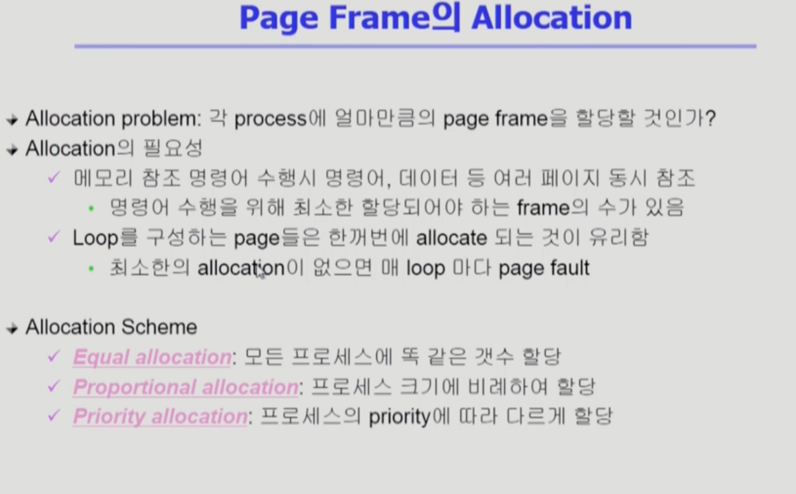

Virtual Memory 2
===
이화여자대학교 반효경 교수님의 운영체제 강의를 요약한 내용입니다. 틀린 부분이 있다면 지적해주시면 감사하겠습니다. [강의 링크](http://www.kocw.net/home/cview.do?cid=4b9cd4c7178db077)

# 1. 다양한 캐슁 환경
## 1.1. 캐슁 기법
- 한정된 빠른 공간(=캐쉬)에 요청된 데이터를 저장해 두었다가 후속 요청시 캐쉬로부터 직접 서비스하는 방식
    - 느린 저장장치까지 갈 필요가 없다.
    - 디스크(더 느림)와 물리메모리(빠름)
- paging sysytem 외에도 
    - cache memory(cpu가 메인메모리 접근 시에 사이에 캐시메모리 확인)
    - buffer caching : 파일시스템에 대한 read/write 요청을 메모리에서 빠르게 서비스하는 방법
    - Web caching : 읽어온 웹 페이지를 저장했다가 보여주기.
등 다양한 분야에서 사용
## 1.2. 캐쉬 운영의 시간 제약
- replacemnt 알고리즘 : 삭제할 항목을 결정하는 일에 지나치게 많은 시간이 걸리는 경우 실세 시스템에서 사용할 수 없음
- Buffer caching이나 Web caching의 경우(=대부분의 경우)
    - O(1) 에서 O(log n) 정도까지 허용
- Paging system인 경우
    - page fault인 경우에만 OS가 관여함
    - 페이지가 이미 메모리에 존재하는 경우 참조시각 등의 정보를 OS가 알 수 없음
    - O(1)인 LRU의 list조작조차 불가능
## 1.3. LRU, LFU 알고리즘의 구현의 경우
### LRU 구현
- 세로로 뻗은 LinkedList 생각, 제일 위에가 오래전에 참조된 페이지.
- 제일 위에 있는 페이지 쫓아내면 됨.
- 메모리 내에서 다시 참조되면 빼서 맨 아래로 이동시켜준다.
- O(1) complexity
### LFU 구현
- 한줄로 줄세우기 생각해보기. 맨 위에는 참조횟수 적은 페이지.
- 맨 위에 쫓아내기
- 메모리 내에서 다시 참조되면, 어디까지 내려갈 수 있는지 직접 비교해야 한다. 최악의 경우 O(n) complexity
+ 헤결 : heap에 구현, O(log n) complexity
## 1.4. Paging System에서 LRU, LFU 가능한가?  
- 애초에 주소변환은 하드웨어적으로 해결한다.
- invalid -> page fault 발생 -> I/O필요, trap -> OS개입 : 해당 경우만 운영체제가 개입한다.
### 1.4.1. 접근 시간, 참조횟수를 알 수 있는가?
- 운영체제는 메모리에서 참조횟수가 제일 적은 페이지를 쫓아내야하는데, 찾을 수 있는가?
    - 불가하다. 해당 프로세스에서 요청한 페이지가 이미 메모리에있다면, 운영체제에 cpu가 넘어가지 않고, 하드웨어적으로 주소변환해서 cpu를 읽어들인다. 접근 시간을 알 수 없다.
- 반대로 page fault 발생 시, 디스크를 접근하면서 운영체제로 cpu가 넘어가므로, 디스크의 페이지가 메모리에 올라온 시간을 알 수 있다.
- page fault시에만 운영체제에게 정보가 주어지기 때문에 결국에는 반쪽짜리 정보만 얻게 된다.
### 1.4.2. LRU 구조
- page fault에 의해 운영체제가 개입하므로 LinkedList에 새로 들어온 것을 매달아줄 수 있다. 
- 하지만  다시 참조되면, LinkedList를 끊어서 옮기는 작업을 할 수 없다. cpu가 운영체제로 넘어가지 않기 떄문이다.
### 1.4.3. 결론
- LRU, LFU는 사실 Pagaing system에서는 사용 못함.
- buffer caching, web caching 등에선 사용 가능.

# 2. Clock Algorithm
## 2.1. 설명

- LRU의 근사(approximation) 알고리즘
    - 적어도 시계가 한바퀴 돌때까지 참조 안된 페이지를 쫓아낼 수 있다. 어느정도 유사 효과.
- Second chance algorithm, NUR , NRU(Not Recently Used)
- 하드웨어가 페이지들을 참조할때, reference bit을 1로 세팅,
- 교체 대상 페이지 선정(circular list). 0 찾을때까지 이동
- 운영체제는 이동하면서 1을 0으로 바꾸고, 0인 것을 발견 시 교체. 
- LRU처럼 가장 오래된 것을 쫓아내지는 못한다.
- 한 바퀴 되돌아와서도(=second chance)0 이면 replace
- 자주 사용되는 페이지라면 second chance가 올 때 1  
- LinkedList에서 페이지를 이동시키는 일 등은 운영체제가 못하기 떄문에 하드웨어가 bit를 세팅해준다.
### 2.2. 개선
- reference bit과 modified bit (dirty bit)을 함께 사용
- reference bit = 1 : 최근에 참조된 페이지
- modified bit = 1 : 최근에 변경된 페이지 (I/O를 동반하는 페이지)
    - modified bit = 0 인 경우, 디스크에서 올린 후 write 발생한 적이 없다. 쫓아낼때 그저 삭제.
    - modified bit =1 적어도 한번은 수정한 페이지. backing store에 반영 후 지워야 한다.

# 3. Page Frame의 Allocation
- 사실상 프로그램마다 페이지를 나누어 메모리에 올리기떄문에, 메모리에 다양한 프로그램의 페이지들이 존재한다. 여태 그것들을 그저 오래된 순서로 처리하는 등의 방식을 사용했다. **하지만 실제로는** 프로그램이 같이 올라와있어야 더 효율적이다.
## 3.1. 필요성

- 명령어, 데이터 등 여러 페이지 동시 참조하는 경우
- 3개의 페이지가 특정 for문을 구성한다면? -> 3개의 페이지가 모두 있으면 for문이 계속 잘 돌아간다. 한꺼번에 allocate 되는 것이 유리함.
## 3.2. Allocation Scheme
- 특정 프로그램이 메모리를 전부 점유한다면?
### 3.2.1. Eqaul allocation
- 모든 프로세스에 똑같은 갯수 할당 -> 프로그램마다 필요한 페이지양이 다르다.
### 3.2.2. Proportional allocation
- 프로세스 크기에 비례하여 할당  -> 같은 프로그램도 시간에 따라 필요한 페이지 갯수가 다를 수 있다.
### 3.2.3. Priority allocation 
- 프로세스의 priority에 따라 다르게 할당

# 3.3. Global vs. local  Replacement

## Global replacement
- 굳이 미리 할당하지 않고, 알아서 알고리즘을 사용하면 그때그때 프로세스별로 할당량이 조절된다.
## Local replacement
- 메모리 할당을 한다면, 각각의 프로그램에 메모리가 주어짐.
- 할당된 frame 내에서만 replacement

# 4. Thrashing
 - 어떤 프로그램의 어느정도의 최소 메모리가 할당조차안되면, page fault가 자주 일어난다.
 - 최소한의 page frame 할당이 안돼서 page fault가 지나치게 많이 일어나는 경우
 ## 4.1. 언제 일어날까?

 - 메모리에 동시에 올라간 프로그램이 늘어남에 따른 cpu의 이용률
    - 메모리에 프로그램이 하나만 올라갔을때는, cpu utiliazation이 낮다. I/O하러가면 cpu가 놀기도 한다.
    - 메모리에 두 개가 올라가면, I/O가도 다른 프로그램이 쓴다. 이용률 증가
    - 개수가 올라갈수록, 점점 올라간다.
    - 어느순간 이용률 뚝 떨어짐 왜? thrashing 발생해서.
    - 멀티프로그래밍 degree가 너무 올라가면서, 각 프로그램이 가진 메모리 용량이 대단히 작아지고, page fault가 빈번히 발생. 
    - 어떤 프로그램이 cpu를 잡더라도 page fault가 일어나기때문에, cpu 이용률이 낮아진다.
## 4.2. 과정
1. 최소한의 페이지 프레임 할당받지 못함
2. page fault rate 매우 높아짐 
3. cpu utilization이 낮아짐 
4. OS는 MPD(Multiprogramming degree)를 높여야 한다고 판단 
5. 또 다른 프로세스가 시스템에 추가(higher MPD)
6. 프로세스 당 할당 frame 수가 더욱 감소 
7. 프로세스는 page의 swap in/ swap out으로 매우 바쁨 ,대부분의 시간에 cpu는 한가함
- low throughput
### 막기 위해서는?
- Multiprogramming degree 조절(어느정도 메모리 확보 할 수 있도록)

# 5. Thrashing 해결책들 (global replacement)
## 5.1. Working-Set Model
### Locality of reference
- 프로세스는 특정 시간 동안 일정 장소만을 집중적으로 참조하는 것
- 특정 시간 집중적으로 참조되는 해당 page들의 집합을 locality set이라 함 Working-Set 알고리즘에서는 working set이라고 함
### Working-set Model
- Locality에 기반하여 프로세스가 일정 시간 동안 원활하게 수행되기 위해 한꺼번에 메모리에 올라와 있어야 하는 page 들의 집합을 Working Set이라 정의함
- Working Set 모델에서는 process의 working set의 전체가 메모리에 올라와 있어야 수행되고 그렇지 않을 경우 모든 frame을 반납한 후 swap out(suspend)
    - multiprogramming degree가 너무 높아서 working set 보장 불가 시 전체 반납해버림
- Thrashing 방지
- Multiprogramming degree를 결정
## 5.2. Working-Set Algorithm
- working set은 미리 알 수가 없다. (정확히 모름) 그래서 과거를 통해 추정한다.

### working set의 결정
- working set window를 통해 알아냄
- 창을 뚫는다. working set은 델타시간만큼의 Time interval사이에 참조된 서로 다른 페이지들의 집합이다. 위 그림의 경우 왼쪽하단을 보면 window크기 만큼의 참조된 페이지들의 중복을 제거한 것이 working set이다.
- 해당 프로그램에게 5개 페이지 프레임을 줄 수 있으면 1,2,5,6,7을 올리고, 다 못주면 swap out
- working set의 크기가 바뀔 수 있다.
- working set에 속한 page는 메모리에 유지, 속하지 않은 것은 버림. 즉, 참조된 후 델타시간 동안 해당 page를 메모리에 유지하고 버린다.

+ Process들의 워킹 셋 사이즈 합이 페이지 프레임 수보다 큰 경우
+ 일부 process를 swap out 시켜 남은 process의 working set을 우선적으로 충족 (MPD를 줄임)
- working set을 다 할당하고도 page frame이 남는 경우 swap out 되었던 프로세스에게 working set을 할당(MPD를 키움)

## 5.3. PFF(Page-Fault Frequency) Scheme

- 페이지 폴트를 얼마나 내는지 본다.
- 페이지 폴트를 많이 일으키면 더 준다. rate의 상한과 하한을 두고 일정 수준의 페이지 폴트를 유지하게 한다.
- (빈 프레임)페이지 폴트가 빈번한데 더 줄 메모리가 없으면, 그냥 해당 프로그램을 통째로 swap out 시켜서 남아있는 프로그램이라도 잘 유지하는 방향

## 5.4. Page Size의 결정
- Page size를 감소시키면
    - 페이지 수 증가
    - 페이지 테이블 크기 증가 (엔트리 수가 많아짐)
  
    - Internal fragmentation 감소
        - 잘게 자르기때문에, 내부 조각 감소
    - Disk transfer의 효율성 감소
        - Seek/rotation vs. transfer
        - 디스크는 seek 시간이 오래 걸리기때문에, 가능한 많은 양을 올리는게 좋다.
    - 필요한 정보만 메모리에 올라와 메모리 이용이 효율적
        - Locality의 활용 측면에서는 좋지 않음.
- Trend
    - 메모리 크기도 점점 커지는데, 페이지 사이즈가 너무 작으면, 페이지 테이블도 너무 커진다. 최근에는 큰 크기의 페이지를 사용하는 메모리 시스템 이야기도 나온다.