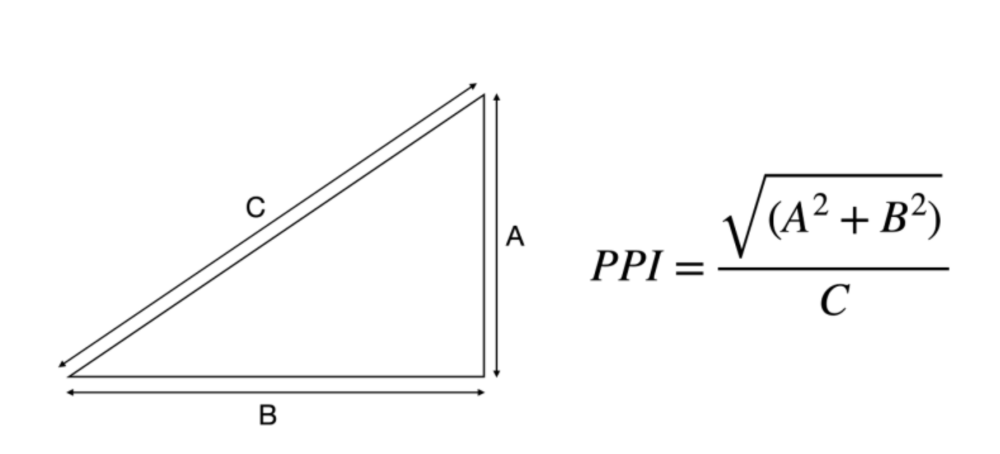
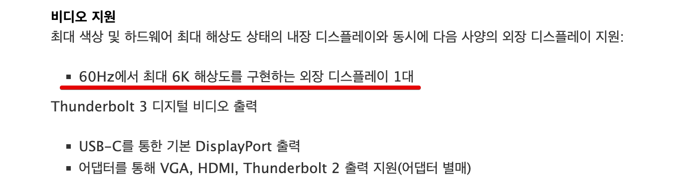

# 컴퓨터 장비 구매하기 - 모니터
## 장비가 필요한 이유
>개발에 입문하고 국비학원을 다니면서 집에 남은 윈도우 7 노트북으로 공부를 했었다. STS를 사용했는데, 서버 한 번 올리거나 프로그램을 껐다가 킬 때마다 지옥을 맛봐야 했다.  
  
학원 수료 후, 결국 휴대용으로 쓸 노트북은 꼭 필요하겠다 싶어서 맥 m1 에어를 구매하게 되었다. 윈도우7+이클립스(+STS) -> 맥+인텔리제이로 변화했는데, 장비의 중요성을 실감했다. 

원래는 지출에 인색한 편이었는데, '금액에 상관없이 효율적인 지출은 무조건 하자' 라는 주의로 바뀌었다.

모니터, 마우스, 키보드가 절실하다. 나의 필요에 맞게 어떤 스펙을 보고 사야할 지 알아보며 정리할 생각이다.

### 목적
우선 사려는 목적은:
- 키보드, 마우스(혹은 트랙패드)
    - 올바른 자세 유지 
- 모니터
    - 강의 필기, 코딩 도중 구글링, 글쓰면서 검색 등
    - 창 전환을 그만하고 싶다.  
- 컨버터
    - 위에 것들을 사용하기 위해

### 현 상황
- 예산 60만원 정도로 다 사야함
- 모니터에 30이하 투자, 나머지 마우스, 키보드, 컨버터
- 오로지 코딩목적, 영상시청이나 게임 등은 필요 없음
***

# 모니터 스펙 보기
참고 : [노써치 모니터 구매가이드](https://nosearch.com/contents/guide/digitalit/monitor) 내용을 정리 했다.
다른 제품 구매가이드나 공동 구매도 있어서, 필요한 제품을 보면 좋을 것 같다.
## 1. 화면
### 화면 크기
- 24~27인치가 보통
- 목적이 코딩이다 보니 넓으면 좋을 것 같은데, 큰 욕심은 없어서 24~27사이에서 나중에 듀얼로 가는 방향으로 생각중이다.
### 화면비율
- 보통 16:9가 표준
- 최근에는 21:9, 32:9처럼 울트라 와이드도 사용
- 와이드가 필요 없고 후에 필요하면 듀얼을 생각하고 있기때문에, 더 알아볼 필요가 없음
### 커브드 모니터
- 32인치 이상이면 고려해볼만 하다고 함
- 딱히 필요없음

## 2. 화질
### 해상도
- 픽셀은 말 그대로 그래픽을 표현하는 점의 개수이다. 점이 많을수록 오밀조밀 세세하게 표현되므로, 더 정밀하고 선명하게 이미지를 표현할 수 있다.
- **PPI**(Pixel Per Inch) : [사진출저-호일님 블로그](https://blog.naver.com/PostView.nhn?isHttpsRedirect=true&blogId=javeri&logNo=222378186352)   

    - 해상도의 밀도를 나타낸다.
    - m1에어는 13.3인치인데, 2560x1600으로 해상도가 높은 편으로 227ppi에 도달한다. 맞추기 위해 화질이 좋은 모니터가 필요하다. 문제는 계산해도 4k에 27인치도 157ppi가 나온다.
    - ppi란? : [나무위키 ppi](https://namu.wiki/w/Pixels%20per%20Inch)
- 가로 픽셀 수 기준으로 2000전후이면 2k, 4000 전후면 4k
    - 2k FHD(1920*1080 약 200만 픽셀)
    - QHD(2560*1440 약 400만 픽셀)
    - 4k UHD(3840*2160 약 800만 픽셀)
### 주사율
- 1초당 몇 개의 이미지를 보여줄 수 있는가?
- 단위 헤르츠(Hz) 
- 게임용 아니면 60Hz 충분, 그 이상은 낭비다.   
[용팔이 훈련소 - 컴퓨터 모니터 한달 쓰고 버릴것도 아닌데 이 영상 좀 보고 사세요](https://www.youtube.com/watch?v=p79bI2kaA_4) 에서 말하기도 낭비라고 한다. 코딩 목적이라 과스펙이 필요없다.
- 게임용은 144Hz이상이라는 말이 많았다.
### 응답속도
- 그래픽 카드에서 보낸 신호 표현하는데 걸리는 시간
- 단위 밀리세컨드(ms) -> 1/1000초
- 게임용 아니면 5~8 충분

### 색감
**색재현율**
- sRGB 90%? 100%?
    - sRGB 색 영역에서 그만큼의 색을 표현 가능하다.

**명암비**
- 흰색과 검은색 몇 단계로 구분 가능한지

**밝기**
- 밝기 높을수록 색과 명암 정확
- 1cd(칸델라)m^2 = 1니트 = 1m^2공간에 촛불 1개가 켜져 있을 떄 밝기

**HDR 인증**
- 밝은 것과 어두운 것을 잘 표현. 간단하게 말해서 생동감 있게 표현해준다.
- 규격이 제대로 정해지지 않아 마케팅 용도로 사용하기도 함
  
**패널**
- 보통 LCD 사용, OLED는 고가에 일부 제품만
- 간단히 정리하자면,
    - IPS 범용
    - TN 게임용
    - VA 영상시청용
    - 스펙이 낮으면 장점이 장점이 아닐 수 있음
## 3. 사용편의
### 포트
- 종류를 잘 보고 사야함
- 맥의 경우 **c-type**을 지원하는 모니터를 사용하면 충전까지 가능하다. 문제는 이 옵션 하나 때문에 가격이 꽤 다르기도 한듯 하다.
- [친절한효자손님 블로그 - gen1, gen2? ](https://rgy0409.tistory.com/2495)
- [크즈아님 블로그 - USB, gen 케이블 알아보기](https://kga-it.tistory.com/32)
- 아무 제품이나 사면 케이블은 불안하다. 썬더볼트가 호환도 속도도 최고며, 4k 두개도 커버된다고 들었다만 가격이 5만원대로 사악하다고 들었다.
- 커뮤니티에서 4k하나는 gen2정도로 가능하다고 했다.
- 결론은 케이블의 버전을 잘 보자. 헷갈리는 경우가 많다.
### 무결점
- 픽셀 불량화소있으면 교환해주는 정책
- 제조사별 정책이 다르니 확인해야
- 개인적으로 양아치같다고 느낀다. 불량화소면 당연히 교환해줘야지...
노써치 사이트 구매가이드
- [노써치](https://nosearch.com/contents/guide/digitalit/monitor)에서는 sRGB100%, NTSC 72%, 명암비 1000:1(전문가 3000:1)권장, 밝기는 300칸델라 이상 권장, 'HDR 기능 지원 유무' 정도 체크 권장
***

# 맥 연동 알아야 할 점
  

[맥 m1 에어 제품 사양](https://support.apple.com/kb/SP825?viewlocale=ko_KR&locale=ko_KR)을 캡쳐한 내용이다. [애플 제품 사양 검색](https://support.apple.com/ko_KR/specs)에 일련번호('이 맥에 관하여'에 있음)를 검색해 확인 가능하다.
- 애초에 맥이 듀얼모니터를 지원하지 않아서, 듀얼 모니터를 사용하려면 따로 지원하는 디스플레이링크 어댑터를 구매해야 한다.
- 모니터 두 개를 연결시키려면 4k는 부담이 갈 수 있다는 말도 있으나, 어댑터가 지원하면 문제 없다는 의견이 많았다. (좋고 비싼 어댑터 쓰면 문제 없음. 비싼거 30만원짜리도 있음.)

[호일님 블로그 맥 외부모니터 선택과 설정 방법](https://blog.naver.com/PostView.nhn?isHttpsRedirect=true&blogId=javeri&logNo=222378186352)

- 그 외에 포트 부분, 독이나 허브 사용
***

# 구매 결정
독이나 허브 제품은 어떤식으로 고르고 무엇이 좋은지, 전송 기능 어느정도 잭을 사야할 지 찾아볼게 많았다. 하지만 지인 추천을 받아서 중단하고, 그냥 33정도하는 주연테크 V28UE 4K를 구매했다.
## 구매 결정 이유
- [유투버 잇섭님의 모니터 후기](https://www.youtube.com/watch?v=1uzMtHt1QBI)로 인해 사용자가 꽤 있고, 평도 좋은 편
- 애초에 **예산이 너무 적다.** 현재 모니터에 30정도 투자하기도 벅차서, 타협할 방법이 없었다.
- 이 가격대에 가질 수 없는 기능들이 있다. -> 4k 27인치, c-type
    - 맥과 사용하기 때문에 고화질 필요(4k 27인치해도 ppi맥이 더 높음)
    - (사실 코딩하는데 4k가 필요없긴하다.) 
    - 기본 제공하는 c-type을 꽂으면 연결 끝. 충전도 충분히 유지된다고 들었다.
- 딱 최소한의 스펙을 가졌다. ex) 주사율 60Hz
- 결정적으로 지인의 추천, 사용하면서 만족
- 피벗 등 기능이 필요없음
# 마무리
굳이 글을 작성한 이유는,
- 나중에 추가 구매를 할때 찾았던 내용을 잊어먹을거 같았다.
- 컴알못이라 생각없이 찾다보니 시간이 한없이 흘러서 정리를 하기 시작했다.
- [markdown-tistory](https://www.npmjs.com/package/markdown-tistory)를 써보고 싶었다.

불량 화소 교체가 잦다고 들었는데, 양품이 나오면 좋겠다.
