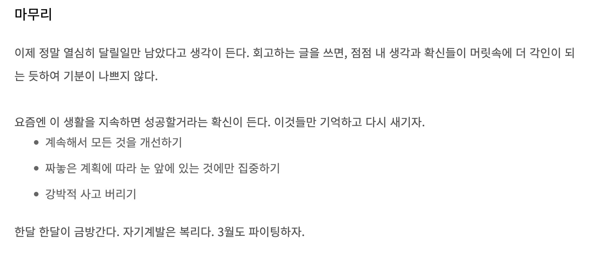

처음으로 한 달을 충실하게 보낸 것 같다. 시간이 참 빠르게 지난다는 것을 새삼 느낀다. 꾸준히 회고를 작성하고, 돌아봐야겠다.

## 실패하는 습관
여태 나의 행적을 정리하면 이러하다.

(2021년)
- 1월
    - 졸업 후 5~6월까지 방황
- 7~12월
    - 개발자의 꿈을 가지고 자바 선행학습, 7월 중순 국비학원 입과
- 12월
    - 학원 수료, 서비스기업에 대한 갈망 + 부족하다는 열등감에 취업을 미룸  

(2022년)
- ~4월
    - 김영한님 http 강의, 자바의 정석 복습, 클린코드 반 이상 읽고 정리, 객체 지향 강의, 함께 자라기 등등.. 읽고 정리 (기억 하나도 안남)
- 4월~6월
    - 방황, 없는 경력 조차 단절 시킴

나는 항상 게으른 사람이었던 기억이 많았고, 그런 내가 싫었기 때문에 규칙적이고 바른 사람이 되고 싶었다. 개발을 잘하고 싶은 마음도 컸다. 그래서 4월까지만 해도 매일 욕심부리면서 과하게 공부만 했다. 힘든 것 정도야 자기확언과 같은 심리적 요법이나 기술들을 통해 유지가능하다고 믿었다.

 

<em >2월 회고 당시 쓴 내용</em>

하지만 2월 당시 회고에도 확신에 찬듯한 기록들을 남겼지만, 결과적으로 12월에서 4월까지도 3주를 공부하면 1주일은 번아웃이 와서 쉰 것으로 기억한다. 그러다가 휴가를 계기로 한 번 쉬기 시작했는데, 2달을 통으로 쉬었다. 막상 힘든 상황에서 한 발 물러서니 시야가 넓어졌고, 내가 **실패하는 습관**을 가지고 있었다는 것을 깨달았다.

## 1. 시도한 것들
항상 나에게 부족한 학습 습관이나 멘탈관리는 개선해야할 1순위 항목이다. 7월에는 학습습관보다 멘탈관리에 실패하는 습관들을 개선하고, 나름대로 안정감을 찾기 위한 노력들을 많이 했다.
### 1.1. 정보의 절제
요즘은 정보량이 과다해서 쉽게 피로해지고, 중요한 일에 집중하지 못하는 경우가 많다고 한다. 실제로 사람은 한 번에 하나에 집중하는게 효율적이며 보통 그런 연습을 해야한다. 실제로 주변 물건 정리를 하는 것도 도움이 되고, 스마트폰을 줄이거나 아에 전자기기 안식일을 하루씩 가지는 경우도 좋다는 이야기가 많다.

나는 잡생각이 많아 집중을 못하는 편이다. **내가 현재 소화할 수 있는 정보량이 지극히 적음**을 요즘에야 깨달았다. 정보의 절제가 필요함을 느꼈다.

>결과적으로 당분간은 지인들과 연락을 아예 근절했다. 주변 정리도 꾸준히 하고 있다. 스마트폰은 정해진 시간만 하루 30분 이하로 사용한다.
이전에 집중시간을 과도한 기록으로 정보량과 오버헤드가 많았는데 타임로그 빼고 모두 없앴다. 또한 신경쓸일을 줄이기 위해 규칙을 만들고, 타이머나 알림을 적극 활용한다.

### 1.2. 도파민, 중독
보통 무언가를 성취하려면 그에 합당한 노력이 들기 마련이다. 그런데 작은 노력으로도 큰 보상을 주는 것들이 있다. 바로 술, 음란물, 설탕, 스마트폰 등이 그것이라고 한다.

술을 예시로 들면, 큰 돈을 들이지 않고도 어디서나 쉽게 구매할 수 있다. 그냥 사서 마시기만 하면 된다.(노력이 필요하지 않다.) 하지만 보상은 즉각적으로 나타나며 확실하다.

그렇기 때문에 중독성도 더 강력하며, 실제로 이러한 것들과 관련하여 도파민이 많이 분비되며, 각종 중독을 유발한다. 그리고 중독은 많은 문제를 야기한다.

 맛있는 음식만 먹다가 퍽퍽한 닭가슴살을 먹으면 맛이 없다. 마찬가지로 중독이 되기 시작하면 일상이 무감각해지고, 소소한 행복을 잃어버린다. 행복을 느끼는 쉬운 길이 있기때문에 더욱더 벗어나기 힘들다고 한다. 꾸준한 노력으로 무언가 성취하는 것을 더 거부하게 된다.

이런 사실을 인지면서 삶의 태도가 많이 변했다. **중독과 강한 자극들은 내가 상상하는 미래와 정반대로 가는 지름길**이라는 것을 깨달았다. 이러한 요소들을 내가 통제해야겠다고 결심했다.

>이제는 경조사나 정해진 날이 아니면 술을 아예 먹지 않고, 정해진 양을 넘기지 않는다. 다른 것들도 마찬가지이다.

### 1.3. 전전두엽, 계획적인 삶
전전두엽은 뇌 앞쪽부분에 위치하는데, 성공의 뇌라고도 불린다. 실제로 감정에 휘둘리기보다 계획적으로 행동하는 사람은 전전두엽이 더 두꺼워지고 커진다. 순간순간 좋은 선택과 행동이 나를 더 계획적이고 절제력이 강한 사람으로 만드는 것이다.

> 이런 뇌과학 지식들이 무언가 하기싫을때 동기나 근거가 되기도 한다. 이전에 새벽에 일어나는 일이 고역이었다면, 지금은 전전두엽이 두터워지는 상상을 하며 설레하며 일어난다. 싸이코같지만 그렇다.
> 정해진 시간에 하는 일들을 만들었다. 하기로 마음먹은 일은 무조건한다. 물론 무조건 할 수 있는 환경을 조성한다.

### 1.4. 나 자신과의 대화
나는 내가 둔감한 사람인 줄 알았는데, 꽤나 예민하다는 것을 깨달았다. 그날 나 자신을 번뇌에 들게한 생각이 있으면, 그것에 대해 써보고 왜 그런 감정이 드는지 해부한다. 막상 까보면 별거 없었다.

> 매일 일기쓰기를 실천중이다. 공부하는 내용에 따라 느낀점이나 개선 방안도 기록중이다.

### 1.5. 집중력 기르기
사람의 뇌는 원래 방해받기를 좋아하고, 무언가에 아무리 집중해도 100%를 모두 집중하는게 아니며, 20%~40%는 다른 생각을 하게 된다고 한다.(수치 정확히 기억이 안남) 그래서 집중에 벗어났을때, 그것을 되돌리는 능력이 중요하다고 한다. 명상을 하면서 호흡에만 집중을 하고, 다른 생각에게 집중을 빼앗기면, 다시 호흡으로 되돌리는 연습을 하면 좋다고 한다.

> 매일 20분 이상 연습했고, 20일차이다.

### 1.6. 설명하기
반효경 교수님의 운영체제 강의를 다시 정리하면서, 가상의 대상에게 설명한다고 생각하고 혼잣말을 하곤 한다. 앞으로는 목차만 적어놓고 설명하는 식으로 연습해볼 생각이다.

유명한 개발자분들의 이야기에 의하면, 발표를 준비하면서 성장하는 경우가 많다고 한다. 누군가에게 설명하기 위해 공부하다보면, 몰랐던 부분도 세세하게 알게 되며, 기억에도 잘 남는다.  현재 자바 기초를 부실공사 해놓아서 기억에 남은게 없다. 꾸준히 시간을 할애해서 백기선님 자바 라이브스터디를 다시 보고 정리하거나, 강의형 스터디를 개설하는 것을 생각중이다.

## 2. 공부한 것들
- 백준 알고리즘 : 브루트 포스, 그래프, BFS 등 52문제
- 반효경 교수님 운영체제 : 챕터 5 ~ 11(끝) 1회 정리, 블로그에 6회까지 업로드
- 자바 플레이그라운드 (넥스트 스텝) : 자동차 경주 미션 완료, 좌표 계산기 미션 완료, 블랙잭 피드백 전 구현까지 완료

## 3. 잘한 점, 못한 점
### 3.1. 잘한 점
- 항상 계획적으로 행동했고, 그런 것이 재밌게 느끼고 있다. 이번 달 구체적으로 결심한 일은 모두 지켰다.
- 규칙적인 생활 -> 6 기상, 7:30 기상스터디, 9:00~10:30 헬스
- 자기개발 유투브나 책을 잘 활용했다.

### 3.2. 아쉬운 점
- 항상 단기 계획이 부족하다. 하루 할당량이 없다.
    - 해야할 다른 공부로 넘어가지 못하고 붙잡고 있는 경우가 많았다.
    - 월 단위 목표가 있었다면, 공부량이 더 늘었을거라 예상한다.
    - 변수나 급한 일이 생겼을때, 시간을 더 촘촘하게 쓰지 못했다.
- 책을 못읽었다. 꾸준한 독서를 하고싶다.
    - 자기전 밤시간 빛도 피할 겸 30분정도 책을 읽으려 했으나, 공부시간을 채우느라 신경쓰지 못했다.
    - 좋아하는 책을 읽을때 공부에 동기부여가 많이 된다.
- 학습 개발이 미흡했다.
    - 전체적으로 이번달은 멘탈관리에 집중해서 학습에 대한 개선이 적다.

## 4. 개선 및 다음 달 목표
### 4.1. 개선 사항
- 월, 주, 일 단위 계획 추가, 시간 잘 지키기
- 자기 전 30분 독서시간 확보하기
- 학습방법 개발하기 -> 강의형, 발표형 스터디
- 일기에 주 단위 회고 하기
    - 매일 일기에 개선점을 쓰지만, 후에 잊고 적용되지 않는 부분이 많다. 중요한 부분을 표시해놓고, 주마다 추합해보자.
### 4.2. 목표
- 습관들 잘 유지하며 개선하기
- 백준 알고리즘 강의 중급 : 하루 2문제 -> 60문제
- 넥스트 스텝 미션 완료 (1주)
- 운영체제 정리 및 완전 복습 (2주)
- 김영한님 로드맵 : 스프링 핵심 원리 -> http 복습 -> 활용 1 -> jpa기본 -> 활용 1 복습 -> 활용 2
    - 셋째주에 핵심원리, http 복습 완료, 9월전 기본편까지 
    - 미션과 운영체제를 완료하면 비는 시간에 본격적인 스프링 공부하기.
    - 2500분 가량으로 단순 계산으로는 9월 중순에 1회독은 가능하다.

# 마무리
쓰다보니 요즘 하는 생각을 거의 다 썼다. 거의 회고가 아닌 일기 수준이다. 글쓰는게 좋은건지 주저리주저리하게 된다. **다음 회고는 학습이 개선된 내용으로 채우고 싶다.**