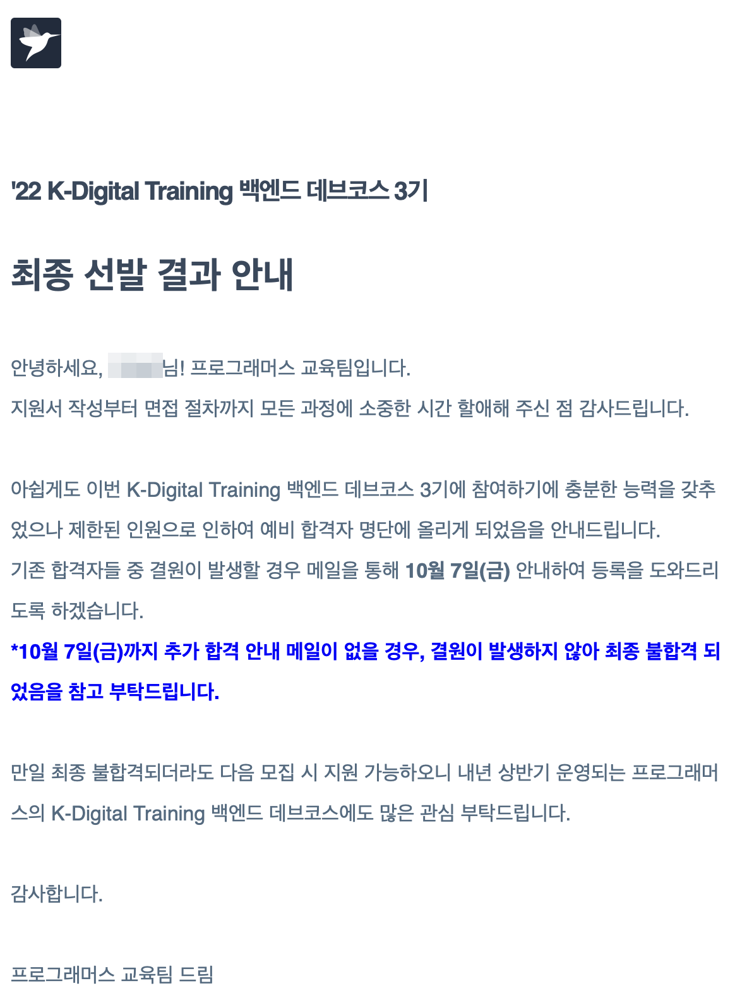

9월도 순식간에 지나갔다. 원래 9월에 5개의 강의를 한번은 끝내려는 목표가 있었는데, 생각보다 특강 혹은 필수로 참여해야하는 행사가 많았고, 교육과정도 지원하다보니 집중력이 부족했다. 결국 2개 강의밖에 못들었다. 10월에는 더 규칙적이고 계획적으로 생활해서 성과를 더 낼 것이다.

## 적응
이전에는 무언가를 검색해도 이해가 가지 않는 경우가 많았다. 관련 용어나 지식이 없으니, 글을 읽다 막히고, 억지로 읽어도 기억에 남질 않았다. OS 대학강의도 듣고, 객체지향 관련 책이나 강의를 듣고, TDD 미션도 해보고, 알고리즘을 풀면서 자료구조를 조금씩 익혔다. 그랬더니 이제는 검색을 해도 이해가 간다.

특히 요즘 영한님의 스프링 강의를 듣는데 너무 즐겁다. 영어 문서도 전보다 읽는 속도가 빨라졌고, 거부감이 줄었다. 조금씩 꾸준히 쌓는것의 효과가 나타난다고 생각되어 기분이 좋다.
## 주간 회고의 필요성
글을 작성하려는데 문득, 의미있는 회고를 하고 있는지 의문이 들었다. 지금은 막무가내로 일기처럼 쓰고 있는데, 내가 생각하는 회고는 외부의 관점에서 나를 바라보는 것이다. 3자 입장에서 내가 했던 선택의 이유나 결과, 변화를 살펴보고, 개선점을 찾는 것이 목표이다.결국에는 구체적인 행동으로 달라진게 있어야한다. 그 목적을 분명히 해야겠다는 생각을 했다.

다른 블로그의 회고를 보면서 기간 순으로 정리하면 어떨까 싶다. 주차별로 무엇을 했고, 어떤 변수가 있었는지 쭉 정리해보면, 30일을 수납장에 차곡차곡 물건을 정리하듯 바라보며 꼼꼼하게 돌아볼 수 있을 것 같다. 이를 위해서는 주간 회고를 제대로 해야한다. (이번달에도 주간 회고를 1번밖에 하지 못했다.)

이번 달은 강의 진행 목표 달성이 매우 모자르다. 원인은 세미나, 취업 시도, 특강, 경조사, 명절 등인데 주차별로 정리하면 필수 행사로 인해 줄어드는 시간을 좀더 잘 사용할 수 있을거라 생각한다.

## 데브코스 백엔드 3기 지원
[데브코스](https://school.programmers.co.kr/learn/courses/14677?utm_source=google&utm_medium=banner&utm_campaign=school_14677_lookalike_position&utm_content=14677_rsp&gclid=EAIaIQobChMI3vHj9LHN-QIVEKq9Ch2lBgEPEAEYASAAEgLsePD_BwE)의 커리큘럼이나 후기 등을 보고 일반적인 과정과 다르게 섬세함을 느꼈다, 이미 학습한 내용과 겹치더라도 개발자의 성장 방법을 배울수 있을거 같았고, 강사진 분들도 현업에 계신 능력자들 이다. 인원도 30명으로 소수정예다.

프로그래머스 블로그에 포스팅된 내용을 보면, 매니저님들의 열의도 엄청났다. 홍보 영상이나 페이지를 보면, 가시밭길을 준비했으니 의지를 가져오라는 메시지를 볼 수 있었다. 과장된 홍보를 하는 타 과정과 차이가 있다고 생각해서 지원했다. 

선발 프로세스는 대략 이러했다. <u>자소서 -> 코테 -> 자소서+코테로 면접자 선발 -> 면접</u>

아쉽게도 면접을 잘 못봤다. 상대방의 의도를 파악하는 순발력이 부족한 사람(소통능력↓)으로 비춰졌다고 생각한다. 그렇다고 동기나 목적의식을 정확히 표현하지도 못해서 사실상 포기한 상황이었다. 광탈을 예상했지만, 의외로 결과는 예비합격을 받았다. 10/7까지 기다려야한다.

교육생을 뽑는 면접인만큼 조금 더 적극적이고 편안함 마음가짐으로 임했으면 어땠을까 아쉬움이 남는다. 하지만 못가도 나는 내 할일을 하면 된다. 조금 느려도 방향성만 옳으면 된다.

## 건강
### 운동
7월 1일부터 어쩔수 없는 날 2~3일 정도를 제외하고 매일 웨이트를 했다. 근육량이 많이 늘어서 몸무게도 회복되고, 자세가 좋아지고 활력이 생겼다.

문제는 왼쪽 무릎에 간헐적인 소리와 턱관절 디스크에서 소리가 난다. 건강에 예민해서 병원도 가봤지만, 병원에서는 통증이 없이 소리만 나는 것은 질병으로 보지 않았다. 그럼에도 무릎이나 턱은 특히나 조심해야하는 부위라서, 컨디션이 좋고 자세가 잘 나오지 않는 이상 고중량 스쿼트는 하지 않고, 턱의 소리를 방지하기 위해 코로만 숨을 뱉으려고 노력중이다. 턱관절은 거북목이랑도 상관이 있다고 들었는데, 의사선생님의 조언에 따라 매일 찜질을 하고 있다.

추가로 웨이트할때 몸의 불균형도 문제이다. 자세가 이상하니 찝찝해서 중량을 늘리지 못한다.

결국 내가 운동을 하는 이유는 건강(자세 교정, 활력)과 근비대인데 극단적인 근비대가 목적이 아니며, 바른 자세로 유지가능한 점진적 발달하는게 목표다. 그런 점을 고려했을때 답답하더라도 쇳덩이들은 잠시 내려놓고 교정운동을 하는게 맞는 것 같다. 앞으로는 웨이트 시간 20분을 빼서 교정운동을 하고 운동을 시작할 생각이다.

### 알러지 검사
알러지 검사를 맡고 약을 처방받았다. 기본적으로 비염이 있어서, 여태 환절기 혹은 공기가 조금만 차지면 코가 막히고 콧물을 질질 흘렸다. 비염때문이라고만 생각했는데, 알러지 약을 먹으니 사라져서 신세계를 맛보고 있다.

검사결과 고양이, 진드기에 알러지가 있었다. 고양이 있는 지인 집에서 얻어 잔적이 있는데 아찔하다. 고양이 관련 알러지 물질은 체내에 1년은 잔류한다고 의사선생님이 그러셨다.

원인을 알고 대비할 수 있다는 점에서 알러지 검사는 매우 좋은 시도같다. 비염떄문에 콧물이 줄줄 흐르는 분들에게 검사와 약 복용을 추천한다. 비염만이 원인이 아닐 수 있다.

## 9월 한 일

- 코테
    - 백준, 프로그래머스 : 22문제
    - 리트코드 grind75 : 40문제
    - 코딩테스트 : 카카오(1솔?), 라인(2솔합), 데브코스 코테(3솔? 합)

- 자바
    - 넥스트 스텝 자바 미션
        - 블랙잭 리팩터링 중 (20%)

- 스프링
    - 강의
        - 스프링 핵심원리 : 1회 완료 및 정리
        - 실전! 스프링 부트와 JPA 활용1 - 웹 애플리케이션 개발 : 1회 완료 및 정리

- 세미나 등
    - 캐치 커리어콘 - 핀테크업계 개발자로 스타트UP #카카오페이 외
    - 캐치 \[하반기채용대비] 카카오 #코딩테스트/기술면접
    - 캐치 라이브 클래스 시리즈 알고리즘&자료구조 / DB&네트워크 / 스프링&자바
    - 10~15년차 개발자와 면담

- 교육과정 지원
    - 데브코스 예비합격
    
- 자격증?
    - 라이프 가드 자격증 갱신(교육과정 떨어질 경우 대비)

## 평가
### 잘한 점
- 외부에서 좋은 것을 받아들이려는 노력했다.
    - 독서
    - 경력있는 개발자와 면담
    - 서비스회사에 취업한 분들의 특강을 듣고 적용
        - 알고리즘 푸는 플랫폼 변경
        - 면접 준비 방향성 조정
        - 무언가를 만드는 학습 계획
- 배운 내용 정리를 했다.
    - TIL에 그날 한 내용을 약간씩 쓰면서 복습이 되어서 좋다.
    - 강의를 너무 배낀다고 생각해서 강의 정리 포스팅은 중단했지만, 설명하듯 써보는 연습이 기억에 도움이 됐다.
- 라인 코테 합격
    - 2솔이상 모두 합격인듯하다. 겨우 붙었다. 그만큼 허들이 낮다는 이야기지만, 많이 늘었다.

### 아쉬운 점
- 취업 시도가 적다.
    - 하반기에 지원을 많이 해보고 경험을 늘렸어야 했는데, 준비가 덜됐다는 생각에 너무 지원을 안했다.
    - 항상 수집해야할 정보가 많지만, 공부해야할 내용들이 눈에 들어오다보니, 그 사이에서 갈팡질팡한다. 역시 시간을 정확하게 정하는게 해답이라 생각한다.
- 주간 회고 부족
    - 주간 회고가 매우 중요한 작업이라 생각한다. 토스 인터뷰에서도 회고의 중요성에 대해 이야기하는 것을 보았다. 공부할 시간이 부족하다는 강박을 이겨내지 못했다.(저번 달에도 그랬다.) 회고를 하는게 더 효율적임을 기억하자.
- 추가 스터디나 동료를 구하지 않았다.
    - 동료학습과 데드라인을 정하는게 절실하다.

## 개선 및 목표
### 개선점
- 주간 회고 하기
    - 그때그떄 개선점을 찾고 짧은 주기로 피드백
- 시간을 할당하고 중요한 것에만 집중하기
    - 몰입, 빠른 학습
- 스터디 참여하기 
    - 소통능력, 마감기한으로 학습량 증가, 정리하고 공유하는 습관, 좋은 동료 얻기

### 10월 목표
- 자바 미션 리팩토링 2주차까지 완료
- 3개 강의
    - JPA활용2, JPA표준, Querydsl
- grind 75 다풀기 (medium 이상 난이도 35문제)
- 딥워크 책 정리 및 적용
- 스터디 하나 이상 추가하기

## 마무리
솔직히 회고를 쓸때마다 부끄럽다. 어짜피 난 더 나아지는 중이니 떳떳하다 생각하지만, 학습량이 적은 것도 사실이기 때문이다. 하지만 의지력이나 학습 방법 측면에서는 보이지 않는 성과들이 분명 존재한다. 확실히 실력이 늘고 있음을 느끼기도 하고, 다음 달에는 폭발적인 성과를 기대하고 있다. 

요즘이 인생의 터닝포인트라는 생각이 든다. 먼저 학습에 대한 내가 가져왔던 여러 편견이 부숴졌다. 더해서 여러 교육과정이나 동아리, 스터디를 보면서 다양한 좋은 사람들을 만날 기회가 많다고 느낀다.

이런 다양한 기회들 중 어떤 것을 선택할 것인가는 항상 고민이다. 목적지까지 도달하는데 무엇이 효율적인지 정확히 알기가 어렵다. 좋은 사람들의 말을 많이 듣고, 시행착오를 겪는 수밖에 없다.

결론은 고민이든 공부든 시간을 정해서 집중력있게 하는 것이 좋다고 생각한다. 시간을 쪼개고 쪼개서 지름길로 달려가자.

