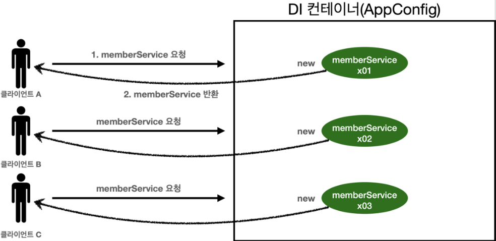
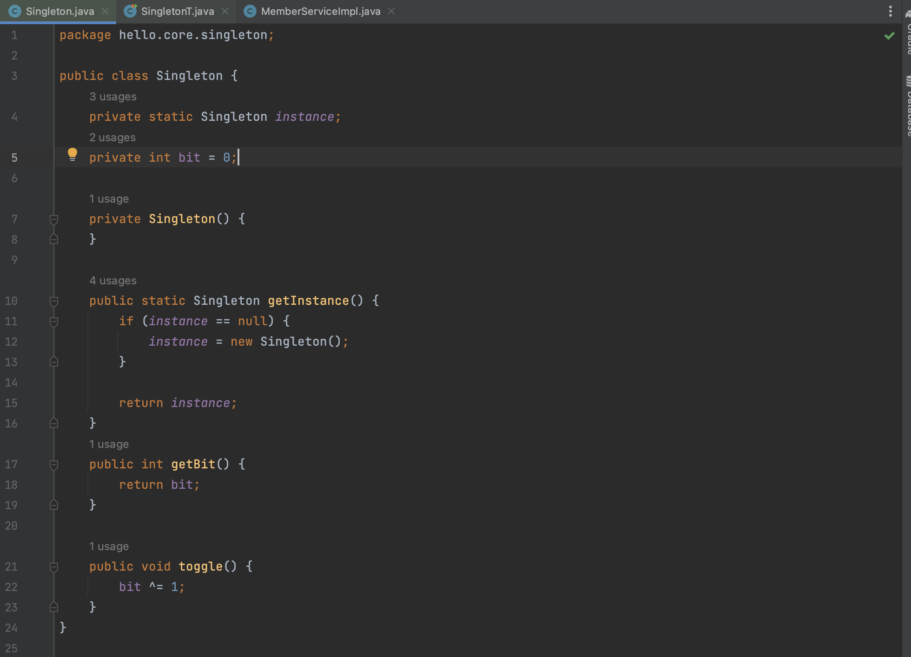
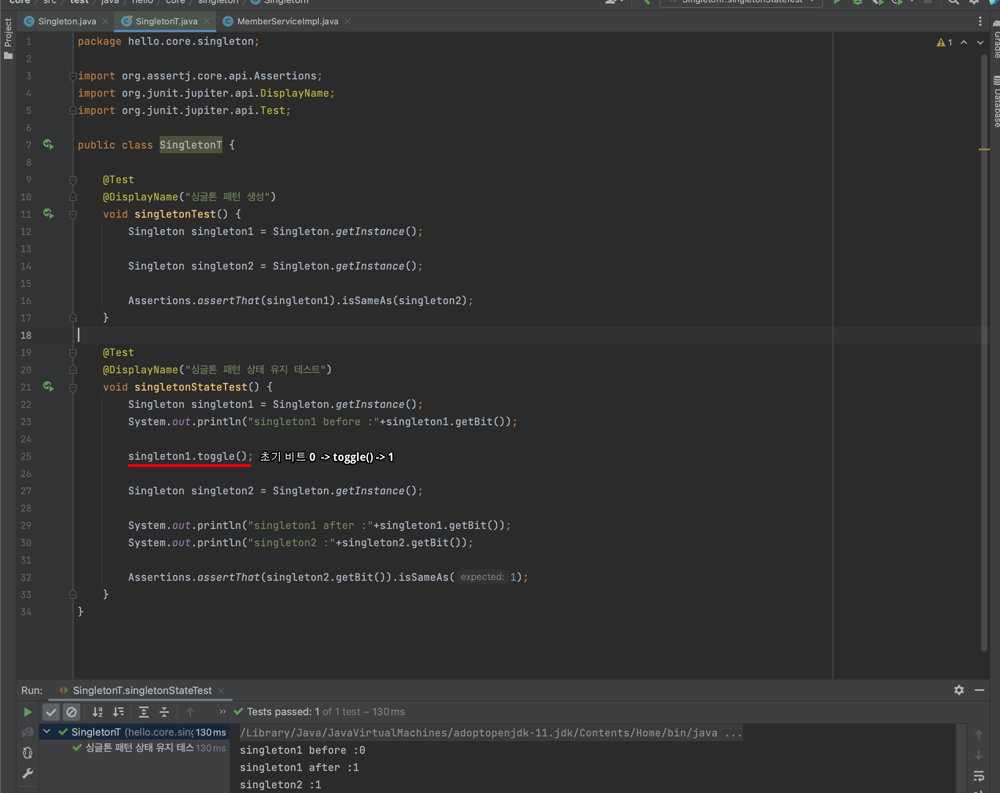
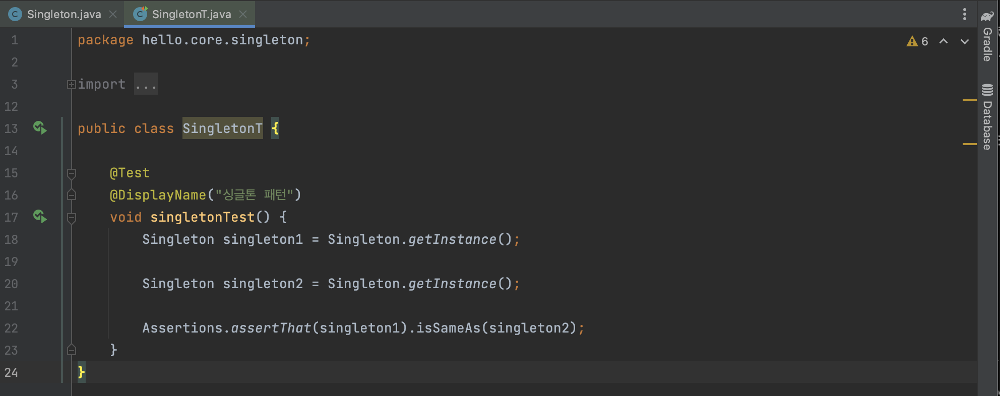
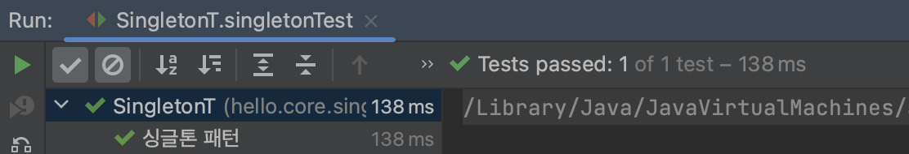
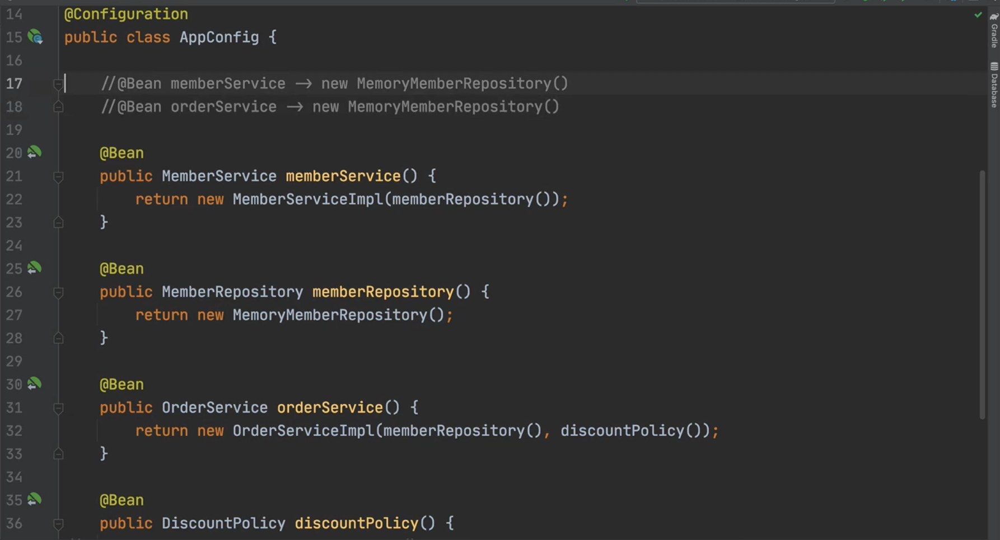
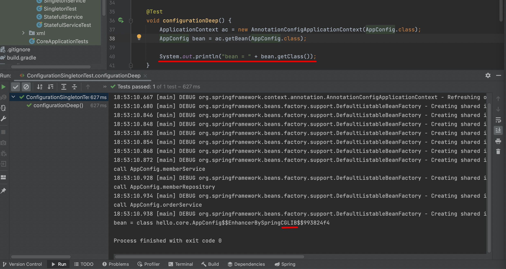

인프런 김영한님의 [스프링 핵심원리 - 기본편](https://www.inflearn.com/course/%EC%8A%A4%ED%94%84%EB%A7%81-%ED%95%B5%EC%8B%AC-%EC%9B%90%EB%A6%AC-%EA%B8%B0%EB%B3%B8%ED%8E%B8/dashboard)을 학습하고 정리한 내용입니다. 학습 목적의 정리이며, 모든 강의 내용을 정리하진 않습니다. 틀린 부분 지적해주시면 감사하겠습니다. 

# 웹 애플리케이션과 싱글톤

대부분의 스프링 애플리케이션은 웹 애플리케이션이며, 웹 애플리케이션은 보통 여러 고객이 동시에 요청을 하는 구조이다. 그렇다면 수 많은 고객들이 요청할때마다 객체가 생성된다면 메모리 낭비가 심해질 것이다. 
>예시로 초당 트래픽이 100이라면, 객체가 100개씩 생성되고 소멸할 것이다.

## 해결책 : 싱글톤 패턴
그것을 해결하는 방법이 싱글톤 패턴이다. 클래스 인스턴스가 1개만 생성되도록 보장하는 디자인 패턴이다. 수많은 고객들은 하나의 인스턴스를 공유하는 것이다.

# 싱글톤 컨테이너

스프링 컨테이너는 싱글톤 패턴을 따로 적용해주지 않아도 객체 인스턴스를 싱글톤으로 관리해준다. 이 때 싱글톤 객체를 생성하고 편리하게 관리하는 기능을 싱글톤 레지스트리라고 한다.
## 싱글톤 패턴 예시
```
public class Singleton {
    private static final Singleton instance = new Singleton();

    private Singleton() {}
    
    public static Singleton getInstance() {
        return instance;
```
강의에서 사용한 기본적인 싱글톤 패턴의 구현이다. static으로 해당 클래스 인스턴스를 초기화한다. 생성자를 private 설정했기때문에 new 예약어를 사용해도 추가로 인스턴스를 생성할 수 없다. 오로지 최초로 만든 인스턴스를 getInstance()메서드로만 가져올 수 있다.

```
public class Singleton {
    private static Singleton instance;

    private Singleton() {}

    public static Singleton getInstance() {
        if (instance == null) {
            instance = new Singleton();
        }

        return instance;
    }
}
```
getInstance()가 호출되는 시점에 인스턴스를 생성하는 방식(lazy-init)이다. 인스턴스가 이미 존재한다면, 해당 인스턴스를 반환한다. 그외에도 동기화 문제를 해결하기위해 synchronized를 붙이거나 Holder방식을 사용한다.

## 인스턴스의 공유

bit라는 상태를 만들고, 초기값을 0으로 부여했다. toggle()연산을 통해 비트값을 바꿀 수 있도록 구현했다. ("bit ^= 1;" -> bit가 0이면 1로, 1이면 1으로 바뀜)

출력과 테스트를 통해 확인해보자. singleton1을 먼저 생성하고, 상태를 바꿔준 후, singleton2를 새로 생성했다.

새로 생성한 singleton2의 상태값이 같음을 통해 인스턴스를 공유하고 있음을 알 수 있다. 

싱글톤 패턴은 인스턴스를 공유하기떄문에 위와 같이 상태를 유지(statful)하게 설계하면, 후에 큰 문제가 될 수 있다. 이 내용은 주의점에서 설명한다.

## 싱글톤의 문제점
메모리를 절약해주는 싱글톤 패턴은 유연성이 떨어지며, 안티패턴으로 불리기도 한다. 문제점을 살펴보자.
- 구현하는 코드가 많이 들어간다.
- 클라이언트가 구체 클래스에 의존한다.
    - DIP 위반
        - Config를 사용한다면 DIP 위반을 피할 수 있으나, 싱글톤 패턴의 의도가 해당 인스턴스를 직접 참조해서 사용하도록 public static으로 열어둔 것이라 대부분 전역적으로 직접 참조해서 사용한다.
    - OCP 위반 가능성 높음
- 테스트가 어렵다.
- 내부 속성을 변경하거나 초기화하기 어렵다.
- 생성자를 pirvate으로 지정했기에 자식클래스 생성이 어렵다.



해당 코드를 이용해 테스트를 작성했다. 따로 생성했지만, 동일성(Identity)를 체크하면 테스트가 성공한다.

# 싱글톤 방식의 주의점
싱글톤 패턴을 사용할때에는 무상태로 설계해야한다. 스프링 빈의 필드에 공유 값을 설정하면 큰 장애가 날 수 있다.
- 특정 클라이언트에 의존적인 필드가 있으면 안된다.
- 특정 클라이언트가 값을 변경할 수 있는 필드가 있으면 안된다.
- 가급적 read-only
- 필드 대신에 자바에서 공유되지 않는 지역변수, 파라미터, Threadlocal등을 사용해야한다.

아까 "인스턴스의 공유"에서 싱글톤 패턴에서 상태유지가 되도록 설계했더니, 새로 생성한 객체와 상태값이 같은 것을 확인했다. 스프링 컨테이너를 사용할때도, 스프링 빈의 필드 공유 값을 설정하면 마찬가지로 상태가 유지된다. 상태가 유지되도록 함부로 설계하면, 자신도 모르는 곳에서 값이 수정되어 큰 오류가 날지도 모른다.

# \@Configuration
## 싱글톤을 보장하는 방법?

스프링 컨테이너는 \@Configuration이 적용된 설정파일을 읽어서 빈을 등록한다. 하지만 스프링 컨테이너는 자바코드를 순서대로 읽을터인데, 여러 번 생성되는 객체는 어떻게 처리하는 것일까? 예시로 위 이미지에서 MemoryMemberRepository는 여러번 빈에 등록될 것이다.

## CGLIB?

AppConfig는 \@Configuration을 지정한 설정파일이다. 해당 파일에 대한 빈을 조회해서 클래스를 출력했다. 그런데 클래스 이름이 AppConfig에서 끝이아니고 추가적으로 CGLIB라는 키워드가 붙어있다.

CGLIB는 바이트 코드를 조작하는 라이브러리이다.AppConfig@CGLIB는 AppConfig를 상속받은 임의의 클래스이며, 스프링 빈으로 AppConfig대신 등록된다. 

결론적으로 해당 클래스가 싱글톤을 보장시켜준다. 대략적으로 설명하면, Bean이 붙은 메서드마다 스프링 빈의 존재여부를 체크해서 등록하거나 반환해주는 코드가 동적으로 만들어진다.

## \@Configuration을 안붙이면?
빼고 다시 호출해도 스프링 빈은 모두 등록된다. 하지만 인스턴스가 모두 다르게 생성되어 버린다. 싱글톤을 보장해주지 않는 것이다.