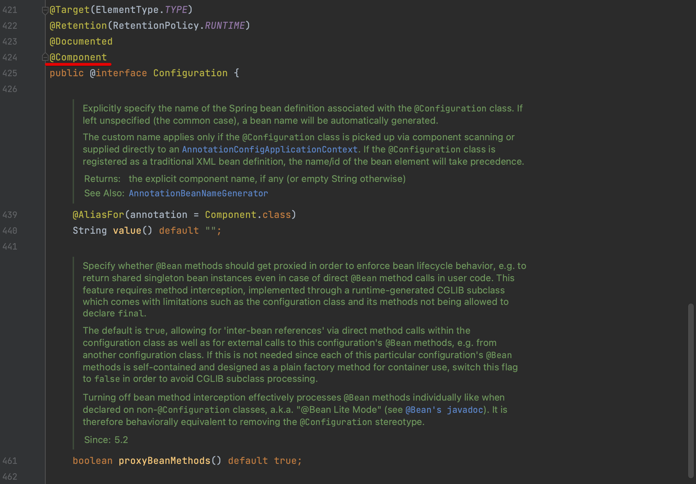
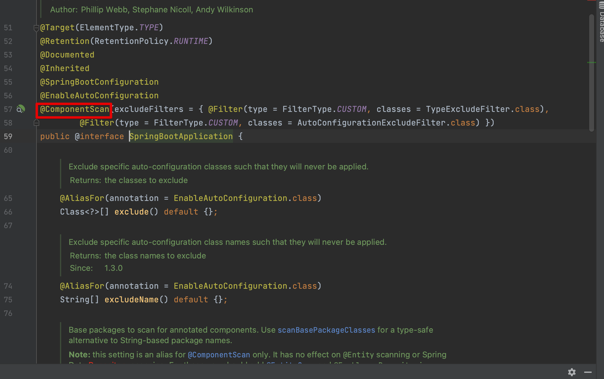
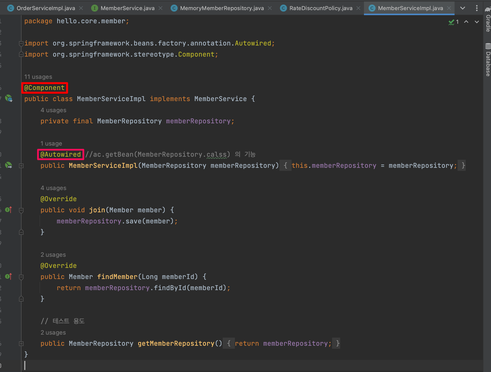
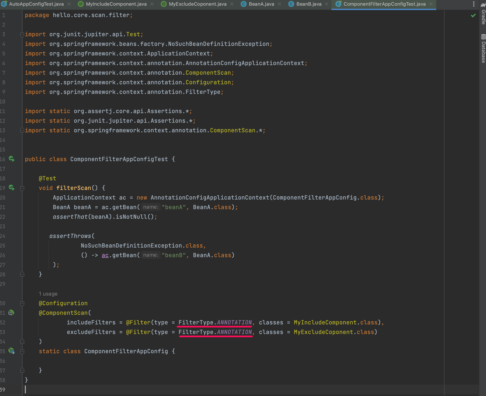
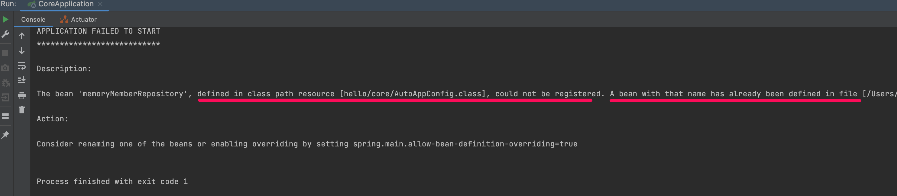
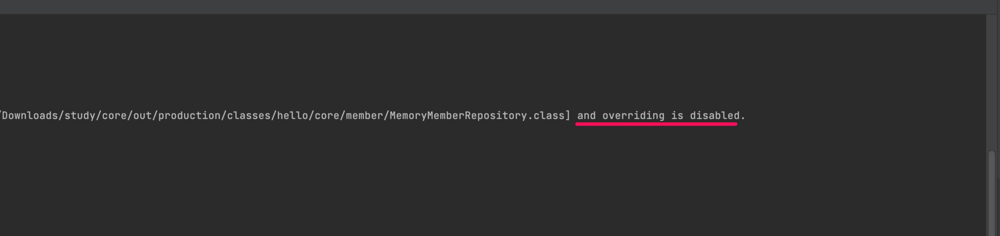
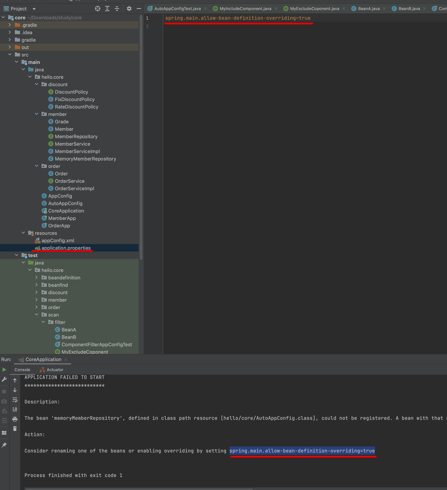

인프런 김영한님의 [스프링 핵심원리 - 기본편](https://www.inflearn.com/course/%EC%8A%A4%ED%94%84%EB%A7%81-%ED%95%B5%EC%8B%AC-%EC%9B%90%EB%A6%AC-%EA%B8%B0%EB%B3%B8%ED%8E%B8/dashboard)을 학습하고 정리한 내용입니다. 학습 목적의 정리이며, 모든 강의 내용을 정리하진 않습니다. 틀린 부분 지적해주시면 감사하겠습니다. 

# 컴포넌트 스캔과 의존관계 자동 주입
## \@ComponentScan
여태 \@Bean 또는 XML의 \<bean>등을 통해서 설정정보에 직접 등록한 스프링 빈을 나열했다. 그런데 서비스가 엄청나게 크다면 일일히 해당 키워드들을 추가해야할 것이다.

스프링은 설정 정보 없이 자동으로 스프링 빈을 등록하는 컴포넌트 스캔 기능을 지원한다. 위와같은 번거로움을 없애준다.

\@ComponentScan을 클래스에 붙여주면, \@Component 어노테이션을 붙인 타입(클래스)들을 빈으로 등록해준다. 여기서 주의할 점은 \@Configuration를 붙여준 클래스들도 자동으로 설정정보에 등록되어 버린다.

\@Configuration의 내부를 살펴보면, \@Component 설정이 되어 있는 것이 그 이유임을 알 수 있다.


\@SpringBootApplication어노테이션은 스프링 프로젝트 생성시 자동으로 붙어있다. 내부구조를 살펴보면, \@ComponentScan이 달려있다. 부트를 쓰면 자동으로 스프링 빈이 등록되는 이유이다.

## \@Autowired
그런데 \@ComponentScan 사용 시, \@Component를 사용하여 빈을 등록하지만, 설정 파일이 존재하지 않는다. 
의존관계 주입을 해주는 파일이 없어진 것이다.


그래서 \@Autowired를 사용한다. 생성자에 어노테이션만 붙이면 간단하게 의존관계를 주입해준다. 위와 같이 여러개의 객체도 모두 주입해준다.

## 빈 이름
### 기본
빈 이름은 기본적으로 맨 앞글자를 소문자로 바꾼 클래스명을 사용한다. OrderService객체를 빈으로 등록한다면, 빈 이름은 "orderService"가 되는 것이다.

### 직접 지정
\@Component("helloService")와 같이 이름을 직접 지정도 가능하다.

# 탐색 위치와 기본 스캔 대상
## 탐색 위치
```
\@ComponentScan(
        basePackages = "hello.core"
}
```
basePackages에 탐색 시작 위치를 지정할 수 있다. 패키지를 입력하면 해당 패키지부터 탐색을 시작하며, 해당 패키지의 하위 패키지를 모두 탐색한다.

기본값을 지정하면, 해당 클래스가 속한 패키지 부터 시작된다. 영한님은 패키지 위치를 지정하지 않고, 설정 정보 클래스의 위치를 프로젝트 최상단에 두는 것을 권장했다. 메인 설정 정보는 프로젝트를 대표하는 정보이니, 시작 루트에 위치하는 것이 자연스럽기도 하다.

참고로 basePackageClasses를 이용하면 클래스로 지정도 가능하다.

## 기본 스캔 대상
- \@Component : 컴포넌트 스캔에 사용한다. 다음 오는 어노테이션들은 \@Component의 기능에 부가기능들을 가진다
- \@Controller
    - 컨트롤러로 인식
- \@Repository
    - 스프링 데이터 접근 계층으로 인식, 데이터 계층의 예외 -> 스프링 예외로 변환
    - 디비가 바뀔때 예외가 변경되는 경우 방지
- \@Configuration
    - 설정 정보 인식, 스프링 빈이 싱글톤 유지되도록 추가 처리
- \@Service
    - 개발자들이 비즈니스 계층을 인식하게 도움

# 필터
- \@includeFilter
    - 추가 대상
- \@excludeFilter
    - 제외 대상
```
@ComponentScan(
    includeFilters = @Filter(type = FilterType.ANNOTATION, classes = WantIncludeComponent.class)
)
```
includeFilters를 통해 해당 클래스를 추가로 빈으로 등록하는 경우이다. excludeFilters를 이용하면 반대로 제거해준다.

excludeFilters의 경우 간혹 쓰이지만, includeFilters의 경우 거의 쓰이는일이 없다고 한다. 아까 이야기했던 default 탐색 위치를 활용하는게 보통 쉽고 명확한 방법이라고 한다.


강의의 예시이다. 참고로 밑줄 부분은 기본값이라 생략이 가능하다.

FilterType은 ANNOTATION을 포함하여 총 5가지이다.
- ASSIGNABLE_TYPE : 지정한 타입과 자식 타입 인식
- ASPECTJ : AspectJ패턴
- REGEX : 정규표현식
- CUSTOM : TypeFilter라는 인터페이스 구현해서 처리

# 중복 등록과 충돌
## 자동 빈 등록 vs 자동 빈 등록
\@ComponentScan을 활용하여 등록된 빈들의 이름이 같아서 충돌하는 경우를 말한다. 임의로 두 개의 서비스에 빈 이름을 같은 것으로 직접 지정해보면 ConfilctingBeanDefinitionException 이 발생한다.

## 수동 빈 등록 vs 자동 빈 등록
\@ComponentScan을 활용하여 등록된 빈과 \@Bean 등으로 수동 등록한 빈이 충돌하는 경우이다.

당연한 이야기일지 모르지만 수동 빈이 우선권을 가지고 자동 빈을 덮어쓰게 된다. 하지만 이 경우 의도적으로 구현하지 않은 경우 발견하기 힘든 치명적인 장애가 될 수 있다.

스프링 부트에서 이것을 방지하기 위해 수동빈도 오류메시지가 나오도록 기본값을 바꾸었다고 한다.

스프링 부트로 실행하여 수동 빈과 자동 빈을 충돌시킬 경우, 다음과 같이 오류가 발생한다.



이미 등록되어 있어서 등록이 불가하며, 오버라이딩은 불가하다고 나온다.


application-properties의 설정을 변경하면 오버라이딩을 허용할 수 있다. 오류 발생시 친절하게 하단에 메시지도 보여준다.

>하지만 영한님은 개발은 혼자하는 것이 아니며, 명확성이 항상 중요하다고 강조하셨다. 차라리 버그를 빨리 발견하거나, 코드를 더 짜는게 나을 수 있다는 의견이다.