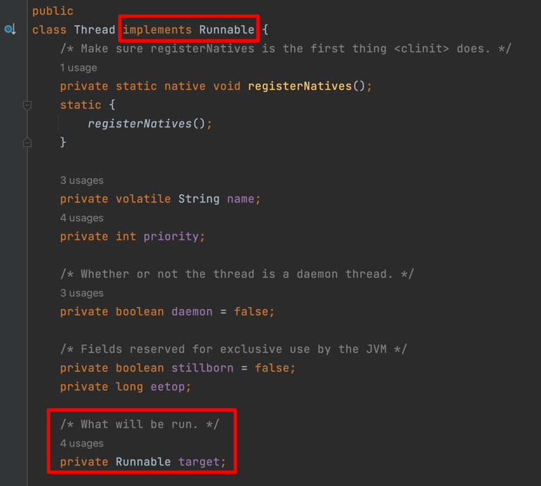
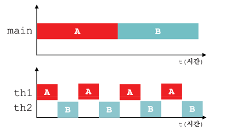
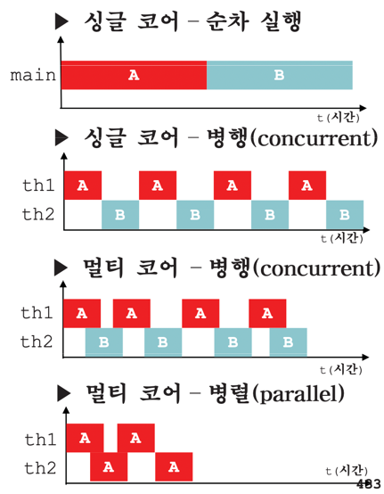

13\. Thread
===
이펙티브 자바 스터디를 진행하면서 쓰레드에 대해 아는게 없음을 깨달았다. 자바의 정석을 먼저 복습하여 쓰레드를 학습해보자.

## 01 프로세스와 쓰레드
### 프로세스(process)
- 실행 중인 프로그램. 프로그램을 실행하면 OS로부터 실행에 필요한 자원을 할당받아 프로세스가 된다.
- 프로그램 수행에 필요한 데이터와 메모리 등의 자원 그리고 쓰레드로 구성되어 있다.

### 쓰레드(thread)
- 프로세스의 자원을 이용해서 실제로 작업을 수행한다.
- 모든 프로세스에는 최소한 하나 이상의 스레드가 존재한다.

## 02 멀티쓰레딩의 장단점
### 멀티쓰레딩
싱글쓰레드라면 한 번에 한 작업밖에 할 수 없다. 여러 사용자에게 서비스를 제공하는 경우 멀티쓰레딩은 필수적이다.
여러 쓰레드를 생성해서 사용자의 요청과 일대일로 처리되도록 프로그래밍 해야 한다.

프로세스를 생성하는 것은 쓰레드를 생성하는 것에 비해 시간과 메모리 공간이 필요하다.
- 동일한 작업을 하는 프로세스를 여러개 만들면 손해일 것이다.
- PCB의 모양을 기억하자. 쓰레드는 프로세스에서 공유가능한 값들은 공유하여 효율적으로 사용한다.
- 쓰레드는 동료 쓰레드와 code section, data section, OS resouces를 공유한다.

### 장점
- CPU 사용률 향상
- 자원을 보다 효율적으로 사용
- 사용자에 대한 응답성 향상
- 작업이 분리되어 코드가 간결해진다.

### 장점만 존재하진 않는다.
- 동기화, 교착상태를 고려해 신중하게 프로그래밍해야 한다.

## 03 - 05 쓰레드의 구현과 실행

### 구현
1. Thread클래스를 상속
2. Runnable 인터페이스를 구현

두 경우 모두 `run()` 메서드의 구현부를 만들어주기만 하면 된다. 
Runnable 인터페이스를 구현하는 방법은 더 높은 재사용성을 가질 수 있다.

- Thread는 Runnable을 구현하며, Runnable을 private 필드로 가지고 있다.  
- 기본적으로 Thread 생성자에 Runnable 인스턴스를 인수로 넘기면 필드에 저장하는 방식이다.

### 실행

```java
class ThreadEx1 {
	public static void main(String args[]) {
		ThreadEx1_1 t1 = new ThreadEx1_1();

		Runnable r  = new ThreadEx1_2();
		Thread   t2 = new Thread(r);	  // 생성자 Thread(Runnable target)

		t1.start();
		t2.start();
	}
}

class ThreadEx1_1 extends Thread {
	public void run() {
		for(int i=0; i < 5; i++) {
			System.out.println(getName()); // 조상인 Thread의 getName()을 호출
		}
	}
}

class ThreadEx1_2 implements Runnable {
	public void run() {
		for(int i=0; i < 5; i++) {
			// Thread.currentThread() - 현재 실행중인 Thread를 반환한다.
		    System.out.println(Thread.currentThread().getName());
		}
	}
}
```
- getName으로 Thread의 이름을 가져오기도 한다.
- Runnable 인스턴스를 생성자에 제공하는 것을 볼 수 있다.

### 실행 - start()
- 쓰레드를 생성하고 start()를 호출해야만 쓰레드가 실행된다.  
- **하지만** start()가 호출되었다고 해서 바로 실행되지 않는다. 
실행대기 상태에 있다가 <u>자신의 차례가 되어야 실행</u>된다. 물론 실행대기중인 쓰레드가 하나도 없으면 곧바로 실행 상태가 된다.

❗실행이 종료된 쓰레드는 다시 실행할 수 없다.
- 하나의 쓰레드에 대해 start()가 한 번만 호출될 수 있다는 의미
- 작업을 한 번 더 수행해야 한다면 새로운 쓰레드를 생성한 다음에 start()를 호출해야 한다.
- 두 번 이상 호출 시 IllegalThreadStateException 발생

## 06 start() 와 run()
- main메서드에서 run()을 호출하는 것은 생성된 쓰레드를 실행시키는게 아니라
단순히 클래스에 선언된 메서드를 호출하는 것이다.
- start()는 새로운 쓰레드가 작업을 실행하는데 필요한 호출스택을 생성한 다음에 run()을 호출해서 생성된 호출스택에 run()이 첫 번째로 올라가게 한다.

## 과정
1. main메서드에서 쓰레드의 start()를 호출
2. start()는 새로운 쓰레드를 생성, 쓰레드가 작업하는데 사용될 호출스택을 생성한다.
3. 새로 생성된 호출스택에 run()이 호출되어, 쓰레드가 독립된 공간에서 작업을 수행한다.
4. 두 호출 스택이 스케줄러가 정한 순서에 의해서 번갈아 실행된다.

## 07 main쓰레드
- main 메서드를 실행하는 쓰레드
- 프로그램을 실행하면 기본적으로 하나의 쓰레드를 생성하고, main 메서드를 호출해서 작업이 수행되도록 하는 것이다.
- 실행 중인 사용자 쓰레드가 하나도 없을 때 프로그램은 종료된다.

## 08 싱글쓰레드와 멀티쓰레드
<p style="text-align:center">
    
    <em style="display:block">자바의 정석 요약집 자료 1</em>
</p>

첫번째는 하나의 쓰레드로 두 개의 작업을 하는 경우이고, 
두번째는 두개의 쓰레드로 두 개의 작업을 수행하는 경우이다.
- 두번째의 경우, 얼핏보면 두 가지일을 동시에 처리하는 것처럼 보일 것이다. 사실 빠르게 작업 전환(context switching)이 이루어지고 있는 것이다.
- context switching에는 PC 정보 등을 저장하고 읽어 오는 시간이 소요된다. 당연히 프로세스의 스위칭이 쓰레드의 문맥 교환보다 더 무겁다. 
- 오히려 context switching 비용때문에 쓰레드가 2개인 두번째가 더 느릴 수 있다. 싱글 코어에서 단순히 CPU만을 사용하는 계산 작업이라면 오히려 싱글쓰레드가 효율적일 수 있는 것이다.


## 09 - 10 싱글쓰레드와 멀티쓰레드 예제

### 예제 코드 및 비교
```java
class Ex13_3 {
    static long startTime = 0;

    public static void main(String args[]) {
        ThreadEx13_3 th1 = new ThreadEx13_3();
        th1.start();
        startTime = System.currentTimeMillis();

        for(int i=0; i < 300; i++) {
            System.out.print("-");
        }

        System.out.print("소요시간1 :" + (System.currentTimeMillis() - Ex13_3.startTime));
    }
}

class ThreadEx13_3 extends Thread {
    public void run() {
        for(int i=0; i < 300; i++) {
            System.out.print("|");
        }

        System.out.print("소요시간2 :" + (System.currentTimeMillis() - Ex13_3.startTime));
    }
}
```
자바의 정석 예시 코드이다. 위의 코드를 실행하면 싱글코어일때와 멀티코어일때 실행 결과가 다르다.
- 싱글 코어의 경우 차례로 실행되어 쓰레드가 동시에 실행될 수 없다. "---|||---|||"와 같이 일정한 패턴을 보일 수 있다.
- 멀티 코어의 경우 동시에 실행이 가능하므로 불규칙한 패턴을 보인다.

<p style="text-align:center">
    
    <em style="display:block">자바의 정석 요약집 자료 2</em>
</p>

결국 전체적으로 비교했을때,
지금의 예제 코드 처럼 단순 출력 로직을 만든다면 속도의 차이가 다음과 같이 나타날 수 있다.

    멀티코어 2개 쓰레드 > 싱글 코어 1개 쓰레드 > 싱글 코어 2개 쓰레드

오히려 싱글코어 1개 쓰레드가 싱글코어 2개 쓰레드보다 빠른 것이다.


이미지 속에 3번째 그래프인 `멀티 코어 - 병행` 부분을 살펴보면 겹치는 부분이 존재한다. **화면이라는 자원을 놓고 두 쓰레드가 경쟁**하는 것이다.

### 불확실성에 주의하기
추가로 위 결과는 실행할 때마다 다른 결과를 얻을 수 있다. 그 이유는,
- OS의 프로세스 스케줄러의 영향을 받기 때문이다. 
- JVM의 쓰레드 스케줄러에 의해서 어떤 쓰레드가 얼마나 실행될 것인지 결정되는 것과 같이 프로세스도 프로세스 스케줄러에 의해서 실행순서와 실행시간이 결정된다.

따라서 매 순간 상황에 따라 프로세스에 할당되는 실행시간이 일정하지 않고, 쓰레드에도 마찬가지이다. 
자바가 OS(플랫폼) 독립적이라고 하지만 실제로는 OS종속적인 부분이 몇 가지 있는데 쓰레드도 그 중 하나이다.

## 11 쓰레드의 I/O 블락킹(blocking)
두 쓰레드가 **서로 다른 자원을 사용하는 작업**의 경우 싱글쓰레드 프로세스보다 **멀티쓰레드 프로세스가 더 효율적**이다.
**외부기기의 입출력을 필요로 하는 경우 유용하다.** 예시로 한 쓰레드가 사용자 입력을 기다리느라 멈춰있을때, 다른 작업을 나머지 쓰레드로 진행할 수 있다.

## 12 쓰레드의 I/O 블락킹(blocking) 예제 1
```java
class ThreadEx6 {
	public static void main(String[] args) throws Exception
	{
		String input = JOptionPane.showInputDialog("아무 값이나 입력하세요."); 
		System.out.println("입력하신 값은 " + input + "입니다.");

		for(int i=10; i > 0; i--) {
			System.out.println(i);
			try {
				Thread.sleep(1000);
			} catch(Exception e ) {}
		}
	}
}
```
입력이 먼저 존재할 때, 입력을 마치기 전에는 출력이 되지 않는다.

## 13 쓰레드의 I/O 블락킹(blocking) 예제 2
```java
class ThreadEx7 {
	public static void main(String[] args) throws Exception 	{
		ThreadEx7_1 th1 = new ThreadEx7_1();
		th1.start();

		String input = JOptionPane.showInputDialog("아무 값이나 입력하세요."); 
		System.out.println("입력하신 값은 " + input + "입니다.");
	}
}

class ThreadEx7_1 extends Thread {
	public void run() {
		for(int i=10; i > 0; i--) {
			System.out.println(i);
			try {
				sleep(1000);
			} catch(Exception e ) {}
		}
	}
}
```
쓰레드를 두 개로 나누어 처리하면 입력을 기다리면서도 출력이 계속 된다.

## 14 쓰레드의 우선순위
쓰레드는 우선순위라는 속성(멤버변수)를 가지고 있다. 이 우선순위 값에 따라 쓰레드가 얻는 실행시간이 달라진다.
예시로 파일전송기능이 있는 메신저의 경우 파일다운로드보다 채팅의 우선순위 높아야 편할 것이다. 시각적이거나 빠르게 반응해야하는 작업들은 우선순위를 보통 높게 잡아야 한다.

### 우선순위 지정하기
```Java
void setPriority(int newPriority)   // 우선순위 변경
int getPriority()                   // 우선순위 반환
```

- 쓰레드가 가질 수 있는 우선순위는 1~10이다. 숫자가 높을수록 우선순위가 높다.
- 쓰레드의 우선순위는 생성한 쓰레드로부터 상속받는다. 
  - main 메서드를 수행하는 쓰레드는 우선순위가 5이므로 main에서 생성 시 기본으로 5가 된다.

## 15 쓰레드의 우선순위 예제
싱글 코어, 멀티 코어에서 간단히 문자 하나를 출력을 시키는 run()을 구현하여 작업량을 확인했다.
- 쓰레드의 우선순위는 쓰레드를 실행하기 전에만 변경할 수 있다.
- 싱글 코어에서 두 개의 쓰레드로 작업을 시켜보니, 우선순위가 높은 쓰레드에 더 많은 작업이 주어졌다.
- 멀티 코어에서 두 개의 쓰레드로 작업한 경우, 차이가 거의 없었다.

### 불확실성
- 역시나 OS 마다 다른 방식으로 스케쥴링하기 때문에, 멀티코어라 해도 어떤 OS에서 실행하느냐에 따라 다른 결과를 얻을 수 있다.
- 우선순위에 차등을 두어 실행하려면, 특정 OS의 스케줄링 정책과 JVM 구현을 직접 확인해봐야 한다.
- 자바는 쓰레드가 우선순위에 따라 어떻게 처리되어야 하는지에 대해 강제하지 않는다.
  - 우선순위와 관련된 구현이 JVM마다 다를 수 있다.
  - 확인하더라도 OS 종속적이라 어느 정도 예측만 가능하다.

## 16 쓰레드 그룹(thread group)
쓰레드를 그룹으로 묶어서 관리할 수 있다. 
쓰레드 그룹은 보안상의 이유로 도입되었다. 자신이 속한 스레드 그룹이나 하위 쓰레드 그룹은 변경할 수 있지만 다른 쓰레드 그룹의 쓰레드를 변경할 수는 없다.

### 사용 및 관련 메서드
Thread 생성자를 이용하면 된다.

    Thread(ThreadGroup group, String name)
    Thread(ThreadGroup group, Runnable target)
    Thread(ThreadGroup group, Runnable target, String name)
    Thread(ThreadGroup group, Runnable target, String name, long stackSize)

    ThreadGroup getThreadGroup() // 쓰레드 자신이 속한 쓰레드 그룹 반환
    void uncaughtException(Thread t, Throwable e) // 처리되지 않은 예외에 의해 쓰레드 그룹의 쓰레드가 실행이 종료되었을 때, JVM에 의해 이 메서드가 자동적으로 호출된다.

### 그룹 규칙
- 모든 쓰레드는 반드시 쓰레드 그룹에 포함되어 있어야 한다. 기본적으로 자신을 생성한 쓰레드와 같은 쓰레드 그룹에 속하게 된다.
- 자바 어플리케이션이 실행되면, JVM은 main과 system이라는 쓰레드 그룹을 만들고 JVM 운영에 필요한 쓰레드들을 생성해서 이 쓰레드 그룹에 포함시킨다.
  - main 메서드 수행하는 main이라는 이름의 쓰레드 -> main쓰레드 그룹
  - 가비지컬렉션을 수행하는 Finalizer스레드 -> system쓰레드 그룹
- 우리가 생성하는 모든 쓰레드 그룹은 main 쓰레드 그룹의 하위 쓰레드 그룹이 되며, 쓰레드 그룹을 지정하지 않고 생성한 쓰레드는 자동으로 main쓰레드 그룹에 속한다.

## 17 쓰레드 그룹의 메서드
[524p 참조] 내용만 서술
- 지정된 이름의 새로운 쓰레드 그룹을 생성 지정된 쓰레드에 포함되는 새로운 스레드 그룹 생성
- 활성상태 쓰레드의 수/그룹의 수를 반환
- 현재 쓰레드가 실행중인 쓰레드 변경 권한이 있는지
- 하위 쓰레드까지 모두 삭제 
- 쓰레드 목록 지정 배열에 담고 개수 반환
- 최대 우선순위 반환, 그룹 이름 반환, 쓰레드 그룹의 상위 쓰레드 그룹을 반환, 모든 쓰레드 인터럽트
- 데몬 쓰레드인지, 삭제되었는지
- 정보 출력, 지정 쓰레드 그룹의 상위 쓰레드 그룹인지 확인
- 데몬으로 설정/헤제, 그룹의 최대 우선순위 설정

## 18 데몬 쓰레드(daemon thread)
- 일반 쓰레드의 작업을 돕는 보조적인 역할을 하는 쓰레드이다. 일반 쓰레드가 모두 종료되면 존재의 의미가 사라지기때문에 강제적으로 자동 종료된다.
이 점을 제외하면 일반 쓰레드와 다르지 않다.
- 무한 루프와 조건문을 이용해서 실행 후 대기하고 있다가 특정 조건 만족되면 작업을 수행하고 다시 대기하도록 작성한다.
- 일반쓰레드와 작성 및 실행방법이 같다. 쓰레드 생성 후 setDaemon(true)를 호출하기만 하면 된다.
- 데몬쓰레드가 생성한 쓰레드는 데몬쓰레드가 된다.

## 19 데몬 쓰레드 예제
- setDaemon은 start() 호출 전에 지정해야 한다. 그렇지 않으면 IllegalThreadStateException이 발생한다. (start() 두번할때도 발생하는 에러)
- 데몬쓰레드로 미리 설정해놓으면 일반쓰레드 종료 후 자동 종료된다.

## 20 쓰레드의 상태
- NEW : 생성되고 아직 start() 호출안한 상태
- RUNNABLE : 실행 중 또는 실행 가능한 상태
- BLOCKED : 동기화블럭에 의해서 일시정지된 상태(lock이 풀릴 때까지 기다리는 상태)
- WAITING, TIMED_WAITING : 쓰레드의 작업이 종료되지는 않았지만 실행가능하지 않은(unrunnable) 일시정지상태. TIMED는 일시정지시간이 지정된 경우를 의미
- TERMINATED : 쓰레드의 작업이 종료된 상태

1. 생성 후 start()를 호출하면 큐 구조의 실행대기열에서 차례를 기다린다.
2. 자신의 차례가 되면 실행
3. 주어진 실행시간이 다되거나 yield()를 만나면 다시 실행대기상태가 되고 다음 차례의 쓰레드가 실행상태가 된다.
4. 실행 중에 suspend(), sleep(), wait(), join(), I/O block에 의해 일시정지상태가 될 수 있다. I/O block은 입출력작업에서 발생하는 지연상태를 말한다.
예시로 사용자 입력을 기다리는 동안 일시정지 상태에 있다가 입력을 마치면 다시 실행대기 상태가 된다.
5. 지정된 일시정지시간이 다 되거나(time-out), notify(), resume(), interrupt()가 호출되면 일시정지상태를 벗어나 다시 실행대기열에 저장되어 자신의 차례를 기다린다.
6. 실행을 모두 마치거나 stop() 호출 시 쓰레드는 소멸한다.

## 21 쓰레드의 실행제어
동기화와 스케줄링때문에 쓰레드 프로그래밍은 어렵다. 효율적인 멀티쓰레드 프로그래밍을 위해 정교한 스케줄링이 필요하다.
스케줄링을 잘하기 위해서는 쓰레드의 상태와 관련된 메서드를 잘 알아야 한다.

- static void sleep(long millis)/(long millis, int nanos) : 지정된 시간 동안 쓰레드를 일시정지. 지정 시간 지나면 자동적으로 실행대기상태가 된다.
- void join()/(long millis)/(long millis, int nanos) : 지정된 시간동안 쓰레드가 실행되도록 한다. 지정 시간이 지나거나 작업이 종료되면 join()을 호출한 쓰레드로 다시 돌아와 실행을 계속
- void interrupt() : sleep()이나 join()에 의해 일시정지상태인 쓰레드를 깨워서 실행대기상태로 만듦. 해당 쓰레드에서는 Interrupted Exception이 발생함으로써 일시정지상태를 벗어남
- void stop() : 쓰레드를 즉시 종료
- void suspend() : 쓰레드를 일시정지시킨다. resume()을 호출하면 실행대기상태가 된다.
- void resume() : suspend()에 의해 일시정지상태에 있는 쓰레드를 실행대기상태로 만든다.
- static void yield() : 실행 중에 자신에게 주어진 실행시간을 다른 쓰레드에게 양보하고 자신은 실행대기상태가 된다.

suspend, resume, stop은 데드락을 만들기 쉬워서 deprecated 되었다.
- stop은 즉시 종료를 시켜버려서 여러 문제를 야기하는 듯 싶다.
- suspend는 중지한 상태에서 공유 자원을 쥐고 놓지 않아서 데드락이 자주 발생햔다.

## 22 sleep()
지정된 시간동안 쓰레드를 멈추게 한다.

### 사용

    static void sleep(long millis)
    static void sleep(long millis, int nanos)

- 밀리세컨드 = 1000분의 1초
- 나노세컨드 = 10억분의 1초 -> 0~999999까지 지정 가능. 99만9999 나노세컨드는 약 1 밀리세컨드이다.

시간을 지정 가능하지만, 어느 정도의 오차가 발생할 수 있음을 염두해야 한다.

### interruptedException
- sleep에 의해 일시정지가 된 쓰레드는 interrupt()가 호출되면, InterruptedException이 발생되어 실행대기 상태가 된다.
- 항상 예외처리 해줘야 한다.

## 23 sleep() 예시
sleep()은 항상 현재 실행 중인 쓰레드에 대해 작동한다. 쓰레드를 새로 생성하고, main메서드에서 해당 쓰레드를 참조해서 sleep()을 호출하더라도 영향을 받는 것은 main쓰레드이다.
> 그냥 Thread.sleep(~)과 같이 사용하기

## 24 interrupt()
쓰레드에게 작업 중간에 멈추라고 요청하는 기능을 한다. stop()처럼 강제로 종료시키지 않는다.
그저 쓰레드의 interrupted상태(인스턴스 변수)를 바꾼다.

    void interrupt()              // 쓰레드의 interrupted상태를 false에서 true로 변경
    boolean isInterrupted()       // 쓰레드의 interrupted상태를 반환
    static boolean interrupted()  // 현재 쓰레드의 interrupted상태를 반환 후, false로 변경

## 25 interrupt() 예제
```java
class ThreadEx13_1 {
  public static void main(String[] args) throws Exception 	{
    ThreadEx13_2 th1 = new ThreadEx13_2();
    th1.start();

    String input = JOptionPane.showInputDialog("아무 값이나 입력하세요.");
    System.out.println("입력하신 값은 " + input + "입니다.");
    th1.interrupt();   // interrupt()를 호출하면, interrupted상태가 true가 된다.
    System.out.println("isInterrupted():"+ th1.isInterrupted()); // true
  }
}

class ThreadEx13_2 extends Thread {
  public void run() {
    int i = 10;

    while(i!=0 && !isInterrupted()) {
      System.out.println(i--);
      for(long x=0;x<2500000000L;x++); // 시간 지연
    }

    System.out.println("카운트가 종료되었습니다.");
  } // main
}
```

- while문을 !isInterrupted()로 막아놓고, interrupt 호출하는 경우
- interrupt() 호출 시 종료 문구가 출력하게 구현

## 26-27 suspend(), resume(), stop()
- suspend()는 sleep()처럼 쓰레드를 멈추게 하며, resume()을 호출해야 다시 실행대기 상태가 된다.
- stop()은 호출 즉시 쓰레드가 종료된다.

suspend()와 stop()이 교착상태를 일으키기 쉽게 되어 있어 deprecated 되었다.
> stop(Throwable obj) 는 자바 11에서 제거되었다. stop()의 제거 계획은 아직 없는듯 하다고 이펙티브 자바에서 말한다.

## 28 join()과 yield()
### join()
- 쓰레드 자신이 하던 작업을 잠시 멈추고, 다른 쓰레드가 지정된 시간동안 작업을 수행하도록 한다.
- sleep과 마찬가지로 interrupt()에 의해 대기상태에서 벗어날 수 있다.
- sleep과 유사하나 현재 쓰레드가 아닌 특정 쓰레드에 대해 동작한다.(static이 아님)
- 시간을 지정하지 않으면 해당 쓰레드가 작업을 모두 마칠때까지 기다린다.

### yield()
- 자신에게 주어진 실행시간을 다음 차례 쓰레드에게 양보한다.
- 1초 할당받았는데 0.5초가 남은 경우, 포기하고 다시 실행대기 상태가 된다.

## 29 join()과 yield() 예제

```java
class ThreadEx19 {
	static long startTime = 0;

	public static void main(String args[]) {
		ThreadEx19_1 th1 = new ThreadEx19_1();
		ThreadEx19_2 th2 = new ThreadEx19_2();

		th1.start();
		th2.start();
		startTime = System.currentTimeMillis();

		try {
			th1.join();	// main쓰레드가 th1의 작업이 끝날 때까지 기다린다.
			th2.join();	// main쓰레드가 th2의 작업이 끝날 때까지 기다린다.
		} catch(InterruptedException e) {}

		System.out.print("소요시간:" + (System.currentTimeMillis() - ThreadEx19.startTime));
	} // main
}

class ThreadEx19_1 extends Thread {
	public void run() {
		for(int i=0; i < 300; i++) {
			System.out.print(new String("-"));
		}
	} // run()
}

class ThreadEx19_2 extends Thread {
	public void run() {
		for(int i=0; i < 300; i++) {
			System.out.print(new String("|"));
		}
	} // run()
}

```
join()으로 인해 main쓰레드가 th1, th2의 작업이 끝날때까지 기다린다. main쓰레드의 소요시간이 가장 마지막에 찍힌다.
책에 yield() 예제라고도 써있는데 해당 내용이 없다.


## 30 쓰레드의 동기화(synchronization)
한 쓰레드가 진행중인 작업을 다른 쓰레드가 간섭하지 못하게 막는 것을 '쓰레드의 동기화'라고 한다.
멀티쓰레드 프로세스의 경우 여러 쓰레드가 같은 프로세스 내의 자원을 공유해서 작업하기 때문에 서로의 작업에 영향을 주게 된다.
그것을 방지하게 도입된 개념이 바로 **'임계 영역(critical section)'**과 **'잠금(락, lock)'**이다.

자바에서는 synchronized블럭을 이용해서 쓰레드의 동기화를 지원했지만, 
JDK1.5부터는 java.util.concurrent.locks와 java.util.concurrent.atomic 패키지를 통해서 다양한 방식으로 동기화를 구현 가능하다.
- atomic 패키지에서는 락 없이 스레드 안전한 프로그램을 만들게 해준다. AtomicLong 등을 지원한다. 자바에서 원래 long과 double타입은 변수를 읽고 쓰는데 원자성을 지원하지 않는다. 

### critical section과 lock
- **공유 데이터**를 사용하는 코드 영역을 **임계 영역**으로 지정해놓고,
공유 데이터(객체)가 가지고 있는 **lock**을 획득한 단 하나의 쓰레드만 이 영역 내의 코드를 수행할 수 있게 된다.
- 해당 쓰레드가 모든 코드를 수행하고 벗어나서 lock을 반납해야만 다른 쓰레드가 반납된 lock을 획득하여 임계 영역의 코드를 수행할 수 있다.

## 31 synchronized를 이용한 동기화
synchronized로 임계 영역을 설정할 수 있다. 두 가지 방식이 있다.
    
    1. 메서드 전체를 임계 영역으로 지정
      public synchronized void calcSum() {
          .../
      }

    2. 특정한 영역을 임계 영역으로 지정 
      synchronized(객체의 참조변수) {
          .../
      }

1번 - 메서드 앞에 사용
- 메서드 전체를 임계 영역으로 설정한다.
- **synchronized메서드가 호출된 시점**부터 해당 메서드가 포함된 **객체의 lock**을 얻어 작업을 수행하다가 **메서드가 종료**되면 lock을 반환한다.

2번 - 특정 영역 지정
- 참조변수는 lock을 걸고자 하는 객체를 참조해야 한다.
- **블럭 안에 들어가면서부터** 쓰레드는 **지정된 객체의 lock**을 얻는다. **블럭**을 벗어나면 lock을 반납한다.
- lock이 있는 쓰레드만 임계 영역 코드를 수행하며, **다른 쓰레드들은 lock을 얻을때까지 기다리게 된다.**
- 성능을 생각해 임계 영역을 최소화하는게 좋다.

## 32-33 synchronized를 이용한 동기화 예제 1,2
```java
class ThreadEx21 {
	public static void main(String args[]) {
		Runnable r = new RunnableEx21();
		new Thread(r).start(); // ThreadGroup에 의해 참조되므로 gc대상이 아니다.
		new Thread(r).start(); // ThreadGroup에 의해 참조되므로 gc대상이 아니다.
	}
}

class Account {
	private int balance = 1000;

	public  int getBalance() {
		return balance;
	}

	public void withdraw(int money){ // synchronized 붙이기!
		if(balance >= money) {
			try { Thread.sleep(1000);} catch(InterruptedException e) {}
			balance -= money;
		}
	} // withdraw
}

class RunnableEx21 implements Runnable {
	Account acc = new Account();

	public void run() {
		while(acc.getBalance() > 0) {
			// 100, 200, 300중의 한 값을 임으로 선택해서 출금(withdraw)
			int money = (int)(Math.random() * 3 + 1) * 100;
			acc.withdraw(money);
			System.out.println("balance:"+acc.getBalance());
		}
	} // run()
}
```
- 은행 계좌에서 출금하는데, 랜덤으로 정해진 금액으로 출금한다.
- 출금 메서드에서 출금직전에 출금하려는 금액만큼 잔고가 있는지 확인하고, 잔고가 더 작다면 출금을 하지 않는다.
- 2개의 쓰레드에서 동시에 출금작업을 지속한다.

원래는 잔고의 출력 결과가 0 이하는 나오지 않아야한다. 하지만 if문 내부에서 한 쓰레드가 작업하고 있을때, 다른 쓰레드가 if문을 통과해버릴수 있다.
withdraw 메서드를 synchronized 선언한다면 잔고가 0미만으로 떨어지지 않게 할 수 있다.

## 34 wait()과 notify()
특정 쓰레드가 객체의 락을 가진 상태로 오랜 시간을 보낸다면, 다른 쓰레드들은 해당 객체의 락을 기다리느라 다른 작업을 하지 못할 것이다.
이런 상황을 개선하는게 wait()과 notify()이다.

### wait()
- 작업을 진행할 상황이 아니면, 쓰레드가 락을 반납하고 기다리게 한다. 해당 객체의 대기실(waiting pool)에서 통지를 기다린다.
- 다른 쓰레드가 작업을 할 수 있게 된다.
### notify()
- 다시 락을 얻어 작업을 할 수 있게 한다. 호출 시 해당 객체의 대기실에 있던 모든 쓰레드 중에서 임의의 쓰레드만 통지를 받는다.
- 락을 얻는다고 해서 즉시 실행을 보장하는 것은 아니다. 실행가능 상태가 되는 것이다.
- notifyAll()
  - 기다리고 있는 모든 쓰레드에게 통보를 한다.
  - 하지만 lock을 얻을 수 있는 것은 하나의 쓰레드일 뿐이라 나머지는 lock을 기다려야 한다.
  - 호출된 객체의 waiting pool에 대기 중인 쓰레드에만 적용된다.

어짜피 가져가게 락은 하난데 왜 이게 필요하지? 라는 생각이 들었다. 기다리고 있는 여러 쓰레드에 대해 해당 작업이 끝났음을 모두 알려야하는 경우 사용한다고 한다.
락이 하나이더라도 실행가능하다는 것을 알려야하는 경우는 있다고 이해했다. notifyAll()도 필요한 메서드라고 한다.

## 35-36 wait()와 notify() 예제 1,2
Table을 공유 자원으로 Cook은 요리를 만들고, Customer은 요리를 먹는다. Table의 음식을 제거하는 메서드, 생성하는 메서드는 각각 synchronized 처리가 되어 있다.
- 예제 1에서는 작업 수행이 불가능할때, sleep()하도록 되어 있다. lock을 가진채로 놓아주지 않아서 원활하게 로직이 진행되지 않는다.
- 예제 2에서는 wait()과 notify()를 추가하여 원활하게 작동한다. wait()은 lock을 놓아주기 때문이다. 하지만 해당 코드도 notify()로 어떤 쓰레드를 깨울지 모르기 때문에 비효율적인 측면이 있다.


